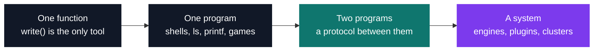

# Software engineering portfolio

[](https://antoinepoisson.github.io/Old-School-Projects/)

   

108 projects built between 2018 and 2023, kept as they were delivered: the source, the constraints
that shaped it, how to build it, and an honest account of what went past the brief and what did not.

The archive starts where `printf` is forbidden and the only tool is `write()`, and ends with a
networked game engine, an HTTP server whose every feature is a hot-loaded module, and a connected
device spanning firmware to dashboard. Twenty-three of these were team projects, and those READMEs
record how the system was divided — not only what the binary did.

That progression is the point, and it is a progression in what has to be held in your head at once:



| | |
| --- | --- |
| **Committed source** | ~205,000 lines across 3,877 files, in 15 languages |
| **Heaviest** | C (116k lines) · C++ (44k) · JavaScript (32k) |
| **Also here** | Python, Haskell, Kotlin, Go, Rust, Java, Ruby, x86-64 assembly, GLSL |
| **Team projects** | 23 of 108 |
| **Graded** | 91 of 108 — 33 A, 53 B, 3 C, 2 D |

Line counts exclude vendored libraries such as the Irrlicht and SFML headers shipped inside
*Indie Studio*.

## A few representative projects

- **[R-Type](Tek3/CPP/CPP_rtype)** — a multiplayer shoot’em up on an entity-component engine written
  from nothing. The engine had to be designed *before* the game existed: TCP carries anything that
  must arrive exactly once, UDP carries the state stream, and client-side prediction covers the gap.
- **[Zia](Tek3/CPP/CPP_zia)** — an HTTP server whose parser, handlers, TLS layer and CGI support are
  all hot-loaded shared libraries. The core has to define its hook points before knowing what will
  ever hook into them.
- **[42sh](Tek1/PSU/PSU_42sh_2018)** — a Unix shell built by a team: command tree, pipes,
  redirections, aliases, history, completion, and terminal line editing written by hand rather than
  borrowed from readline.
- **[Arcade](Tek2/OOP/OOP_arcade_2019)** — games and renderers both `dlopen`ed at runtime and
  swappable mid-play. The abstraction had to be thin enough to fit an SFML window and a terminal
  cell at the same time.
- **[my_navy](Tek1/PSU/PSU_navy_2018)** — battleship between two processes whose only channel is
  `SIGUSR1` and `SIGUSR2`. A signal carries no payload, so a board coordinate becomes a timed
  sequence of interrupts — 10 signals per round, and one lost bit hangs the game.
- **[CarePlant](Tek5/IOT/CarePlant)** — a full IoT chain: an analogue soil sensor, a captive Wi-Fi
  portal, an API, a database and a React dashboard, where a failure in any layer is invisible from
  the others.

## Browse the archive

<pre>
School/
├── <a href="Tek1">Tek1/</a>       C foundations, algorithms, graphics and Unix systems       50 projects
├── <a href="Tek2">Tek2/</a>       C++, assembly, networks, concurrency and functional code    40 projects
├── <a href="Tek3">Tek3/</a>       advanced C++, applications, DevOps and security             16 projects
└── <a href="Tek5">Tek5/</a>       IoT and real-time 3D                                         2 projects
</pre>

The portfolio site linked at the top of this page is built from this archive but kept off this
branch: it is published as a single commit on `gh-pages`, replaced whole on every deploy, so its
weight never accumulates in this history.

Tek4 was Epitech’s standard gap year and is therefore not represented. Every project carries its own
README: what it had to do, the constraints that shaped it, how to build it, and what was left out.

## Use the official Epitech environment

The root [`Dockerfile`](Dockerfile) is a deliberately thin wrapper around
[`epitechcontent/epitest-docker`](https://hub.docker.com/r/epitechcontent/epitest-docker), the image
published from Epitech's public
[`epitest-docker`](https://github.com/Epitech/epitest-docker) repository for automated project
testing. It brings the maintained Epitech packages for the C, C++, systems and web curriculum into
one consistent shell without copying the archive into the image. The matching [`.dockerignore`](.dockerignore)
also keeps the build context down to the wrapper itself, even though this repository contains more
than a hundred source trees.

```bash
docker build --platform linux/amd64 -t school-epitech .
docker run --rm -it --platform linux/amd64 \
  -v "$PWD":/workspace -w /workspace school-epitech
```

The `--platform` option also makes the image usable through emulation on Apple Silicon; it can be
omitted on an x86-64 Linux host. Once inside the container, enter a project and follow its own
**Build & run** section—for example:

```bash
cd Tek1/PSU/PSU_42sh_2018
make
./42sh
```

The image tag can be changed without editing the file:

```bash
docker build --build-arg EPITECH_IMAGE=epitechcontent/epitest-docker:devel \
  --platform linux/amd64 -t school-epitech .
```

This is Epitech's current automated-test environment, not a frozen snapshot of every workstation
used between 2018 and 2023. Graphical, audio, Android and multi-service projects may still require
display/device forwarding or the project-specific containers documented in their own README.

## Projects

<details>
<summary><strong>Tek1 — 2018-2019 (50 projects)</strong></summary>

**[CPool](Tek1/CPool) — C Pool — the entry bootcamp**

- [C Pool — Day 01: the Unix environment](Tek1/CPool/CPool_Day01_2018) (B)
- [C Pool — Day 02: shell scripting](Tek1/CPool/CPool_Day02_2018) (B)
- [C Pool — Day 03: first steps in C](Tek1/CPool/CPool_Day03_2018) (B)
- [C Pool — Day 04: pointers](Tek1/CPool/CPool_Day04_2018) (B)
- [C Pool — Day 05: recursion](Tek1/CPool/CPool_Day05_2018) (B)
- [C Pool — Day 06: strings](Tek1/CPool/CPool_Day06_2018) (B)
- [C Pool — Day 07: libmy and arguments](Tek1/CPool/CPool_Day07_2018) (B)
- [C Pool — Day 08: compilation and dynamic allocation](Tek1/CPool/CPool_Day08_2018) (B)
- [C Pool — Day 09: structures](Tek1/CPool/CPool_Day09_2018) (B)
- [C Pool — Day 10: Makefile and do_op](Tek1/CPool/CPool_Day10_2018) (B)
- [C Pool — Day 11: linked lists](Tek1/CPool/CPool_Day11_2018) (B)
- [C Pool — Day 12: file descriptors](Tek1/CPool/CPool_Day12_2018) (B)
- [C Pool — Day 13: discovering CSFML](Tek1/CPool/CPool_Day13_2018) (B)
- [Rush 1 — The Squares](Tek1/CPool/CPool_rush1_2018) (B)
- [Rush 2 — What language is this?](Tek1/CPool/CPool_rush2_2018) (B)
- [WorkshopLib — building libmy](Tek1/CPool/CPool_workshoplib_2018) (B)
- [Tree — ASCII fir tree](Tek1/CPool/CPool_Tree_2018) (B)
- [match & nmatch](Tek1/CPool/CPool_match-nmatch_2018) (B)
- [Bistro-matic](Tek1/CPool/CPool_bistro-matic_2018) (B)
- [EvalExpr](Tek1/CPool/CPool_evalexpr_2018) (B)
- [InfinAdd — big number addition](Tek1/CPool/CPool_infinadd_2018) (B)
- [Final Stumper — rush3](Tek1/CPool/CPool_finalstumper_2018) (B)

**[Maths](Tek1/Maths) — Maths — applied mathematics in C**

- [101pong — vectors and bounces](Tek1/Maths/101pong_2018) (A)
- [102architect — transformations and homogeneous coordinates](Tek1/Maths/102architect_2018) (A)
- [103cipher — matrix cipher](Tek1/Maths/103cipher_2018) (A)
- [104intersection — lines and quadrics](Tek1/Maths/104intersection_2018) (A)
- [105torus — mathematics of the torus](Tek1/Maths/105torus_2018) (A)

**[CPE](Tek1/CPE) — CPE — algorithms in C**

- [Matchstick](Tek1/CPE/CPE_matchstick_2018) (A)
- [Push Swap](Tek1/CPE/CPE_pushswap_2018) (A)
- [Get Next Line](Tek1/CPE/CPE_getnextline_2018) (A)
- [Dante's Star](Tek1/CPE/CPE_dante_2018) (B)
- [Lem-in / A-maze-d](Tek1/CPE/CPE_lemin_2018) (B)
- [Corewar](Tek1/CPE/CPE_corewar_2018) (B)

**[PSU](Tek1/PSU) — PSU — Unix systems programming**

- [my_ls](Tek1/PSU/PSU_my_ls_2018) (B)
- [my_navy — battleship over signals](Tek1/PSU/PSU_navy_2018) (B)
- [my_sokoban](Tek1/PSU/PSU_my_sokoban_2018) (B)
- [my_printf](Tek1/PSU/PSU_my_printf_2018) (B)
- [Minishell 1](Tek1/PSU/PSU_minishell1_2018) (A)
- [Tetris](Tek1/PSU/PSU_tetris_2018) (B)
- [Minishell 2](Tek1/PSU/PSU_minishell2_2018) (A)
- [42sh — full shell](Tek1/PSU/PSU_42sh_2018) (A)

**[Graphics](Tek1/Graphics) — Graphics — 2D games in C**

- [My Hunter](Tek1/Graphics/MUL_my_hunter_2018) (A)
- [My Runner](Tek1/Graphics/MUL_my_runner_2018) (A)
- [My Defender — tower defense](Tek1/Graphics/MUL_my_defender_2018) (A)
- [My RPG](Tek1/Graphics/MUL_my_rpg_2018) (A)

**[Stumper](Tek1/Stumper) — Stumper — timed algorithm challenges**

- [Solo Stumper 1 — alphabetical sorting](Tek1/Stumper/CPE_solostumper_1_2018)
- [Solo Stumper 2 — palindrome](Tek1/Stumper/CPE_solostumper_2_2018)
- [Duo Stumper 1 — ASCII fractal](Tek1/Stumper/CPE_duostumper_1_2018)
- [Duo Stumper 2 — Boggle](Tek1/Stumper/CPE_duostumper_2_2018)
- [Duo Stumper 3 — Caesar cipher](Tek1/Stumper/CPE_duostumper_3_2018)

</details>

<details>
<summary><strong>Tek2 — 2019-2020 (40 projects)</strong></summary>

**[Internship](Tek2/Internship) — Internship — front-end warm-up**

- [React Carnet Book](Tek2/Internship/React-Carnet-Book)
- [React Gallery Site](Tek2/Internship/React-Gallery-Site)
- [React Admin Side](Tek2/Internship/React-Admin-Side)
- [Vue To-do](Tek2/Internship/Vue-To-do)

**[CPPool](Tek2/CPPool) — C++ Pool — the second bootcamp**

- [C++ Pool — Day 01: warming back up in C](Tek2/CPPool/cpp_d01_2019) (B)
- [C++ Pool — Day 02 morning: pointers](Tek2/CPPool/cpp_d02m_2019) (B)
- [C++ Pool — Day 02 afternoon: data structures](Tek2/CPPool/cpp_d02a_2019) (B)
- [C++ Pool — Day 03: string library](Tek2/CPPool/cpp_d03_2019) (B)
- [C++ Pool — Day 06: first classes](Tek2/CPPool/cpp_d06_2019) (B)
- [C++ Pool — Day 07 morning: Resistance is Futile](Tek2/CPPool/cpp_d07m_2019) (B)
- [C++ Pool — Day 07 afternoon: SKAT](Tek2/CPPool/cpp_d07a_2019) (B)
- [C++ Pool — Day 08: operator overloading and canonical form](Tek2/CPPool/cpp_d08_2019) (B)
- [C++ Pool — Day 09: inheritance](Tek2/CPPool/cpp_d09_2019) (B)
- [C++ Pool — Day 10: operator overloading and abstract classes](Tek2/CPPool/cpp_d10_2019) (B)
- [C++ Pool — Day 13: polymorphism and interfaces](Tek2/CPPool/cpp_d13_2019) (B)
- [C++ Pool — Day 14 morning: casting](Tek2/CPPool/cpp_d14m_2019) (B)
- [C++ Pool — Day 14 afternoon: exceptions](Tek2/CPPool/cpp_d14a_2019) (B)
- [C++ Pool — Day 15: templates](Tek2/CPPool/cpp_d15_2019) (B)
- [C++ Pool — Day 16: the standard library](Tek2/CPPool/cpp_d16_2019) (B)
- [C++ Pool — Day 17: generic algorithms](Tek2/CPPool/cpp_d17_2019) (B)
- [C++ Rush 1 — SKL, objects in pure C](Tek2/CPPool/cpp_rush1_2019) (B)
- [C++ Rush 2 — Santa Claus](Tek2/CPPool/cpp_rush2_2019) (B)
- [C++ Rush 3 — MyGKrellm](Tek2/CPPool/cpp_rush3_2019) (B)

**[PSU](Tek2/PSU) — PSU — memory, instrumentation & Zappy**

- [malloc — memory allocator](Tek2/PSU/PSU_malloc_2019) (A)
- [my_nm & my_objdump — ELF exploration](Tek2/PSU/PSU_nmobjdump_2019) (A)
- [strace — system call tracing](Tek2/PSU/PSU_strace_2019) (A)
- [ftrace — function call tracing](Tek2/PSU/PSU_ftrace_2019) (A)
- [Zappy](Tek2/PSU/PSU_zappy_2019) (C)

**[JAM](Tek2/JAM) — JAM — 48-hour game jam**

- [Epitech JAM — Space](Tek2/JAM/JAM_space_2019) (D)

**[Assembly](Tek2/Assembly) — Assembly — x86-64**

- [MiniLibC](Tek2/Assembly/ASM_minilibc_2019) (A)

**[Functional](Tek2/Functional) — Functional — a change of programming model**

- [Wolfram — cellular automaton](Tek2/Functional/FUN_wolfram_2019) (A)
- [Image Compressor — k-means in Haskell](Tek2/Functional/FUN_imageCompressor_2019) (A)

**[Network](Tek2/Network) — Network — sockets & protocols**

- [myFTP — FTP server](Tek2/Network/NWP_myftp_2019) (A)
- [myTeams — collaborative messaging](Tek2/Network/NWP_myteams_2019) (A)

**[OOP](Tek2/OOP) — OOP — concurrency, design & a year-end project**

- [Arcade — retro gaming platform](Tek2/OOP/OOP_arcade_2019) (B)
- [Plazza — concurrent pizzeria](Tek2/OOP/CCP_plazza_2019) (A)
- [NanoTekSpice — logic circuit simulator](Tek2/OOP/OOP_nanotekspice_2019) (B)
- [Indie Studio — 3D Bomberman](Tek2/OOP/OOP_indie_studio_2019) (A)

**[CNA](Tek2/CNA) — CNA — numerical analysis & trading**

- [Trade — crypto trading bot](Tek2/CNA/CNA_trade_2019) (C)
- [Groundhog — real-time temperature indicators](Tek2/CNA/CNA_groundhog_2019) (C)

</details>

<details>
<summary><strong>Tek3 — 2020-2021 (16 projects)</strong></summary>

<pre>
Tek3/
├── <a href="Tek3/CPP">CPP/</a>            advanced C++ &amp; networking
│   ├── <a href="Tek3/CPP/CPP_babel">CPP_babel/</a>   Babel — voice over IP                     · B
│   ├── <a href="Tek3/CPP/CPP_rtype">CPP_rtype/</a>   R-Type — multiplayer game engine           · B
│   └── <a href="Tek3/CPP/CPP_zia">CPP_zia/</a>     Zia — modular HTTP server                    · A
├── <a href="Tek3/AppDev">AppDev/</a>         web &amp; mobile applications
│   ├── <a href="Tek3/AppDev/DEV_dashboard">DEV_dashboard/</a>  Dashboard                              · A
│   └── <a href="Tek3/AppDev/DEV_epicture">DEV_epicture/</a>   Epicture                                · A
├── <a href="Tek3/DevOps">DevOps/</a>         infrastructure &amp; automation
│   ├── <a href="Tek3/DevOps/DOP_my_marvin">DOP_my_marvin/</a>  My Marvin — Jenkins CI/CD pipeline     · A
│   ├── <a href="Tek3/DevOps/DOP_popeye">DOP_popeye/</a>     Popeye — multi-service containerisation  · A
│   └── <a href="Tek3/DevOps/DOP_bernstein">DOP_bernstein/</a>  Bernstein — Kubernetes orchestration    · A
├── <a href="Tek3/Security">Security/</a>       applied cryptography
│   └── <a href="Tek3/Security/SEC_caesar">SEC_caesar/</a>    Cryptography challenges                  · A
└── <a href="Tek3/SideProjects">SideProjects/</a>   self-directed practice
    ├── <a href="Tek3/SideProjects/BotDiscord_JavaScript">BotDiscord_JavaScript/</a>    Discord bot relaying Git pushes into the right channel
    ├── <a href="Tek3/SideProjects/BrickBreaker_Python">BrickBreaker_Python/</a>      Brick Breaker, the Atari classic, from scratch
    ├── <a href="Tek3/SideProjects/Pong_Python">Pong_Python/</a>              Pong, ball physics and paddle collision from scratch
    ├── <a href="Tek3/SideProjects/JeuDeOie_Python">JeuDeOie_Python/</a>          Game of the Goose, the French board game, in Python
    ├── <a href="Tek3/SideProjects/HangMan_Java">HangMan_Java/</a>             Hangman, word-guessing game, in Java
    ├── <a href="Tek3/SideProjects/HangMan_Ruby">HangMan_Ruby/</a>             Hangman again, this time in Ruby
    └── <a href="Tek3/SideProjects/RockPaperScissors_Java">RockPaperScissors_Java/</a>   Rock Paper Scissors against the computer, in Java
</pre>

</details>

<details>
<summary><strong>Tek5 — 2022-2023 (2 projects)</strong></summary>

**[Web3](Tek5/Web3) — Web3 — real-time 3D on the web**

- [Three.js Journey](Tek5/Web3/ThreeJsJourney)

**[IOT](Tek5/IOT) — IoT — connected devices**

- [CarePlant — connected plant](Tek5/IOT/CarePlant) (D)

</details>

## License

See [`LICENSE`](LICENSE).
