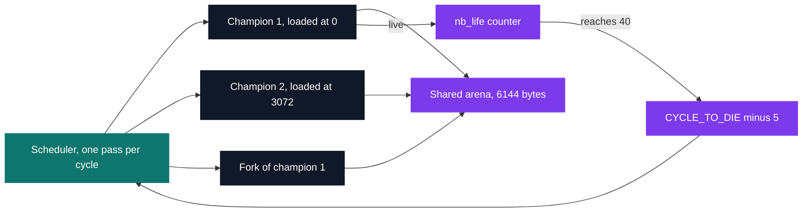

# Corewar

[](https://antoinepoisson.github.io/Old-School-Projects/projects/cpe-corewar-2018)

  

[Tek1](../../README.md) / [CPE](../README.md) / **CPE_corewar_2018**

*Team project · Elementary Programming in C (B-CPE-200) · May–June 2019 · 2 weeks · Grade B*

Two binaries and one contract between them. `asm` compiles a champion's assembly into a `.cor`
file; `corewar` loads several `.cor` files into one shared memory arena and runs them against each
other until only one is still alive.

The contract is not internal. A `.cor` produced here has to run on another team's virtual machine,
and their files have to run on this one. A binary format gets no partial credit: one byte of drift
in the header and nothing executes at all.

At **11,813 lines across 276 files** — 246 `.c` and 30 headers — this is the largest project of
Tek1.


**The header has to round-trip exactly.** Magic `0xEA83F3` written big-endian, a 132-byte name
block, a 4-byte code size, a 2,052-byte comment block — code starts at byte 2192, always.

The code size is only known once the last instruction is written, so `asm` leaves four zero bytes
in its place, then `lseek(var->fd, 136, SEEK_SET)` seeks back over the header and patches in the
real value.

The machine checks that same field from the other side: it reads offset 136, byte-swaps it, and
rejects the champion unless it equals `file size − 2192` and the code still fits in the arena.

A three-instruction champion, and the bytes `asm` actually writes for it — 2,192 of header plus 15
of code, read back out of the produced `.cor`:

```text
offset  bytes                     source
000000  00 EA 83 F3               magic 0xEA83F3, big-endian
000004  50 69 6E 67 00 ... 00     .name "Ping"          padded to 132 bytes
000088  00 00 00 0F               prog_size = 15        back-patched at offset 136
00008C  73 74 61 79 ... 00        .comment "stays alive" padded to 2052 bytes
000890  01 00 00 00 01            loop:   live %1
000895  02 90 00 00 00 00 03              ld %0, r3
00089C  09 FF F4                          zjmp %:loop
```

**The coding byte is where implementations diverge.** The byte after an opcode packs two bits per
operand — `01` register, `10` direct, `11` indirect. `ld %0, r3` is `10 01 00 00`, that is `0x90`.

Two exceptions have to be mirrored on both sides. Four instructions take a single direct argument
and carry no coding byte at all, and six write a direct as a 2-byte index instead of 4. Miss one
and the decoder slips a byte, then reads garbage forever.

| Instruction | Code | Cycles | Coding byte |
| --- | --- | --- | --- |
| `live` | `0x01` | 10 | — |
| `ld` | `0x02` | 5 | yes |
| `st` | `0x03` | 5 | yes |
| `add` | `0x04` | 10 | yes |
| `sub` | `0x05` | 10 | yes |
| `and` | `0x06` | 6 | yes |
| `or` | `0x07` | 6 | yes |
| `xor` | `0x08` | 6 | yes |
| `zjmp` | `0x09` | 20 | — |
| `ldi` | `0x0A` | 25 | yes |
| `sti` | `0x0B` | 25 | yes |
| `fork` | `0x0C` | 800 | — |
| `lld` | `0x0D` | 10 | yes |
| `lldi` | `0x0E` | 50 | yes |
| `lfork` | `0x0F` | 1000 | — |
| `aff` | `0x10` | 2 | yes |

Only the assembler reads the provided `op_tab`: `stack_instruct.c` resolves mnemonics through it,
and `is_wrong_parameters.c` rejects an operand whose type the instruction does not accept. The
machine keeps its own copy of the opcode numbers and cycle costs, in two switch statements.

**One arena, many processes.** All champions share 6,144 bytes (`MEM_SIZE`) laid out as a ring.
Every read in the decoder wraps its own index, so an instruction may straddle the last byte of
memory into the first without any special case.

`init_arena` spreads the champions `MEM_SIZE / n` apart so nobody starts on top of anyone, unless
`-a` pins a load address. `fork` copies the whole process structure and appends it to the process
array, so the machine grows a scheduled entity mid-fight — forked processes run, but they do not
count towards the survivor tally.



Each process carries one 16-slot register file, a carry flag and a fork marker. Slot 0 holds the
program counter, which leaves `r1` to `r15` usable — and makes `r16`, which the operand check
still accepts, read one past the end of the array.

**The failure mode the design defends against.** An instruction is decoded when a process picks it
up, then waits out its cycle cost — up to 1,000 cycles for `lfork`. During that wait an opponent
can overwrite exactly the byte it was decoded from, which is the entire point of the game.

So the machine re-reads the opcode at the saved program counter immediately before firing, and
throws the instruction away if it no longer matches. A decoded instruction is held as an array of
decimal strings, which is why the comparison goes through `my_atoi`:

```c
int check_instruct_always_true(corewar_t *core, int i)
{
    if (core->arena[core->champ[i]->instruct->old_pc] !=
        my_atoi(core->champ[i]->instruct->cmd[0]))
        return (0);
    return (1);
}
```

A second decision covers the other direction: when a program counter lands on a byte that is not a
valid opcode, `find_posi_new_pc_instruction` scans forward for the next value in 1–16 and gives up
only after five full laps of the arena, instead of stalling on the spot.

`-dump N` is graded, not optional: it prints all 6,144 bytes, 32 per line, two uppercase hex
digits each, with non-zero cells highlighted. One audit note — the guard is `i % core->dump == 0`
and the cycle counter starts at zero, so the snapshot lands on the first scheduler pass, not on
cycle N.

## Beyond the baseline

- **A bonus ncurses machine** (`corewar/bonus/src/display.c`) paints the whole arena as two hex
  digits per cell, 32 per row, non-zero cells in cyan, with the cycle counter parked beside the
  grid — one repaint per round with a 50 ms frame delay, not one per cycle.
- **A bonus assembler** that range-checks label offsets: a jump further than `IDX_MOD` (512) in
  either direction is refused outright, instead of being written as a 2-byte value the machine
  would silently fold back with `% IDX_MOD`.
- Both bonuses live in their own subtree with their own Makefile, so the root `make` still builds
  only the graded `asm/` and `corewar/`.

## Technical stack

C, two independent binaries each with its own `libmy` · Criterion (`asm/tests/`,
`corewar/tests/`) · ncurses for the bonus machine · built with `make`.

Allowed calls were limited to `(f)open`/`(f)read`/`(f)write`/`(f)close`, `(l)stat`, `lseek`,
`fseek`, `getline`, `malloc`, `realloc` and `free` — hence the hand-written `my_printf`,
`get_next_line` and string layer under both binaries.

## Verification

23 Criterion tests: 8 in `asm/tests/` covering `fill_tab`, `write_prog_size`, the two instruction
writer groups and parameter typing, and 15 in `corewar/tests/`, of which 9 drive `parsing_error`
through malformed command lines — missing champions, flags with no value, values that are not
numbers.

`make tests_run` rebuilds both suites from scratch and runs `gcovr` over the result.

## Build & run

```bash
make                                        # builds ./asm/asm and ./corewar/corewar
./asm/asm champion.s                        # writes champion.cor in the current directory
./corewar/corewar champion.cor rival.cor
./corewar/corewar -h                        # usage block for -dump, -n and -a
./corewar/corewar -dump 1000 a.cor b.cor    # arena snapshot, 32 bytes per line
./corewar/corewar -n 3 -a 2048 a.cor b.cor  # forced player number and load address
```

---

[Tek1](../../README.md) / [CPE](../README.md) · [⌂ All projects](../../../README.md)
