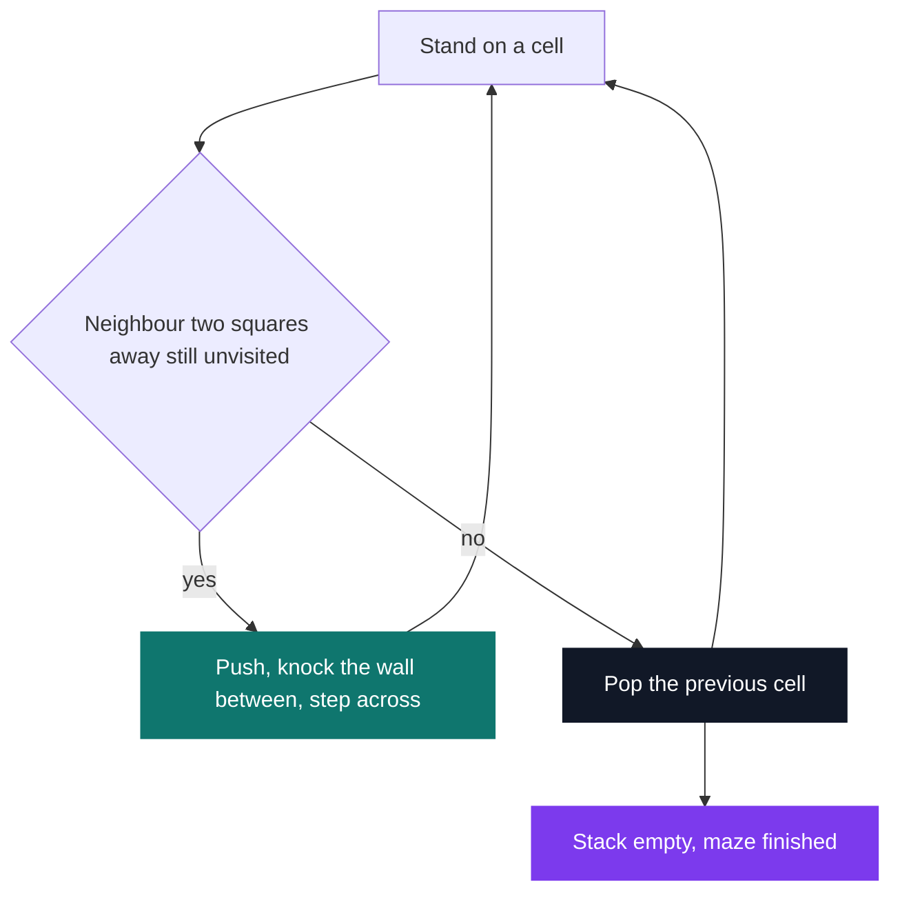

# Dante's Star

[](https://antoinepoisson.github.io/Old-School-Projects/projects/cpe-dante-2018)

  

[Tek1](../../README.md) / [CPE](../README.md) / **CPE_dante_2018**

*Elementary Programming in C (B-CPE-200) · March 2019 · 2 weeks · Grade B*

A maze generator and a maze solver, shipped as two binaries that never call each other. The
generator prints a random ASCII grid to stdout; the solver reads one back from a file and marks a
way out. The only thing joining them is a three-character text format.

That is where the difficulty sits. A solver written against its own generator quietly inherits that
generator's guarantees. This one is handed a file — possibly full of loops, possibly with no exit
at all — and still has to terminate with the right answer.


The subject walks the work through the nine circles of Dante's Hell: circle three asks for a perfect
maze, circle four for an imperfect one, circle five for the solver, and circles six to eight push on
performance and heuristics.

It also fixes the entire interface between the two programs, down to the detail that the last line
of a maze carries no trailing newline.

| Character | Meaning |
| --- | --- |
| `X` | wall |
| `*` | open cell |
| `o` | cell on the solution path, written by the solver only |

Start is the upper-left corner, finish the lower-right one, and either may be a wall — in which case
the correct answer is `no solution found`.

**Generation never checks that a maze is solvable, because it never has to.** The grid is a lattice:
even coordinates are cells, odd coordinates are the wall between two cells. Every carve jumps two
squares and removes the single wall in between.

The open set is therefore a spanning tree of the cell lattice — connected and acyclic by
construction, not by verification. The whole guarantee comes from the step size.



An 11×11 perfect maze — six cells by six, 35 carved passages — and the same grid as the solver
hands it back:

```text
$ ./generator/generator 11 11 perfect > maze.txt && ./solver/solver maze.txt

  maze.txt                solver output
  *X***X*****             oXoooX*****
  *X*X*XXX*X*             oXoXoXXX*X*
  ***X***X*X*             oooXoooX*X*
  XXXXXX*X*X*             XXXXXXoX*X*
  *****X*X*X*             ooo**XoX*X*
  *X*XXX*X*X*             oXoXXXoX*X*
  *X*****X*X*             oXoooooX*X*
  *XXXXXXX*X*             oXXXXXXX*X*
  ***X***X*X*             oooXoooX*X*
  XX*X*X*XXX*             XXoXoXoXXX*
  *****X*****             **oooXooooo
```

**The solver's defence against cycles is a second marker.** Stepping onto a square writes `o`;
backing out of one writes `0`. Only a `*` is walkable, so neither a square on the stack nor an
abandoned one can ever be entered twice.

That single line in `pop()` is what stops an imperfect maze — one with loops in it — from spinning
the search forever:

```c
void pop(variable_t *var, int *x, int *y)
{
    list_t *save = var->list;

    if (var->list == NULL)
        return;
    var->map[*y][*x] = '0';
    *x = var->list->x;
    *y = var->list->y;
    var->list = var->list->next;
    free(save);
}
```

Before printing, every surviving `0` is turned back into `*`, so the exploration leaves no trace.
Read the fifth line of the solver output above: `ooo**X` — those two `*` are a dead-end pocket the
search walked into, backed out of, and erased.

The returned path is the first one found, not the shortest: 45 squares here, with the direction
preference fixed at up, right, left, down. Nothing in the solver calls `rand`, so it is fully
deterministic on a given file — and that fixed order is the door the subject leaves open for
heuristics.

**At 25 cells or more on each side, the grid stops being carved in one piece.** `nbr_split` divides
each axis into bands of at most 24, `split_map_x` and `split_map_y` write the seam corridors, and
each band then gets its own call to the carver.

The ordering is the trick: the seams are written as `*` *before* any carving happens. So the same
"already open means already visited" test that drives the backtracker also stops it dead at the band
border. One mechanism does the connecting and the fencing.

One convention to know before reading `generator/sources/backtracker.c`: the carver tests its bounds
with `size_x` on the y axis and `size_y` on the x axis. Both call sites swap the two fields before
calling it and `handle_imperfect` swaps them back before printing — the carver works transposed.

## Beyond the baseline

- **Imperfect mazes by default.** After the perfect maze is built, `imperfect_maze` halves a budget
  seeded with the grid area — seven passes on an 11×11 — opening at most one extra wall per pass.
  The `perfect` argument skips the step and leaves the spanning tree intact.
- **Band splitting** for grids of 25 cells or more per side, with tunnels stitching the bands back
  together. The seams are visible in a 30×30: one full-width corridor at row 16, one full-height
  corridor at column 16.
- **Two independent builds**, each with its own Makefile, its own copy of the `libmy` static library
  and its own Criterion target. The two copies have already drifted: five of the eighteen sources
  differ between them.

## Technical stack

C, and nothing linked but libc. Twelve symbols cover both binaries — `open`, `read`, `write`,
`malloc`, `free`, `stat`, `atoi`, `strlen`, `strcmp`, `time`, `srand`, `rand` — and the generator
never opens a file at all. Five Makefiles: one root, one per binary, one per copy of the library.

| Component | `.c` files | Lines |
| --- | --- | --- |
| `generator/` (main + sources) | 9 | 563 |
| `solver/` (main + sources) | 4 | 247 |
| `generator/lib/my/` | 18 | 568 |
| `solver/lib/my/` | 18 | 537 |

## Verification

Each binary wires a Criterion target and a `gcovr` coverage step into its Makefile. What is committed
is the redirect-stdout scaffolding — one 20-line file per binary, asserting `cr_expect_eq(0, 0)` —
rather than a real corpus.

The regression check that actually did the work on this project is the picture. A perfect 11×11
either has exactly one route between any two open squares or it does not, and you can see which in a
second — that visual feedback loop is rare at this point in the curriculum, where most output is a
diff or an assertion message.

Behavioural checks that hold today: `X` in the top-left corner and a fully walled-off exit both print
`no solution found` and exit 0; bad arguments exit `84` on both binaries; the solver rejects anything
that is not a regular file, and refuses grids whose lines are not all the same length.

## Build & run

```bash
make                                    # builds generator/generator and solver/solver

./generator/generator 11 11 perfect     # width, height — perfect keeps the spanning tree
./generator/generator 41 41 > maze.txt  # no third argument: imperfect, with loops
./solver/solver maze.txt
```

---

[Tek1](../../README.md) / [CPE](../README.md) · [⌂ All projects](../../../README.md)
