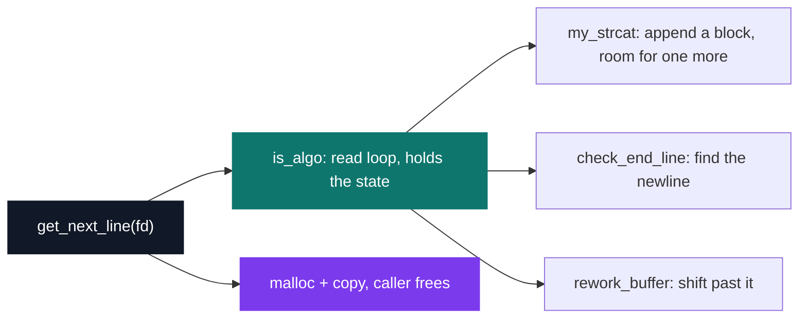
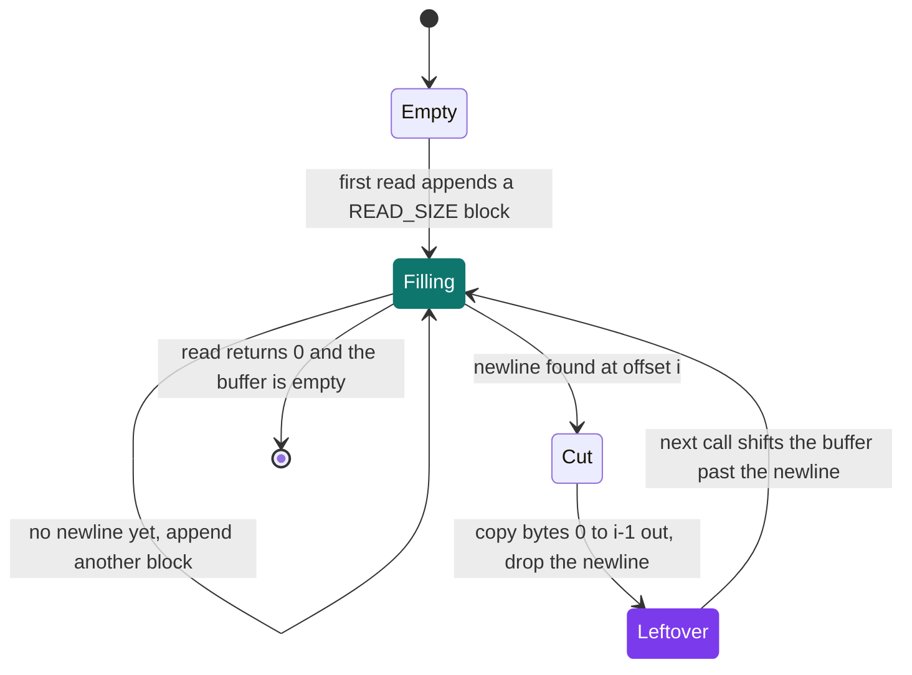

# Get Next Line

[](https://antoinepoisson.github.io/Old-School-Projects/projects/cpe-getnextline-2018)

   

**Epitech project** · Elementary Programming in C (Part II) (`B-CPE-111`) · Tek1 · 2018-2019 · 2 weeks · Grade A

> Reading a file line by line when the system only knows how to read blocks of bytes.

One call, one line, without its `\n`, in freshly allocated memory — on top of a system call that
has no idea what a line is. `read()` hands back a fixed-size block and stops wherever that block
ends: mid-word, or exactly on the newline you were looking for.

The three functions allowed here are `read`, `malloc` and `free`. Nothing else: no `strlen`, no
`strchr`, no `realloc`, no `stdio`. Every string operation in the file is written by hand.

The block size is not a run-time choice either. It is the `READ_SIZE` macro, and the grader
recompiles the file with a different value to check that no assumption was baked in. The same
137 lines of `get_next_line.c` must return the same lines at `READ_SIZE = 300` and at `READ_SIZE = 1`.

## Overview

One of the best-known projects of the curriculum, because it looks like a ten-line exercise and
is not. Every call returns exactly one complete line — and then remembers, until the next call,
the bytes it read past the end of that line.

Here is the whole difficulty, taken from the real fixture `tests/data.txt` and cut at
`READ_SIZE = 7`. Line 1 is 28 bytes long, so it survives four `read()` calls and its terminator
only shows up at the head of the fifth — already glued to the start of line 2.

| `read()` call | 7 bytes handed back | state of the accumulator |
| --- | --- | --- |
| #1 | `"BONJOUR"` | no newline, read again |
| #2 | `" 123456"` | no newline, read again |
| #3 | `"78 1234"` | no newline, read again |
| #4 | `"567890."` | no newline, read again |
| #5 | `"\nCECI e"` | newline at offset 28 — copy line 1 out, keep the rest |

Lose that trailing `"CECI e"` and line 2 comes back truncated. Return it twice and the file
grows. Everything else in the project is bookkeeping around that one invariant.

## How it works

`get_next_line.c` is 137 lines and five functions. `get_next_line` itself only validates the
descriptor and copies the line out; the read loop, the newline search and the buffer shift each
live in their own helper.



**The state.** The prototype is fixed at `char *get_next_line(int fd)`, so there is nowhere to
hang a context object. The leftover bytes live in `static` variables inside the read loop, which
is what the subject explicitly allows and what makes the function stateful.

```c
char *is_algo(int fd, int *line, int read_y, int *nbr)
{
    static char *buffer = NULL;
    static int nbr_charac = 0;
    static int ret_read = 0;
    char *reader = malloc(sizeof(char) * READ_SIZE);
```

`buffer` holds everything read and not yet handed back, `nbr_charac` the offset of the newline
inside it. The buffer is not trimmed at the moment a line is returned: the shift past the newline
happens at the head of the *next* call, in `rework_buffer`.



**End of file without a newline.** The loop condition is `read(fd, reader, READ_SIZE) > 0`, so
`ret_read` carries a 0/1 flag rather than a byte count, and it is 0 exactly when reading is over.
`check_end_line` takes that flag as its second argument: a buffer with no `\n` in it counts as a
complete line only once `read` has stopped returning bytes.

`data.txt` ends on `Ceci est la dernière ligne` with no terminator, so this path is exercised on
every full pass over the fixture.

**Audit note.** The state is a single global stream. `get_next_line` resets its line counter when
the descriptor changes, which skips `rework_buffer`, while the accumulated bytes of the previous
descriptor stay in place. Alternating calls on two open descriptors therefore replay line 1
instead of advancing — keying the buffer on the descriptor is what removes that coupling.

## What this project demonstrates

- Building a « line » abstraction on top of an API that only knows bytes
- Works whatever the buffer size, including 1 byte
- A subject reputed to be simple that catches everyone on the same point: what stays in memory between two calls

## Key features

- Reading a file descriptor line by line, whatever the buffer size
- Remainder kept between two calls through a static buffer
- Buffer size configurable at compile time through `READ_SIZE`

## Technical stack

- **Languages** — C
- **Tools** — Makefile, gcc, Criterion, Valgrind, Git
- **Concepts** — persistent buffer, buffered reading, fine-grained memory management

## Engineering constraints

- allowed functions limited to `read`, `malloc` and `free`
- read size set by the `READ_SIZE` macro defined in `get_next_line.h`, redefinable at compile time
- deliverable limited to `get_next_line.c` and `get_next_line.h` at the root, with no `main` function

## Beyond the baseline

- Criterion tests with dedicated data sets (`data.txt`, `void.txt`) covering the empty file and the file with no trailing newline

## Verification

Six Criterion tests in `tests/test_get_next_line.c`, backed by two fixtures: `data.txt`
(170 bytes, 11 lines, three of them empty, no final newline) and `void.txt` (0 bytes).

| Test | What it pins down |
| --- | --- |
| `read_line` | the first call returns line 1 without its `\n` |
| `read_line_two` | the second call resumes where the first stopped |
| `Invalid_fd` | a negative descriptor returns `NULL` before any `read` |
| `Invalid_file` | an empty file returns `NULL` on the first call |
| `Error_Read` | draining the whole file ends on `NULL`, unterminated last line included |
| `Cannot_Read` | a descriptor opened `O_WRONLY` returns `NULL` on the first call |

A stateful function is awkward to unit test, since the leftover of one case would poison the
next. Criterion runs each test in its own process, so the `static` accumulator starts empty every
time — that isolation is what makes these six tests independent.

Recompiled at `READ_SIZE = 300`, `7` and `1`, the function returns the same 11 lines from
`data.txt`, empty lines and unterminated last line included.

## Build & run

```bash
make tests_run          # compiles get_next_line.c with the Criterion suite and runs it
```

The deliverable ships no `main`, so there is nothing to link on its own — the pair of files is
meant to be dropped into another project. The `#ifndef` guard in the header lets the read size be
overridden from the command line:

```bash
gcc -DREAD_SIZE=1 -c get_next_line.c
```

---

[← CPE — algorithms in C](../README.md) · [↑ Tek1](../../README.md) · [⌂ All projects](../../../README.md)
