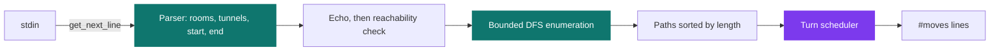
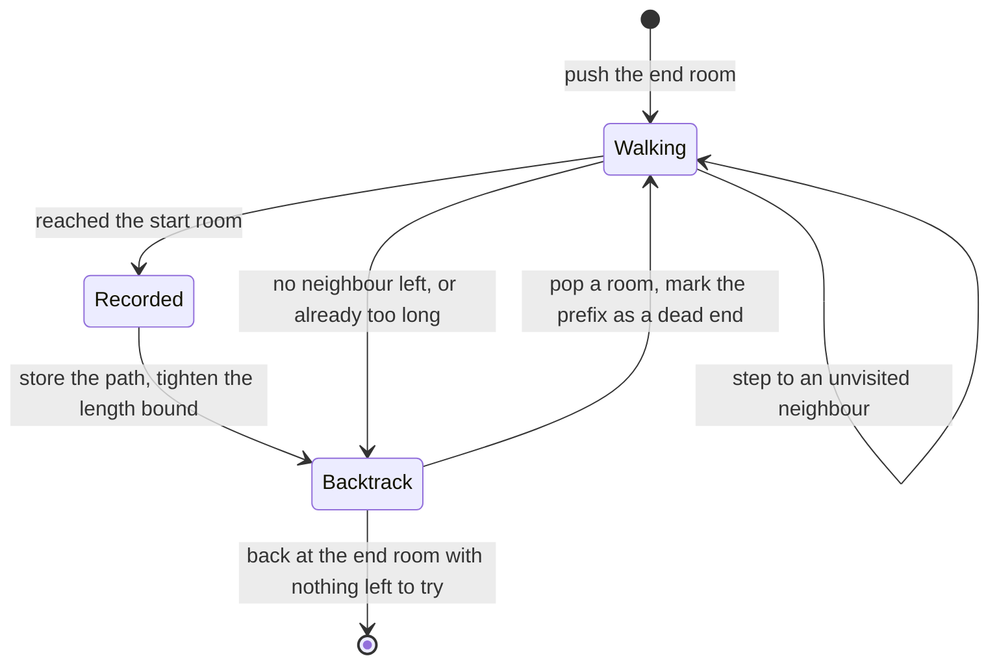

# Lem-in / A-maze-d

[](https://antoinepoisson.github.io/Old-School-Projects/projects/cpe-lemin-2018)

  

**Epitech project** · Elementary Programming in C (Part I) (`B-CPE-200`) · Tek1 · 2018-2019 · 2 weeks · Grade B

> Moving a whole colony across an ant farm, as fast as possible.

A room holds one ant per turn. That single rule turns a pathfinding exercise into a scheduling
problem: the shortest route is a one-lane road, and a colony queueing on it arrives later than the
same colony spread over several routes.

3,540 lines of C in 76 files. The allowed libc list stopped at `read`, `write`, `malloc`, `free`
and `getline`; the binary calls only the first four, so the line reader and the `printf` that echoes
the map back are hand-written too.

## Overview

The program reads a farm on standard input: an ant count, rooms with their coordinates, the
`##start` and `##end` markers, then the tunnels. It replays the map it understood, then prints one
line per turn until the last ant is out.

Ants move in parallel, one room per turn, and never share a room — except the start and the end,
which hold the whole colony.

Everything `./lem_in` writes for a four-room line farm carrying three ants — the echo first, then
the moves, verbatim:

```text
#number_of_ants
3
#rooms
##start
start 1 0
r1 2 0
r2 3 0
##end
end 4 0
#tunnels
start-r1
r1-r2
r2-end
#moves
P1-r1
P1-r2 P2-r1
P1-end P2-r2 P3-r1
P2-end P3-r2
P3-end
```

Ant 1 leaves on turn 1, ant 3 arrives on turn 5. A route of *L* tunnels carrying *k* ants ends on
turn *L + k − 1* — the ants file in one per turn behind each other. That formula is the whole
project. (The subject was later reissued as *A-maze-d*, with robots instead of ants; this
implementation still prints the original `#number_of_ants` header.)

## How it works

Parse, echo, search, schedule: four stages across 16 source files. One `variable_t` of 12 fields —
the room table, the recorded paths, the dead ends, the length bound — is threaded through twelve
of them.



**Parsing is the trap.** The format has three line shapes — an ant count, `name x y`, `a-b` — plus
`#` comments and `##` commands, and every anomaly gets its own message on `stderr`.

| Input anomaly | Message |
| --- | --- |
| Ant count missing | `error: undefined number anthill.` |
| Ant count given twice | `error: multi defined number anthill.` |
| Two rooms sharing a name | `error: node duplicate 'r1'.` |
| Two rooms at the same coordinates | `error: same position 'r2'.` |
| Tunnel *from* an undeclared room | `warning: node 'ghost' does not exist.` |
| Tunnel *to* an undeclared room | `warning: link same node 'ghost'.` |
| Room with no tunnel at all | `warning: useless node 'lonely'.` |

The two ends of a tunnel are resolved by different branches, and the second one falls through to the
self-link message — the same fault reads two ways depending on which end is missing.

**A bad line stops the parse; it does not have to end the run.** The offending line is blanked in the
line array, which truncates both the parse and the echo there. `failure_parsing()` then asks the only
question that matters: is there still an ant count, a start, an end, and a route between them?

A farm whose last tunnel points at an undeclared room, run for real:

```text
warning: link same node 'ghost'.
warning: '' stopped the parsing.
warning: parsing success !
```

The colony still crosses and the dangling tunnel never reaches the `#tunnels` echo. Move that line
higher up, lose every tunnel below it, and the verdict flips to `error: fatal errors parsing !`
with exit 84.

That reachability check is not a second implementation: `check_end_start_link()` runs the solver's
own search loop and returns as soon as one path completes. Same code, one branch changed.

**The search is a hand-rolled stack, not recursion.** The current path lives in a linked list and
the loop walks it forward and backward, so depth costs heap rather than call frames. Three cases per
iteration, in priority order.

```c
for (int cas = -1; posi && check_end_algo(var, posi); cas = -1) {
    if (cas == -1 && check_complete_path(var, posi, &cas))
        posi = complete_path(var, posi);
    if (cas == -1 && check_move_forward(var, posi, &cas))
        posi = move_forward(posi, cas);
    if (cas == -1)
        posi = move_back(var, posi);
}
```

The walk starts at `##end` and looks for `##start`. Two prunings keep it affordable: every abandoned
prefix is written to `bad_path` and never walked again, and `limit_path` holds the room count of the
best route so far, so any partial path that would grow past it is dropped on the spot.



**Scheduling.** `sort_array()` orders the surviving routes by increasing length, then the simulator
advances every ant by one room per turn and refuses a step when the target room is taken. The start
and the end are exempt, which is what lets ants trickle in one per turn.

`move_ants()` hands the simulator `tab_path[0]` — the shortest route only. Take a five-room farm
where `start` reaches `end` two ways, both vertex-disjoint: two tunnels through `a1`, three tunnels
through `b1` then `b2`. Four ants could be split three ways.

| Four ants split as | Last arrival |
| --- | --- |
| 4 via `a1`, 0 via `b1-b2` | turn 5 |
| 3 via `a1`, 1 via `b1-b2` | turn 4 |
| 2 via `a1`, 2 via `b1-b2` | turn 4 |

The measured run takes 5 turns, and the length bound is why: once the two-tunnel route is recorded,
`limit_path` refuses the three-tunnel one, so the second route is never enumerated at all. Choosing
*k* per route to minimise the maximum of *Lᵢ + kᵢ − 1* needs that bound relaxed first — it is a flow
problem, not a shortest-path one.

## What this project demonstrates

- Exhaustive path enumeration with pruning by the length of the best known path
- Parsing of a deliberately treacherous input format, reprinting what was parsed and warning precisely on each malformed line

## Key features

- Moving N ants from a start room to an end room, turn by turn, one ant per room
- Full parsing of the input format: ant count, rooms, tunnels, `##start` and `##end` commands
- Enumeration of the start-to-end routes that fit under the length bound, sorted by length
- Turn-by-turn output in the expected format, and exit code 84 on a fatal map

## Technical stack

- **Languages** — C
- **Tools** — Makefile, gcc, Criterion, Git
- **Concepts** — graph theory, path enumeration with pruning, scheduling under constraint

## Engineering constraints

- plan read from standard input
- one ant per room and per turn, except start and end which hold as many as needed
- no libc function beyond read/write/malloc/free/getline
- imposed output: the parsed map echoed back, then `#moves` lines in the form `Pn-room`

## Beyond the baseline

- A library enriched with a homemade my_printf and get_next_line, reused for all the parsing
- Criterion tests on parsing

The bundled library is 42 `.c` files and six headers, 1,526 lines: `my_printf` with its flags,
`get_next_line`, and the string helpers the parser leans on. `getline` was on the allowed list and
went unused — the reader sits straight on `read()`, one byte per call behind a `READ_SIZE` macro.

## Verification

67 Criterion test cases in `tests/`, 72 assertions across 26 suites, each one redirecting `stdout`
and `stderr` so the imposed output can be matched exactly. `make tests_run` compiles with
`--coverage` and reports through `gcovr`.

## Build & run

```bash
make
./lem_in < farm.map
```

Produces `lem_in`. It takes no arguments — the map arrives on standard input, and a map with no
route from start to end exits 84 after echoing what was parsed.

---

[← CPE — algorithms in C](../README.md) · [↑ Tek1](../../README.md) · [⌂ All projects](../../../README.md)
