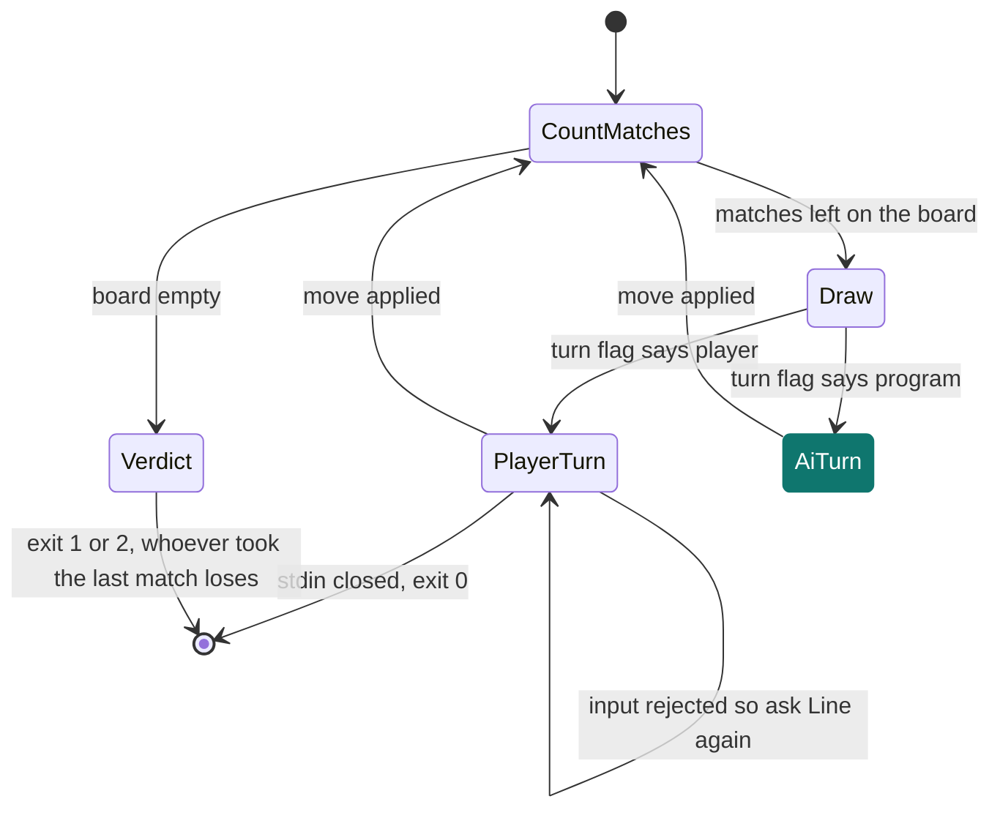
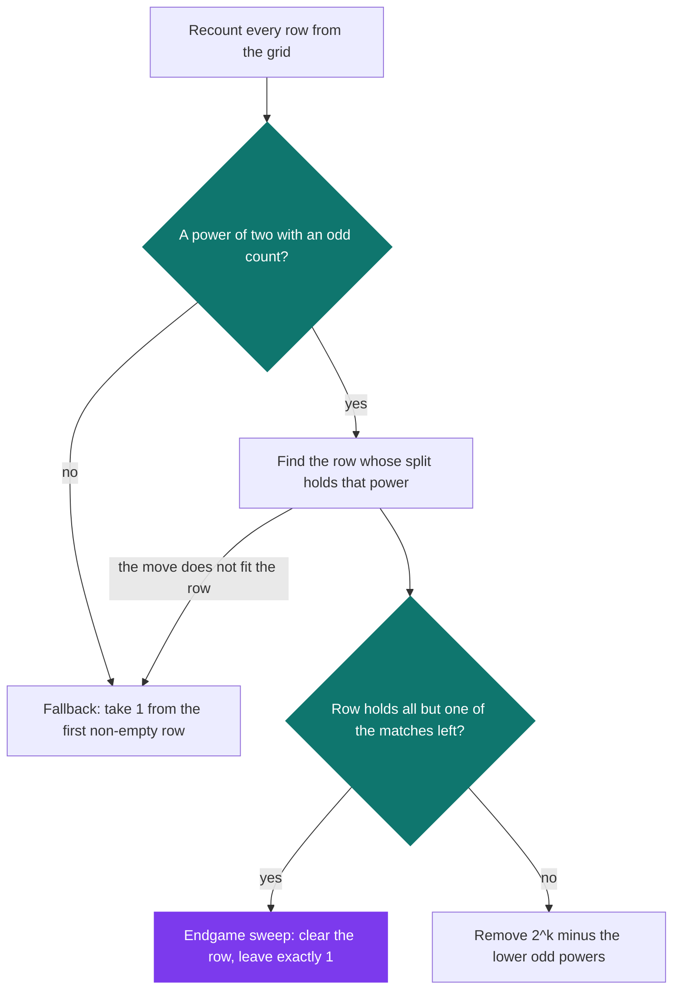

# Matchstick

[](https://antoinepoisson.github.io/Old-School-Projects/projects/cpe-matchstick-2018)

  

**Epitech project** · Elementary Programming in C (Part I) (`B-CPE-110`) · Tek1 · 2018-2019 · 2 weeks · Grade A

> The game of Nim against an artificial intelligence you have to beat.

## Overview

The authorised function list for this project includes `random()` and `srandom()`. The opponent everyone was expected to write picks a legal move and hopes. This one computes the balancing move from Nim theory, and wins close to four games in five against a random player.

Nim is a solved game: a position is lost for whoever moves next when the row sizes cancel each other out, power of two by power of two. The work here is turning that theorem into a player — under a cap on matches per turn, and under the misère rule where taking the last match loses.

```text
$ ./matchstick 4 3
*********
*   |   *
*  |||  *
* ||||| *
*|||||||*
*********

Your turn:
Line: 4
Matches: 1
Player removed 1 match(es) from line 4
*********
*   |   *
*  |||  *
* ||||| *
*|||||| *
*********

AI's turn...
AI removed 1 match(es) from line 1
```

## How it works

`main` takes two integers: the number of rows and the maximum matches per turn. Anything else — a letter, a missing argument, 1 row, 100 rows — is `Invalid Argument.` on stderr and exit 84.

**The board is the state.** `is_initialization` allocates a `char **` pyramid where row *i* holds 2*i*−1 matches, drawn as `|` characters inside a `*` frame. No array of row counts exists anywhere in the program: end-of-game detection, the matches left on a line, and the AI's own arithmetic all recount by scanning that grid for `|`. The render buffer and the model are the same object.



**Reading a move.** `getline` was allowed, yet the delivered code carries its own `get_next_line`, reading stdin three bytes at a time. End of input is not signalled by `NULL` — `NULL` would leave the prompt loop spinning on a dead pipe. It comes back as a 23-character sentinel string the caller compares against, and the game exits with 0.

**The AI.** `calcul_pow_two` splits every row into powers of two and counts how many pieces of each power the whole board holds. A power whose count is odd is the unbalanced one: taking that piece away leaves every count even, which is the losing position for whoever moves next.

The decision that makes it work is the cap. The decomposition never goes above the largest power of two the AI could actually remove in one turn:

```c
int calcul_limit_pow(var_t *var)
{
    int limit = 0;

    for (int i = 0; 1; i++) {
        if (var->nbr_remove >= my_compute_power_rec(2, i))
            limit = i;
        else
            break;
    }
    return (limit);
}
```

With a cap of 3, a row of 7 reads as 2+2+2+1 rather than 4+2+1, because 4 is a move that cannot be played. Applied to the opening 4-row board, both counts are already even:

| Row | Matches | Pieces of 2 | Pieces of 1 |
| --- | --- | --- | --- |
| 1 | 1 | 0 | 1 |
| 2 | 3 | 1 | 1 |
| 3 | 5 | 2 | 1 |
| 4 | 7 | 3 | 1 |
| **Total** | 16 | **6 — even** | **4 — even** |

Game theory agrees with the table here: on heaps 1-3-5-7 with a cap of 3, the player who moves first loses to perfect play, and the rules make the human move first. The program starts one move ahead, and its job is not to hand the lead back.



Eight counters, `2^0` through `2^7`, cover the whole game: the board is capped at 99 rows, so the longest row holds 197 matches and never reaches `2^8`.

## What this project demonstrates

- An AI grounded in Nim game theory, computed through decomposition into powers of two and parity rather than a direct XOR
- Misère variant handling: the strategy inverts at the end of the game, when a single row still holds several matches
- Fallback on an elementary AI when no winning move exists

## Key features

- Terminal game of Nim against the computer, matchstick board redrawn each turn
- Player input validated line by line, maximum matches per turn respected
- End-of-game detection and designation of the loser

**A rejected move rewinds the whole turn.** A bad match count does not re-ask for the count: it drops the move and prints `Line: ` again, which is exactly what the subject demands. Every message a player can trigger goes to stdout, errors on the arguments to stderr.

| Bad input | Message printed on stdout |
| --- | --- |
| Anything other than digits | `Error: invalid input (positive number expected)` |
| Line 0, past the last row, or already empty | `Error: this line is out of range` |
| Zero matches | `Error: you have to remove at least one match` |
| Above the per-turn cap | `Error: you cannot remove more than 3 matches per turn` |
| More than the row holds | `Error: not enough matches on this line` |

## Technical stack

- **Languages** — C
- **Tools** — Makefile, gcc, Criterion, Git
- **Concepts** — game theory (Nim sum), decomposition into powers of two and parity, misère variant, terminal game loop

12 source files and 818 lines for the game, on top of a 30-function `libmy` rebuilt by hand — `my_getnbr`, `my_strcmp`, `my_put_nbr`, `my_compute_power_rec` — because the standard library was not on the table.

## Engineering constraints

- imposed binary: matchstick
- allowed functions: read, write, malloc, free, time, getpid, random, srandom, getline
- matches removed from the right, the user always starts
- imposed return codes: 1 if the player wins, 2 if the AI wins
- 1 < number of rows < 100 and maximum matches per turn > 0

## Beyond the baseline

- An AI based on the winning strategy of Nim: decomposition into powers of two and search for the balanced position (is_extension_ai.c), instead of a random move
- A second-level fallback AI for when the position is already lost

The suggested bonuses were a graphical interface, a scored game with difficulty levels, and a motion-capture input device. The effort went into the opponent instead: the program plays the balancing move whenever the parity table exposes one, and falls back on "take one match" only when every count is already even.

## Verification

`tests/` holds four Criterion cases on `my_getnbr` and its two helpers — the parser every argument and every move passes through.

The strategy is measured by playing. Four runs of 400 games — eight combinations of board size and per-turn cap, 50 games apiece — against an opponent that plays a random legal move: the program takes between 306 and 322 of them, and across all 1600 it never proposed a move that breaks the cap or over-draws a row.

One audit note, because it is the interesting part: the parity table implements normal-play Nim, and `spe_cas` patches the misère ending by sweeping a row down to a single match. That patch is exact for uncapped Nim; add a per-turn cap and the two games stop lining up, so a perfect opponent finds lines the table does not see. A random one still takes about one game in five.

## Build & run

```bash
make
./matchstick 4 3   # 4 rows, at most 3 matches per turn
```

| Exit code | Meaning |
| --- | --- |
| `1` | the player wins |
| `2` | the AI wins |
| `84` | invalid arguments |
| `0` | stdin closed before the end of the game |

---

[← CPE — algorithms in C](../README.md) · [↑ Tek1](../../README.md) · [⌂ All projects](../../../README.md)
