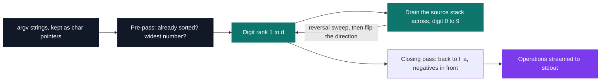
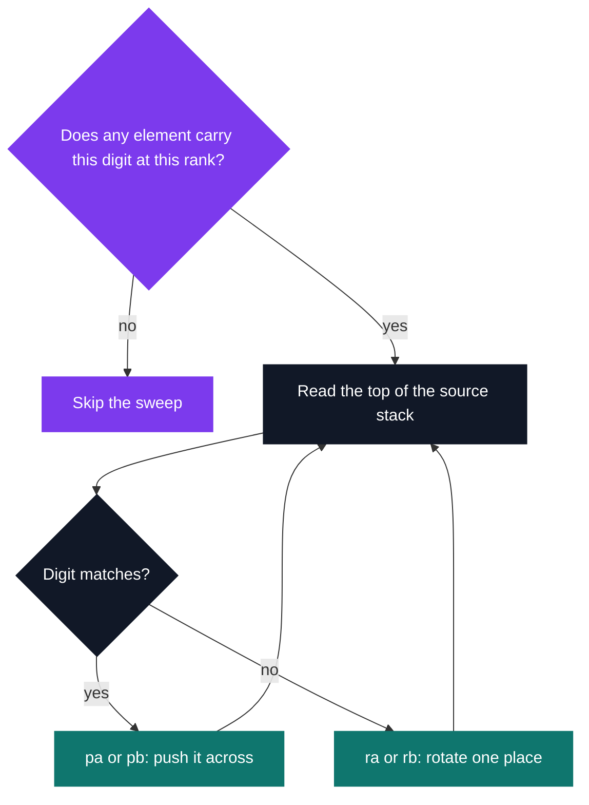

# Push Swap

[](https://antoinepoisson.github.io/Old-School-Projects/projects/cpe-pushswap-2018)

  

**Epitech project** · Elementary Programming in C (Part I) (`B-CPE-110`) · Tek1 · 2018-2019 · 2 weeks · Grade A

> Sorting a list with two stacks, eleven legal moves, and a score that counts every one of them.

## Overview

The operation set is the whole difficulty. Two stacks, eleven moves, and every move only ever touches
a stack top: no indexing, and no way to bring two chosen values next to each other without rotating
both of them into position first.

So a correct sort is only the entry ticket. The grade is the number of operations printed, which
turns "sort these integers" into "sort them on a machine with two registers, no random access, and a
bill for every instruction".

| Operations | Effect | Emitted here |
| --- | --- | --- |
| `sa` `sb` `sc` | swap the top two of `l_a`, of `l_b`, or of both | `sb`, once, to close the line |
| `pa` `pb` | move the top element across to the other stack | both |
| `ra` `rb` `rr` | rotate up: the first element becomes the last | `ra`, `rb` |
| `rra` `rrb` `rrr` | rotate down: the last element becomes the first | `rrb` |

Five of the eleven carry the whole sort. The two stacks are never rotated together, and the single
`sb` that reaches the output runs on an empty `l_b`.

## How it works

The strategy is an LSD radix sort on the **decimal** digits. Pass *k* collects every element whose
*k*-th digit from the right is 0, then 1, and so on up to 9, pushing each one across to the other
stack. After *d* passes — *d* being the digit width of the widest number — the stack is ordered.



Inside a pass the source stack is swept in place: read the top element, then either push it across
or rotate it out of the way.



**The direction alternates.** Rank *k* drains `l_a` into `l_b`, rank *k+1* drains `l_b` back. But a
push reverses the order, so between two ranks the code drains the stack across and straight back
again: `2n` pushes plus `n` rotations, `3n` operations that only undo the reversal.

That sweep is exactly measurable. For 100 five-digit values it is 1 200 of the ~4 000 operations
printed — 30% of the score spent restoring an order the previous rank had already produced, and the
clearest target for a cheaper version of this program.

**Empty digits are skipped.** `check_utility_united()` walks the source stack before each digit and
reports whether anything carries it; when nothing does, the sweep for that digit — up to one full
rotation of the stack — never runs. On `5 8 5 8 5 8 5 8` that guard is 21 operations against 69.

The sort itself never turns a value into an `int`. `linked_list_t.data` is a `char *` pointing
straight into `argv`, and a digit is read by reversing the string in place, indexing it, and
reversing it back:

```c
my_revstr(string);
if ((string[size - 1] - '0') == united) {
    my_revstr(string);
    take_element_one(&(*l_a), &(*l_b));
    modif = 1;
    i++;
}
else
    my_revstr(string);
```

Only the pre-pass parses anything: it calls `my_getnbr` once per argument to decide whether the input
already arrives sorted, in which case the program prints a bare newline and stops.

Both stacks are circular doubly linked lists, so `ra` is two pointer assignments and no element is
ever copied. Each operation is written the instant it is applied — `write(1, "ra ", 3)` sits inside
the rotation itself — so no instruction list is ever held in memory.

That streaming has one consequence: the program cannot know which operation will be its last. The
closing `sb` in `main()` answers it. `l_b` is empty by then, so `sb` is a legal no-op, and it carries
the required newline without leaving a trailing space. Price: exactly one operation on the score.

```text
$ ./push_swap 5 2 8 1
ra ra ra pb ra pb ra pb ra pb pa pa pa pa sb
op     stack A     stack B     one radix pass, digits scanned 0 -> 9
start  5 2 8 1     -
ra     2 8 1 5     -
ra     8 1 5 2     -
ra     1 5 2 8     -           the 1 is on top
pb     5 2 8       1
ra     2 8 5       1
pb     8 5         2 1         the 2
ra     5 8         2 1
pb     8           5 2 1       the 5
ra     8           5 2 1       rotating a one-element stack: a wasted move
pb     -           8 5 2 1     the 8
pa     8           5 2 1
pa     5 8         2 1
pa     2 5 8       1
pa     1 2 5 8     -           drained back, ascending
sb     1 2 5 8     -           no-op on an empty stack, closes the line
```

## What this project demonstrates

- A radix sort reshaped for an operation set with neither random access nor arbitrary comparison
- Two circular doubly linked lists, making rotation and transfer constant time
- Instructions emitted as they happen, with no intermediate list in memory

## Key features

- Sorts using push and rotate only: `pa`, `pb`, `ra`, `rb`, `rrb`
- One pre-pass over `argv` detects an already-sorted input and measures the widest number
- The digit sweep orders by magnitude; a closing pass lifts the negatives out and puts them back in front
- Duplicates and mixed signs both sort correctly

## Technical stack

- **Languages** — C
- **Tools** — Makefile, gcc, Git
- **Concepts** — stacks over circular doubly linked lists, LSD radix sort, operation count optimisation
- **Size** — 9 `.c` files and 4 headers, 613 lines, on top of a hand-written `libmy` of 30 files

## Engineering constraints

- imposed binary: `push_swap`
- only the `sa`, `sb`, `sc`, `pa`, `pb`, `ra`, `rb`, `rr`, `rra`, `rrb`, `rrr` operations are allowed
- only `write`, `malloc` and `free` are allowed — the sources pull in `<unistd.h>`, `<stdlib.h>` and
  `<stddef.h>` and nothing else, and there is no `printf` in the tree
- output: operations separated by single spaces, no leading or trailing space, one closing newline
- errors on the error output, exit code 84

## Beyond the baseline

The obvious first answer is a comparison sort driven by the stack tops. That is exactly what the
operation set punishes: both operands must be rotated into position before they can be compared, so
every comparison is paid for in moves. Radix never compares — it reads one digit of one element.

| Input | Operations printed |
| --- | --- |
| `1 2 3 4 5`, already sorted | 0 |
| `5 2 8 1` | 15 |
| 100 values, 2 digits wide | ~1 650 |
| 100 values, 4 digits wide | ~3 340 |
| 100 values, 5 digits wide | ~4 000 |
| 400 values, 5 digits wide | ~16 000 |

*Each row is an average over 20 random inputs, measured by running the binary.*

The cost model that falls out is the honest result: the bill is linear in the number of elements and
in their digit width, never `n log n`. Five-digit values cost 40 operations per element whether there
are 50 of them or 400, and widening the input from 2 to 4 digits doubles the total.

## Verification

No test file ships with the repository, though the Makefile keeps a `tests_run` rule wired for
Criterion. Checked for this archive by replaying the emitted operations through a stack simulator:
500 random inputs of 2 to 40 values, positive and mixed-sign, every one of them reproducing the
sorted list with `l_b` left empty. The sources compile clean under `-Wall -Wextra`.

## Build & run

```bash
make                    # the shipped Makefile passes --extra; modern clang wants -Wextra
./push_swap 5 2 8 1     # ra ra ra pb ra pb ra pb ra pb pa pa pa pa sb
./push_swap 1 2 3 4 5   # a single newline: already sorted, nothing to print
```

Produces `push_swap`.

---

[← CPE — algorithms in C](../README.md) · [↑ Tek1](../../README.md) · [⌂ All projects](../../../README.md)
