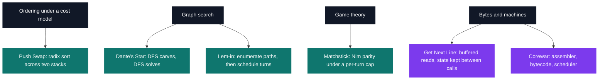

# CPE — algorithms in C

[← Tek1](../README.md) · [⌂ All projects](../../README.md)

Six algorithm projects in C, each written against a short allow-list of libc calls with a hand-built `libmy` underneath it.
The heaviest is Corewar: 11,813 lines across 276 files, an assembler and a virtual machine whose 2,192-byte header has to match another team's implementation byte for byte, or nothing executes at all.
At the other end, Get Next Line — 137 lines that must return the same lines whether `read()` hands back 300 bytes at a time or 1.

| Project | What it is | Size | Grade |
| --- | --- | --- | --- |
| [Matchstick](CPE_matchstick_2018) | Nim against an AI that computes the balancing move from a parity table | 2 weeks | A |
| [Push Swap](CPE_pushswap_2018) | LSD radix sort on two stacks, scored by the number of moves printed | 2 weeks | A |
| [Get Next Line](CPE_getnextline_2018) | A line reader built on `read`, `malloc` and `free`, at any buffer size | 2 weeks | A |
| [Dante's Star](CPE_dante_2018) | A maze generator and a maze solver joined by a three-character format | 2 weeks | B |
| [Lem-in / A-maze-d](CPE_lemin_2018) | Path enumeration plus turn scheduling, one ant per room per turn | 2 weeks | B |
| [Corewar](CPE_corewar_2018) | An assembler and a VM where champions fight over 6,144 shared bytes | 2 weeks · team | B |

The six split into four families, and the same tools keep coming back: an explicit stack instead of recursion, and a cost model that decides what "correct" means.

## Projects (6)

### Elementary Programming in C (Part I) (`B-CPE-110`)

- **[Matchstick](CPE_matchstick_2018)** — *2 weeks · Grade A*
  The game of Nim against an AI that reads the board as a parity table and plays the winning move.

- **[Push Swap](CPE_pushswap_2018)** — *2 weeks · Grade A*
  Sorting a list with two stacks, eleven legal moves, and a score that counts every one of them.

### Elementary Programming in C (Part II) (`B-CPE-111`)

- **[Get Next Line](CPE_getnextline_2018)** — *2 weeks · Grade A*
  Reading a file line by line when the system hands back raw blocks of bytes.

### Elementary Programming in C (Part I) (`B-CPE-200`)

- **[Dante's Star](CPE_dante_2018)** — *2 weeks · Grade B*
  Two binaries that share nothing but a text format: one carves mazes, the other finds the way out.

- **[Lem-in / A-maze-d](CPE_lemin_2018)** — *2 weeks · Grade B*
  Moving a whole colony across an ant farm, one ant per room per turn, as fast as the routes allow.

- **[Corewar](CPE_corewar_2018)** — *2 weeks · Team · Grade B*
  A virtual machine where programs fight to survive in memory, and the assembler that feeds it.
