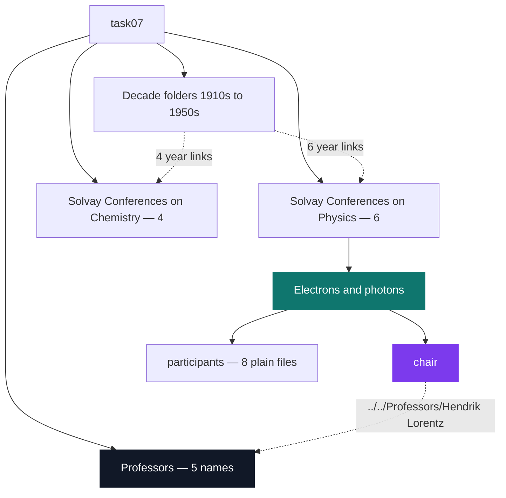

# C Pool — Day 01: the Unix environment

[](https://antoinepoisson.github.io/Old-School-Projects/projects/cpool-day01-2018)

  

[Tek1](../../README.md) / [CPool](../README.md) / **CPool_Day01_2018**

*Solo · Unix & C Lab Seminar (B-CPE-100) · 1 day · Grade B*

Day one of the pool compiles nothing. The grader is a program that pulls a Git repository over SSH
and inspects a filesystem: the right files, in the right directories, with the right permission
bits and the right bytes inside. There is no partial credit for "almost the right shape".

**The sharpest exercise of the day is 46 bytes long.** `mr_clean` deletes every Emacs leftover
below the current directory — the `file~` backups and the `#file#` auto-saves — using one single
`find` command, with no `;` and no `&&` allowed anywhere in it.

Those two bans remove both obvious answers at once. `-exec rm {} \;` needs the semicolon. Two
`find` runs chained back to back need the `&&`. What is left is `find`'s own grammar:

```sh
find . \( -name '*~' -o -name '#*#' \) -delete
```

The parentheses are load-bearing. `find` binds its implicit AND tighter than `-o`, so without them
`-delete` attaches to `#*#` alone and every `~` backup quietly survives — a command that looks
correct, exits 0, and does half the job:

```console
$ ls -1
#main.c#
main.c
main.c~
$ find . -name '*~' -o -name '#*#' -delete    # same test, no parentheses
$ ls -1
main.c
main.c~
```

It is the day's clearest lesson: on this exercise, reading `man` to the end beats guessing.

**The eight deliverables outside the tree.**

| Deliverable | Content | Mode |
| --- | --- | --- |
| `task01/test01` | empty file | `644` |
| `task01/test02` | `Yer a wizard Harry.` — 19 bytes, no newline | `755` |
| `task01/test03` | byte-identical to `test02` (same Git blob) | `755` |
| `task02/z` | `Z` and a line feed — checked with `cat -e` | `644` |
| `task03/midLS` | `ls -m -p` | `755` |
| `mr_clean` | the single `find` above | `755` |
| `push_that.sh` | `git add --all` / `commit -m "$1"` / `push origin master` | `755` |
| `prepare_my_repo.sh` | `blih` repository create, then grant read to the grader | `755` |

Eight files, 358 bytes in total. The mode column is not decoration: a script delivered `644` is a
script the grader cannot execute, and the day is marked on that bit as much as on the text.

Two of those files are the delivery pipeline itself. `prepare_my_repo.sh` creates a repository on
the school's forge, grants the collection account read access to it — a deliverable nobody can read
is a zero — then reads the ACL straight back to prove the grant landed. `push_that.sh` takes the
commit message as `$1`, so the whole submission collapses to one command.


**task07 — the Solvay archive.**

The centrepiece is rebuilding the Solvay conference archive by hand: 21 directories and 13 plain
files, stitched together by 20 relative symbolic links. Nothing in it is ever stored twice.

Each of the ten conferences carries a `chair` link pointing back up into `Professors/`, and the
decade folders carry one link per conference year, pointing across into the conference it opened.
`Hendrik Lorentz` chaired five of those ten and still exists exactly once on disk.

The shape the tree has to reproduce, on one decade and one conference:

```text
task07/1920s/
├── 1921 -> ../Solvay Conferences on Physics/Atoms and electrons
├── 1924 -> ../Solvay Conferences on Physics/Electric conductivity of metals and related problems
└── 1927 -> ../Solvay Conferences on Physics/Electrons and photons

task07/Solvay Conferences on Physics/Electrons and photons/
├── chair -> ../../Professors/Hendrik Lorentz
└── participants/
    ├── A. Einstein
    ├── E. Schrodinger
    ├── H.A. Lorentz
    ├── M. Planck
    ├── M. Sklodowska-Curie
    ├── N. Bohr
    ├── W. Heisenberg
    └── W.L. Bragg
```



Every name in there is a trap for a beginner's shell. `Oxygen, and its chemical and biological
reactions` carries a comma and six spaces: an unquoted `mkdir` turns it into seven directories
instead of one. `Electrons and photons/participants` holds the eight physicists of the 1927
conference — `A. Einstein`, `N. Bohr`, `M. Sklodowska-Curie`, `W. Heisenberg` and four more.

**An audit note on the archive.** In this copy the 20 links are gone. The names and the directory
skeleton crossed into Git; the targets did not. Every `chair` is now a zero-byte regular file in
mode `100644`, and the ten year links vanished outright, which leaves `1910s` to `1940s` empty and
untracked. `task01/test03` tells the same story: specified as a symbolic link to `test02`, it
stores that file's bytes instead of its path.

The two directories the tree wanted empty from the start — `1950s` and `Isotopes/participants` —
each carry a `.file` placeholder, the standard trick for making an empty directory committable.
That is why `find task07 -type f` counts 25 here: 13 plain files, 10 flattened links, 2 markers.

That detail is the day's real lesson stated backwards: on a Unix filesystem the information lives
in names, modes and links, not only in file contents. Lose one of the three and the deliverable is
gone even though every byte is still there.

The deliverables are tiny; the habits are not. Read the manual before guessing, treat permissions
as part of the artefact, quote everything, and reduce the delivery to a single command. Every
later project in this archive assumes all four.

## Technical stack

Shell · `find`, `ln`, `tar`, Git · `blih`, the school's repository manager.

The day closes by packing the Solvay tree into a gzipped tarball with `tar` — that archive is not
kept in this copy, the expanded tree is.

## Build & run

There is no unified binary for this day: the deliverables are shell commands, scripts and a
filesystem tree, each intended to be inspected or executed independently.

```sh
./mr_clean                     # prune ~ and #...# leftovers below .
./task03/midLS                 # ls -m -p : comma-separated, directories end in /
./push_that.sh "commit message"

find task07 -type d | wc -l    # 21
find task07 -type f | wc -l    # 25
```

---

[Tek1](../../README.md) / [CPool](../README.md) · [⌂ All projects](../../../README.md)
