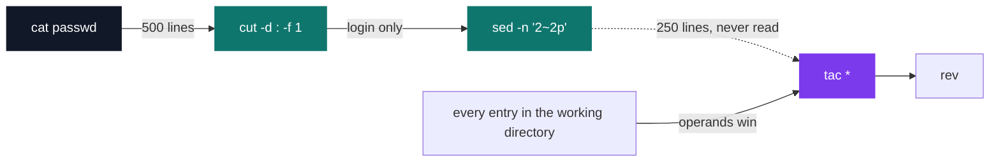

# C Pool — Day 02: shell scripting

[](https://antoinepoisson.github.io/Old-School-Projects/projects/cpool-day02-2018)

 

[Tek1](../../README.md) / [CPool](../README.md) / **CPool_Day02_2018**

*Solo · Unix & C Lab Seminar (B-CPE-100) · 1 day · Grade B*

One of the day's tasks does not say what to write. It ships a file enciphered with a 26-letter
substitution key, and the brief allows a **single command line** to recover the plaintext. The
cipher has to be broken before the exercise can be read.

Here is the file as it sits in the repository, `Day02/task05`:

```text
piihywgacye.cs

Qbagy l cnbakg gslg glfy gsy ijgkjg it l "nlg klccqe" lhe bykplnyc:
- ymybw ‘gsyi1’ ow ‘Qapy Y. Niwigy’
- ymybw ‘cgymyh1’ ow ‘Elttw Ejnf’
- ymybw ‘lbhlje1’ ow ‘Kibfw Kau’
- ymybw ‘kaybby-rylh’ ow ‘Dlbmah gsy Dlbgalh’
Tjbgsybdiby, gsac niddlhe csijpe ihpw eackplw gsy pahyc dyhgaihhahu l giih.
```

The key is `LONEYTUSARFPDHIKZBCGJMQVWX`. Its first eight letters are `LOONEY TUNES` with the
repeats dropped; the remaining eighteen are the rest of the alphabet, shuffled. Inverting a
substitution cipher is exactly what `tr` does, so the whole break is one process, both cases mapped
in a single pass:

```console
$ tr 'LONEYTUSARFPDHIKZBCGJMQVWXloneytusarfpdhikzbcgjmqvwx' 'A-Za-z' < Day02/task05
looneytised.sh

Write a script that take the output of a "cat passwd" and replaces:
- every ‘theo1’ by ‘Wile E. Coyote’
- every ‘steven1’ by ‘Daffy Duck’
- every ‘arnaud1’ by ‘Porky Pig’
- every ‘pierre-jean’ by ‘Marvin the Martian’
Furthermore, this command should only display the lines mentionning a toon.
```

Everything else that day is text-stream plumbing under one rule: **one to three lines per script.**
Seven scripts, nine command lines in total once the shebangs are dropped, and not a single `if`,
`for` or `while` among them.

| Script | What it runs |
| --- | --- |
| `find_sh.sh` | `find . -name '*.sh'` |
| `count_files.sh` | `find * -type f \| wc -l` |
| `skip.sh` | `sed -n '1~2p'` |
| `how_many_are_we.sh` | `cut -d ";" -f 3 \| grep -i "$1" \| wc -l` |
| `gotta_catch_them_all.sh` | `cut -d";" -f 5 \| grep -i " $1" \| wc -l` |
| `looneytised.sh` | four chained `sed` substitutions, then one `grep -i` with four `-e` patterns |
| `r_tacpy.sh` | two `export`, then `cut \| sed \| tac * \| rev` |

**Substitute first, filter second.** `looneytised.sh` rewrites the four given names — `theo1`,
`steven1`, `arnaud1`, `pierre-jean` — into toon names, then greps for the *toon names* rather than
the originals. That order means one pass of four `-e` patterns over an already-rewritten stream,
instead of a filter that has to know both the before and after spellings.


It runs clean against the shipped data — five accounts out of five hundred:

```console
$ cat passwd | ./looneytised.sh
dalibe_t:x:57557:52011:Wile E. Coyote dalibert:/u/etna_2011/dalibe_t/cu:/usr/site/bin/shell
gailla_a:x:39590:21000:Porky Pig gaillac:/u/ipsa/gailla_a/cu:/usr/site/bin/shell
lemoin_s:x:129829:62010:Daffy Duck lemoine:/u/isbp_2010/lemoin_s/cu:/usr/site/bin/shell
malher_a:x:95831:90000:Porky Pig malherbe:/u/ionis_stm/malher_a/cu:/usr/site/bin/shell
maudui_p:x:52851:40000:Marvin the Martian mauduit:/u/tmp/maudui_p/cu:/usr/site/bin/shell
```

**A branch that costs nothing.** `how_many_are_we.sh` prints the count for a given campus, and the
*total* when called with no argument. With no argument `"$1"` expands to the empty string, and
`grep -i ""` matches every line — so the second behaviour falls out of the data flow instead of
costing a conditional.

```console
$ cat Day02/students.csv | ./how_many_are_we.sh PAR
      67
$ cat Day02/students.csv | ./how_many_are_we.sh
     162
```

**A `cut` that passes everything through.** `gotta_catch_them_all.sh` splits on `;` while `passwd` is
colon-separated — and that is fine: without `-s`, `cut` passes through any line that contains no
delimiter. The real filter is `grep -i " $1"`, anchored on the single space between given name and
surname. All 500 rows contain exactly one space, so the leading space *is* a surname anchor:
`cha` returns 18, and no given name can pollute the count.

`r_tacpy.sh` is the day's long pipeline: two `export`s, then four filters on one line. `cut` keeps
the login field, `sed -n '2~2p'` keeps 250 of the 500, `tac` flips the line order and `rev` flips
each string.

The interesting choice is `tac` where the obvious answer is `sort -r`. `passwd` arrives already
sorted by login, so flipping the *line order* buys a reverse sort for free — one read, no
comparisons.

**The operand beats the pipe.** It ships as `tac *`, and that glob expands to every entry in the
working directory. A `tac` handed filenames never reads stdin, so what `sed` writes is never
consumed and those files are printed instead:



It is the one place in the day where argument-versus-stdin bites, in a pipeline otherwise built
entirely from filters.

`skip.sh` and `r_tacpy.sh` both address lines by step, `'1~2p'` and `'2~2p'`. That syntax is a GNU
extension: correct on the school's Linux, rejected outright by the BSD `sed` that ships with macOS.

**The datasets were regenerated.** The `passwd` and `Day02/students.csv` here are not the
originals. The pool shipped these exercises with a real dump of 26,413 student accounts — login,
UID, full name, school — which is personal data that was never meant to be published.

Both files were regenerated with the same structure: field layout, home roots, GID-to-promotion
scheme, campus codes, and the six-characters-of-surname login rule. Every identity is invented, and
the scripts run unmodified. Only the volume differs: 500 accounts instead of 26,413, and 162 rows
instead of 3,177.

## Technical stack

Shell · `cut`, `find`, `wc`, `tac`, `rev`, Git.

## Original documentation

The [original project notes](./README.upstream.md) preserve the background on the anonymised
datasets used by these exercises.

## Build & run

There is no top-level build. Five of the seven scripts are filters driven by a pipe; `find_sh.sh`
and `count_files.sh` walk the current directory instead and take no input.

```bash
chmod +x *.sh
cat passwd | ./gotta_catch_them_all.sh cha          # 18
cat Day02/students.csv | ./how_many_are_we.sh LYN   # 14
./find_sh.sh                                        # the day's own scripts
```

---

[Tek1](../../README.md) / [CPool](../README.md) · [⌂ All projects](../../../README.md)
