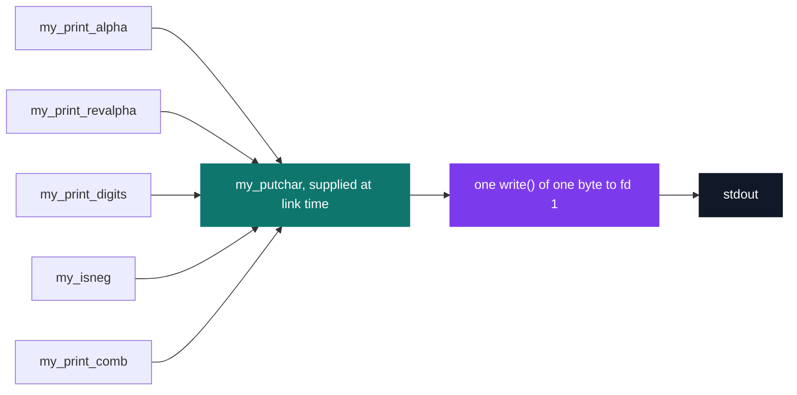
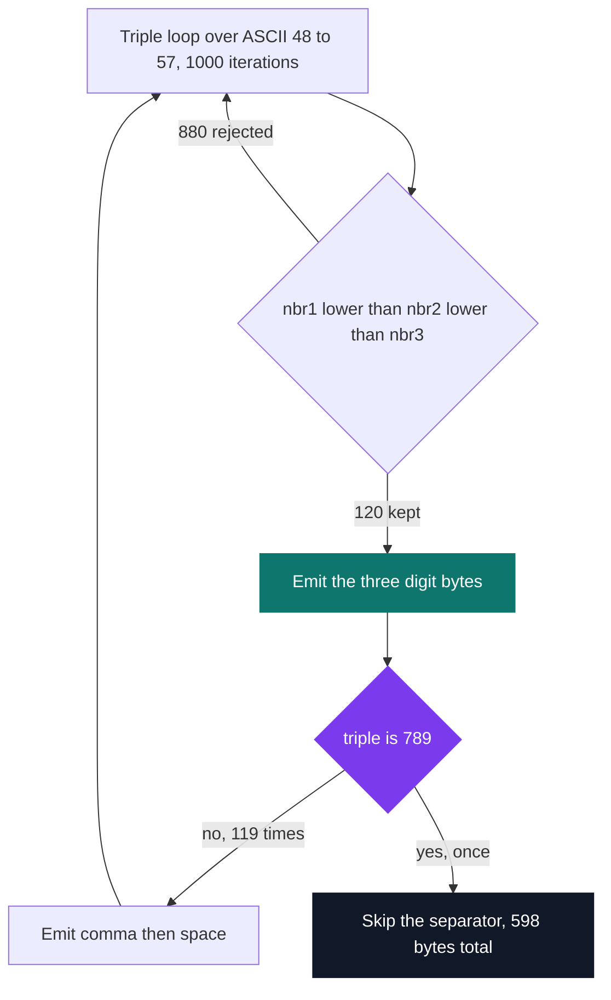

# C Pool — Day 03: first steps in C

[](https://antoinepoisson.github.io/Old-School-Projects/projects/cpool-day03-2018)

 

**Epitech project** · Unix & C Lab Seminar (Part I) (`B-CPE-100`) · Tek1 · 2018-2019 · 1 day · Grade B

> One allowed function — `my_putchar`, one byte at a time — and everything else rebuilt on top of it.

## Overview

The list of authorised functions for this day has exactly one entry: `my_putchar`, which writes a
single byte to file descriptor 1. No `printf`, no `strlen`, no arrays, no strings. In the five
delivered files there is also no `#include` and not one character literal.

Five files, 96 lines, 57 of them code, 10 calls to `my_putchar` in total. Nothing here defines a
`main` or even declares `my_putchar` — both come from the grader and are resolved at link time, so
the code has to be correct against an interface it never gets to look at.

That constraint is the whole lesson. Printing `789` is not a call to a formatter; it is three
ordered byte writes, plus a decision about a separator that has to be made before the next
iteration of the loop exists.



## How it works

Five of the day's exercises are in this directory. Each is a standalone translation unit with a
single exported function, and every one of them ends at the same primitive.

| File | Prints | Lines |
| --- | --- | --- |
| `my_print_alpha.c` | `abcdefghijklmnopqrstuvwxyz` | 17 |
| `my_print_revalpha.c` | `zyxwvutsrqponmlkjihgfedcba` | 17 |
| `my_print_digits.c` | `0123456789` | 17 |
| `my_isneg.c` | `N` or `P` for one `int` | 15 |
| `my_print_comb.c` | the 120 increasing digit triples | 30 |

`my_print_comb` is the day's real problem. Three nested loops walk the ASCII range `48..57`, which
is 1000 iterations; the guard `nbr1 < nbr2 && nbr2 < nbr3` keeps the 120 strictly increasing
triples and drops the other 880. No array is needed because the loop order already produces them
sorted.

The body of `my_print_comb.c`, verbatim apart from one level of indentation trimmed off:

```c
for (nbr1 = 48 ; nbr1 != 58 ; nbr1 = nbr1 + 1) {
    for (nbr2 = 48 ; nbr2 != 58 ; nbr2 = nbr2 + 1) {
        for (nbr3 = 48 ; nbr3 != 58 ; nbr3 = nbr3 + 1) {
            if (nbr1 < nbr2 && nbr2 < nbr3) {
                my_putchar(nbr1);
                my_putchar(nbr2);
                my_putchar(nbr3);
                if (!(nbr1 == 55 && nbr2 == 56 && nbr3 == 57)) {
                        my_putchar(44);
                        my_putchar(32);
            }
            }
        }
    }
}
```

The interesting line is the inner `if`. The expected output separates triples with `", "` but must
not end with one, and with no buffer to hold the list there is no way to go back and erase the last
separator. The code hard-codes the terminal triple `789` as the one case that prints nothing after
itself.



The general trick — emit the separator *before* every element except the first — needs no knowledge
of the final value and generalises to the `my_print_combn` variants of the same series. The sentinel
form used here is the one that only works because the last triple is known in advance.

Real output, from the five functions linked against a driver that supplies `main` and `my_putchar`
and calls `my_isneg(-1)`, `my_isneg(0)`, `my_isneg(42)`. The last line is the full 598-byte run of
`my_print_comb`, elided here in the middle:

```text
abcdefghijklmnopqrstuvwxyz
zyxwvutsrqponmlkjihgfedcba
0123456789
NPP
012, 013, 014, 015, 016, 017, 018, 019, 023, ..., 689, 789
```

## What this project demonstrates

- Rebuilding every output routine from a one-byte primitive, with no array, no string and no header
- Enumerating the 120 increasing triples of distinct digits with three nested loops and one guard
- Solving the trailing-separator problem without storage, by naming the terminal case `789`
- Writing code that links against a `main` and a `my_putchar` it never sees

## Key features

Not a single character literal appears in the five files: every byte is written as its decimal
ASCII code, which is what the day is really teaching.

| Decimal | Byte | Used for |
| --- | --- | --- |
| `32`, `44` | space, `,` | the separator in `my_print_comb` |
| `48`, `58` | `0`, one past `9` | digit loop bounds |
| `55`, `56`, `57` | `7`, `8`, `9` | the terminal triple |
| `78`, `80` | `N`, `P` | the `my_isneg` verdict |
| `97`, `122` | `a`, `z` | alphabet bounds |

## Technical stack

- **Languages** — C
- **Tools** — gcc, Git
- **Concepts** — nested loops, integer arithmetic, problem decomposition

## Engineering constraints

- only function allowed: my_putchar
- arrays and strings forbidden for every task
- do not deliver your own main: the autograder adds its own
- Epitech coding standard (checked with epiclang)

## Verification

Day graded by the school's autograder, so no test file is in the directory. Exercising the code
today means supplying the two symbols the grader used to supply:

```c
#include <unistd.h>

int my_putchar(char c) { return (int)write(1, &c, 1); }
```

One audit finding worth naming: because no file declares `my_putchar`, a current toolchain refuses
all five with `error: call to undeclared function 'my_putchar'`. C99 removed implicit declarations,
and Apple clang 21 makes that diagnostic fatal even under `-std=gnu89`. Downgrading it back to a
warning builds the set and reproduces the output above byte for byte.

## Build & run

No Makefile: each exercise compiles on its own, and the whole set links in one command next to a
driver providing `main` and `my_putchar`.

```bash
gcc -std=gnu89 -Wno-error=implicit-function-declaration -o day03 driver.c \
    my_print_alpha.c my_print_revalpha.c my_print_digits.c my_isneg.c my_print_comb.c
./day03
```

---

[← C Pool — the entry bootcamp](../README.md) · [↑ Tek1](../../README.md) · [⌂ All projects](../../../README.md)
