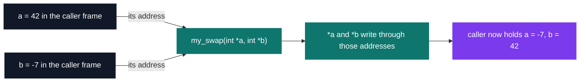
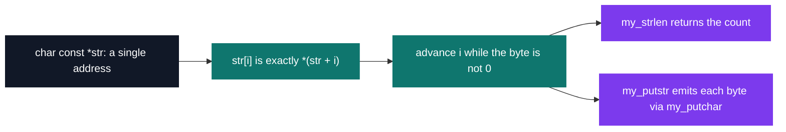

# C Pool — Day 04: pointers

[](https://antoinepoisson.github.io/Old-School-Projects/projects/cpool-day04-2018)

 

**Epitech project** · Unix & C Lab Seminar (Part I) (`B-CPE-100`) · Tek1 · 2018-2019 · 1 day · Grade B

> Pointer day — the concept that sets C apart from every other language.

Three functions, 22 lines of code, one day — and 25 other projects in this archive still carry
these three files in their own `lib/my`. The whole exercise turns on one fact: C passes every
argument by value, so a function receives a *copy* and can never reach the caller's variable.

`my_swap(&a, &b)` is the smallest program where that distinction becomes visible — and the
smallest one where getting it wrong still compiles, still runs, and silently changes nothing.

## Overview

This is reputedly the hardest day of the early pool: the one where you manipulate memory
addresses directly.

A variable has a value, but it also has a location. Once you can hand that location to a function
so it modifies the original, the way you write code changes completely.

Many people drop off here. It is also where everything falls into place once it finally clicks.



## How it works

The day's exercise list runs wider than what is archived here: `my_getnbr` converting a string to
an integer with chained signs (`+---+--++---+---+---+-42` → `-42`) and a `0` return on overflow,
`my_sort_int_array` sorting in place, `my_evil_str` reversing a string inside the buffer it was
handed — with the standing warning that a string literal is read-only and will segfault.

The three functions kept in this folder are the three the rest of the pool never stops re-linking.

| Function | Signature | The pointer idea it forces |
| --- | --- | --- |
| `my_swap` | `void my_swap(int *a, int *b)` | pass by address: the callee writes into the caller's frame |
| `my_strlen` | `int my_strlen(char const *str)` | a string is an address, and its end is a sentinel byte, not a stored length |
| `my_putstr` | `int my_putstr(char const *str)` | `const` on the pointee: read every byte, write none of them |

`my_strlen` and `my_putstr` run the same loop shape — index from 0, stop on the `'\0'` byte, step
by one — and differ only in what they do with the byte. Indexing is not a separate feature of
arrays here: it is address arithmetic with nicer syntax, and the loop stops on a byte, never on a
count.



The swap itself is seven lines, and the third one is where the day is decided:

```c
void my_swap(int *a, int *b)
{
    int *c = 0;

    c = *a;
    *a = *b;
    *b = c;
}
```

The temporary is declared `int *` and then assigned `*a`, an `int`. It compiled in 2018 —
`-Wint-conversion` was a warning, not an error — and the values do come out swapped: on a 64-bit
target the `int` → pointer → `int` round-trip loses nothing, checked down to `INT_MIN` and
`INT_MAX`. Correct behaviour, wrong type: precisely the failure class pointers introduce, where
the compiler knows something the output does not show.

The same day produces the ASCII fir tree archived in
[`CPool_Tree_2018`](../CPool_Tree_2018/README.md) — every character of it emitted one `my_putchar`
call at a time, with no buffer and no string in between.

## What this project demonstrates

- The pivotal concept of C: memory address versus value
- Re-coding the basic libc functions without a safety net
- In-place modification, with no intermediate allocation
- A base that holds: `my_strlen.c` lands byte-identical in Day 07's `lib/my` and is still the same
  file on Days 08, 09 and 10; all three functions reappear in **25** other Tek1 projects here

## Key features

- `my_swap` exchanges two integers by pointer, `my_strlen` walks a string, `my_putstr` prints it
- Three functions that introduce passing by address and array traversal
- No allocation anywhere: the caller owns the memory, the callee only borrows an address

## Technical stack

- **Languages** — C
- **Tools** — gcc, Git
- **Concepts** — pointers, pass by reference, in-place string manipulation

## Engineering constraints

| Constraint | What it takes away |
| --- | --- |
| `my_putchar` is the only call allowed | no `printf`, no `strlen`, no `puts` — every primitive is hand-written |
| no `main` in the delivery | the autograder links its own, so each file must stand as its own translation unit |
| `my_getnbr` returns `0` on overflow | the conversion has to see the overflow coming; once the value has wrapped, it is too late to detect |
| Epitech coding standard | the school header block on every file, one job per function, short bodies |

That first rule leaves a gap: `my_putstr.c` calls `my_putchar` with no prototype in sight and lets
the compiler guess its signature. Day 07's copy adds the missing line, `void my_putchar(char c);`.
Three days is how long the habit took.

## Verification

Graded by the school's autograder; no tests were written for the day.

Recompiling the untouched files today sorts them in one pass: `my_strlen.c` still builds clean,
while the other two are rejected. What gcc warned about in 2018, clang now refuses:

```console
$ cc -c my_swap.c
my_swap.c:12:7: error: incompatible integer to pointer conversion assigning to 'int *' from 'int'; remove * [-Wint-conversion]
   12 |     c = *a;
      |       ^ ~~
my_swap.c:14:8: error: incompatible pointer to integer conversion assigning to 'int' from 'int *'; dereference with * [-Wint-conversion]
   14 |     *b = c;
      |        ^ ~
      |          *
2 errors generated.
```

Built under the era's rules instead, and driven from a small `main`, the three functions behave:
42 and -7 swap, `INT_MIN` and `INT_MAX` swap, `my_strlen("pointer")` returns 7.

## Build & run

No `main` and no Makefile are delivered — each exercise compiles on its own and is linked against
the grader's harness.

```bash
# compile the three objects with the 2018-era relaxations
cc -std=gnu89 -Wno-int-conversion -Wno-implicit-function-declaration \
   -c my_swap.c my_strlen.c my_putstr.c

# then link them with your own main and a my_putchar
cc -o day04 main.c my_putchar.c my_swap.o my_strlen.o my_putstr.o
```

---

[← C Pool — the entry bootcamp](../README.md) · [↑ Tek1](../../README.md) · [⌂ All projects](../../../README.md)
