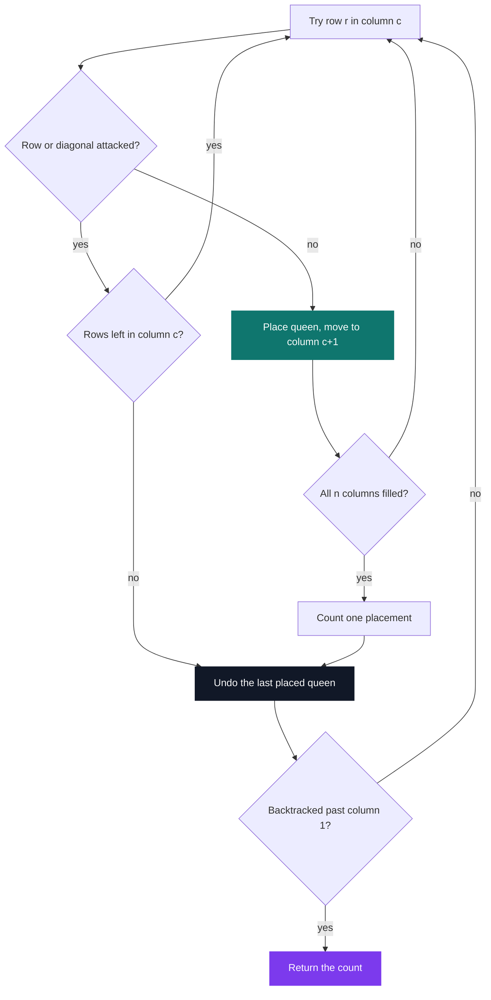

# C Pool — Day 05: recursion

[](https://antoinepoisson.github.io/Old-School-Projects/projects/cpool-day05-2018)

  

**Epitech project** · Unix & C Lab Seminar (Part I) (`B-CPE-100`) · Tek1 · 2018-2019 · 1 day · Grade B

> Describing a problem in terms of a smaller version of itself — from factorial up to the eight queens.

Eight tasks in one day, and the last one is the N queens: count every way to place `n` queens on an
`n × n` board with none able to take another. For `n = 8` that is 4,426,165,368 candidate boards,
and the answer — 92 — has to come back in under two seconds.

The day is built so that brute force never fits in that budget. Factorial and power are each
written twice, once as a loop and once as a function that calls itself, so the cost of a call stack
stops being theory and becomes a number you can measure.

## Overview

Recursion is a way of thinking as much as a technique: instead of describing how to repeat an
operation, you describe the problem in terms of a smaller version of itself.

Everything then rests on one line of code — the base case. Get it wrong and the function does not
fail loudly; it keeps returning plausible numbers.

The subject hands the base cases over task by task: `0! = 1`, `n! = 0` for `n < 0`, `n^0 = 1`,
`n^p = 0` for `p < 0`. They are given up front precisely because they are the part that breaks.

## How it works

Eight tasks were set; four files survive in this directory.

| Function | Idea | Here |
| --- | --- | --- |
| `my_compute_factorial_it` | `for` loop, accumulator | yes |
| `my_compute_factorial_rec` | `nb * f(nb - 1)` | yes |
| `my_compute_power_it` | `for` loop, accumulator | yes |
| `my_compute_power_rec` | `nb * f(nb, p - 1)` | yes |
| `my_compute_square_root` | whole root or `0`, no `math.h` | — |
| `my_is_prime` | stop testing divisors at `√nb` | — |
| `my_find_prime_sup` | smallest prime at or above `nb` | — |
| `count_valid_queens_placements` | backtracking on an `n × n` board | — |

Four files, 72 lines, 42 of them actual code. The overflow rule is baked straight into the guards:
`12!` is 479,001,600 and fits in a 32-bit `int`, `13!` is 6,227,020,800 and does not — so both
factorials return `0` above 12 instead of a wrapped, wrong-looking positive number.

The two primality tasks are the same lesson in a different shape. Walking every divisor up to `nb`
is two billion iterations for an `int` near the top of the range; stopping at `√nb` caps it at
46,340, because a composite number always has a factor at or below its square root.

**The queens.** You never enumerate boards. You place one queen per column, and the moment a
partial board conflicts you drop the whole branch instead of finishing it.



The pruning is the whole point. One queen per column already cuts 4,426,165,368 board arrangements
down to 16,777,216 column vectors; dropping a branch on its first conflict cuts that again by
orders of magnitude.

The first solution such a search finds for `n = 8`, trying rows top to bottom — `Q` a queen, `.` an
empty square:

```text
Q . . . . . . .
. . . . . . Q .
. . . . Q . . .
. . . . . . . Q
. Q . . . . . .
. . . Q . . . .
. . . . . Q . .
. . Q . . . . .

column   1  2  3  4  5  6  7  8
row      1  5  8  6  3  7  2  4     (rows counted from the top)
```

The subject's own sample run stops at `n = 5`. Past it the count stops being monotonic — 10, then
4 — which makes the sequence a good sanity check on any implementation.

| N | 1 | 2 | 3 | 4 | 5 | 6 | 7 | 8 |
| --- | --- | --- | --- | --- | --- | --- | --- | --- |
| Placements | 1 | 0 | 0 | 2 | 10 | 4 | 40 | 92 |

## What this project demonstrates

- **Backtracking**, on the N-queens problem — prune an invalid branch instead of completing it.
- **A controlled comparison**: factorial and power written both ways, so the difference between a
  loop and a call stack is measurable rather than theoretical.
- **A response budget** of two seconds per call, which rules out brute force on primality and on
  the queens alike.

## Key features

- Factorial and power each delivered twice, iterative and recursive.
- Overflow treated as an error rather than as a wrapped value: out of range returns `0`.
- Negative exponent returns `0`, `p == 0` returns `1` — the two edge cases the subject spells out.

## Technical stack

- **Languages** — C
- **Tools** — gcc, Git
- **Concepts** — recursion, backtracking, algorithmic complexity

## Engineering constraints

| Constraint | What it removes |
| --- | --- |
| `my_putchar` is the only allowed function | no `printf`, no `malloc`, no `math.h` |
| Under 2 seconds per answer | no divisor loop up to `nb`, no full board enumeration |
| Integer overflow is an error, return `0` | forces an explicit domain check on every function |
| The directory must compile with `*.c` | one file that breaks the build zeroes the whole day |

The Epitech coding standard sits on top of all four: hence the imposed `EPITECH PROJECT, 2018`
header comment opening every file, and function bodies short enough that a guard and a loop are
about all one function is allowed to hold.

## Verification

The day was graded by the school's autograder and no test file was kept, so the four files were
recompiled for this archive. Two findings are worth stating plainly.

**The recursive base cases are one step off.** `my_compute_factorial_rec` returns at `nb == 0`, then
recurses only while `nb > 1` — so `nb == 1` matches no branch and falls off the end of the function,
and every recursion ends there. `my_compute_power_rec` has the same hole at `p == 1`.

```console
$ gcc -Wall -Wextra -c my_compute_factorial_rec.c
my_compute_factorial_rec.c:16:1: warning: non-void function does not return a value in all control paths [-Wreturn-type]
   16 | }
      | ^
1 warning generated.

$ ./check          # one-off harness, not in the repo: same inputs, both versions
fact  8    it=40320        rec=40320
fact  9    it=362880       rec=0
fact 10    it=3628800      rec=0
fact 11    it=39916800     rec=39916800
2^1        it=2            rec=2
2^2        it=4            rec=2
2^3        it=8            rec=4
```

The iterative files compile clean; the recursive ones return whatever the return register happens
to hold. `my_compute_power_rec(2, 1)` gives 2 when called directly and 1 when called from
`my_compute_power_rec(2, 2)` — same call, two answers, which is the signature of undefined
behaviour and the exact failure this day is designed to teach.

**The second finding is about ordering.** In `my_compute_factorial_it` the domain check sits *after*
the loop, so `my_compute_factorial_it(2000000000)` spins two billion times before returning the
right answer, `0` — 1.8 s at `-O0` here, against a 2-second budget. Hoisting the guard above the
loop is a one-line fix and the whole cost disappears.

## Build & run

No Makefile: pool days are delivered as loose files and each exercise compiles on its own. There is
no `main` — the grader adds its own `main.c` and `my_putchar.c` and links them against these
objects.

```bash
gcc -Wall -Wextra -c my_compute_factorial_it.c my_compute_factorial_rec.c \
                     my_compute_power_it.c my_compute_power_rec.c
```

---

[← C Pool — the entry bootcamp](../README.md) · [↑ Tek1](../../README.md) · [⌂ All projects](../../../README.md)
