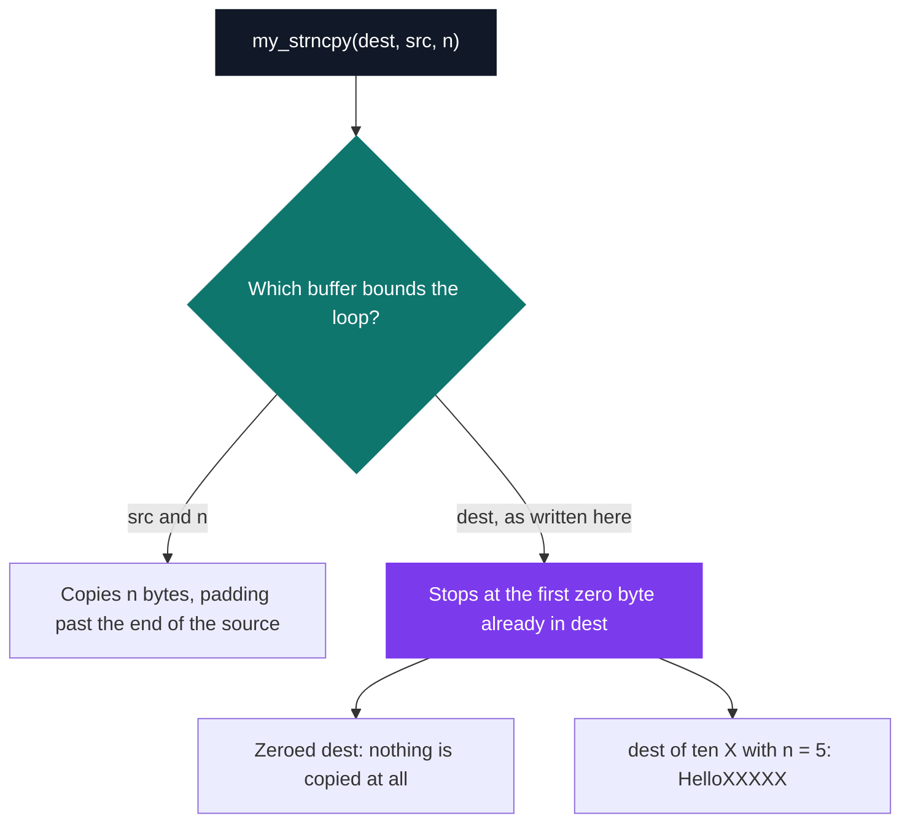
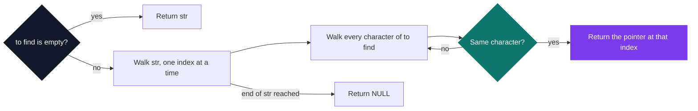

# C Pool — Day 06: strings

[](https://antoinepoisson.github.io/Old-School-Projects/projects/cpool-day06-2018)

 

**Epitech project** · Unix & C Lab Seminar (Part I) (`B-CPE-100`) · Tek1 · 2018-2019 · 1 day · Grade B

> Re-coding the C string library, function by function.

## Overview

The day's rule is short and it removes every shortcut: **`my_putchar` is the only function you are
allowed to call.** No `strlen` to measure, no `memcpy` to move bytes, no `NULL` unless you fetch the
header that defines it.

So every loop bound has to be discovered rather than received. A C string carries no length — the
only thing that says "stop" is a `\0` byte you have to walk to and recognise yourself.

Four functions survive in this archive, 91 lines across four files, each shipped with its own
Criterion file: 7 test cases over 93 lines of test code. Day 06 is the first day in this archive
whose deliverable is the code **and** the tests that check it.

| Function | libc equivalent | The edge case that decides the implementation |
| --- | --- | --- |
| `my_strcpy` | `strcpy` | who writes the terminating `\0` — the loop stops *before* it |
| `my_strncpy` | `strncpy` | `n` larger than the source: pad with `\0`, otherwise add none |
| `my_strstr` | `strstr` | an empty needle must return the haystack, not `NULL` |
| `my_revstr` | — | no `malloc`, so the scratch buffer is a stack array sized at run time |

## How it works

`my_strcpy` is the whole day in nine lines. The loop copies while the source is not terminated, so
it exits one byte *short* of the terminator; the terminator is then written by hand.

```c
char *my_strcpy(char *dest, char const *src)
{
    int a = 0;

    for (a = 0; src[a] != '\0'; a++)
        dest[a] = src[a];
    dest[a] = '\0';
    return (dest);
}
```

Drop the line that follows the loop and the caller reads whatever was already in `dest`. The byte
map makes the invisible byte visible:

```text
char dest[6] = {0};                        my_strcpy(dest, "Hello");

  0    1    2    3    4    5                 0    1    2    3    4    5
+----+----+----+----+----+----+           +----+----+----+----+----+----+
| \0 | \0 | \0 | \0 | \0 | \0 |    -->    | H  | e  | l  | l  | o  | \0 |
+----+----+----+----+----+----+           +----+----+----+----+----+----+
                                                                     ^
                                                       dest[a] = '\0';
```

`my_strncpy` is where the day gets treacherous, and the reason `strncpy` still burns people in
production code. The contract is asymmetric: pad with `\0` when `n` runs past the end of the
source, add nothing at all when it does not. The function that copies is also the function that
decides whether the result is even a string.

The whole behaviour therefore hangs on one choice — which of the two buffers bounds the loop.



The delivered version bounds it with `dest`, which makes the copy depend on what the destination
already held — the one input a caller assumes is irrelevant. That is exactly the class of bug that
makes `strncpy` worth re-implementing once.

`my_revstr` measures the string, declares a stack array of that exact length, fills it backwards
and copies it back over the original; with `malloc` off the table, a variable-length array is the
only scratch space available. And `my_strstr.c` is the only implementation file that includes a
header at all — `<stddef.h>`, purely so it can return `NULL`.

## What this project demonstrates

- Understanding from the inside why `strncpy` is a treacherous function: the padding rule and the
  loop bound are the same decision.
- First unit tests written, in the very first week — and the first lesson that a passing assertion
  is not a proof of correctness.

## Key features

- Reimplementation of `strcpy`, `strncpy`, `strstr` and `revstr`, with `my_putchar` as the only
  callable function
- First day where unit tests accompany the deliverable, one Criterion file per function

## Technical stack

- **Languages** — C
- **Tools** — gcc, Criterion, Git
- **Concepts** — string manipulation, unit testing, edge cases

## Engineering constraints

- no function from the libc string library
- mandatory Criterion unit tests, with imposed minimum coverage (60% lines / 40% branches, then 80% / 60%)
- only function allowed: my_putchar
- Epitech coding standard

## Beyond the baseline

- A Criterion file for every delivered function, including `my_strcpy`, which the subject never
  asks to test

The subject requires tests for `my_strncpy` and `my_revstr` first, then for `my_strstr`,
`my_strncmp` and `my_strcapitalize`. The tests/ folder covers one function per file.

## Verification

Seven Criterion cases across four files, one file per function. Six of them pass. Re-reading them
years later is more instructive than writing them was, because `test_my_strstr.c` is a clean
demonstration of a coverage trap: three passing assertions that cannot tell two different
algorithms apart.

The delivered `my_strstr` returns the first character of the haystack that appears **anywhere** in
the needle — set membership, not sequence matching.



Every committed case agrees with a real `strstr`, which is why all three pass:

| Needle | Assertion | Why it cannot separate the two |
| --- | --- | --- |
| `""` | returns `str` | the empty needle is a special case in both |
| `"az"` | returns `NULL` | neither letter appears in `"Hello World"` at all |
| `"W"` | returns `"World"` | a one-character needle *is* a character |

No case uses a multi-character needle that is actually present, and that is the whole gap:
`my_strstr("Hello World", "World")` returns `"llo World"`, because the scan stops on the `l` at
index 2. One added assertion closes it.

The seventh case is the one that fails, and it is the example the subject prints itself:
`test_my_strncpy.c` copies into a zero-initialised `dest`, the exact buffer state that makes the
destination-bounded loop exit before its first pass.

## Build & run

The day ships without a Makefile: each exercise compiles on its own.

```bash
gcc -c my_strcpy.c my_strncpy.c my_revstr.c my_strstr.c

# unit tests
gcc -o unit_tests tests/test_my_strcpy.c my_strcpy.c -lcriterion
./unit_tests
```

---

[← C Pool — the entry bootcamp](../README.md) · [↑ Tek1](../../README.md) · [⌂ All projects](../../../README.md)
