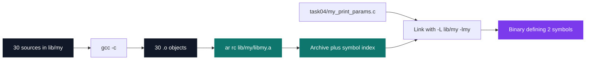

# C Pool — Day 07: libmy and arguments

[](https://antoinepoisson.github.io/Old-School-Projects/projects/cpool-day07-2018)

  

**Epitech project** · Unix & C Lab Seminar (Part I) (`B-CPE-100`) · Tek1 · 2018-2019 · 1 day · Grade B

> Turning the pool's scattered C exercises into the `lib/my` archive that 33 later projects in this repository still carry.

The deliverable stops being a program. Day 07 hands in a static archive, and from here the earlier
days' functions are no longer files that get graded and deleted — they are members a linker pulls
on demand. Counting this one, 34 project directories in this repository ship a `lib/my`.

That shift has a price. Inside an archive the function name *is* the contract: nobody reads the
body any more, and neither `gcc -c` nor `ar` checks that the body matches the name. A wrong symbol,
a missing one, or a correct name over the wrong code surfaces later, at link time, in someone
else's build.

34 source files, 514 lines, 251 of them code. The archive exports exactly **30 symbols**, from
`my_putchar` to `my_strncat` — and one of them, `my_showmem`, lives in a file called
`my_showmen.c`. The linker never notices.

## Overview

Days 03 to 06 handed in loose `.c` files: one function per file, compiled once, graded, done. This
day gathers all of it into a single library that any later project can link against — the moment a
pile of exercises becomes a personal tool meant to last two years.

The mechanical part is the compilation chain, walked end to end for the first time: preprocessor,
compilation into `.o` objects, archiving with `ar`, then link resolution against `-lmy`. Each stage
has its own failure mode, and confusing them is the classic beginner trap.

In parallel the day introduces `argc` / `argv`, so a program stops being a fixed script and starts
taking input from its caller. Two small programs, `my_print_params` and `my_rev_params`, exercise
that — and incidentally prove the archive links.

## How it works

One function per file, one file per object, all objects into one archive. That granularity is not
cosmetic: it is what lets the linker take only what a program actually calls.



The last node is the point of the whole day. `my_print_params` links against an archive of 30
symbols and the finished binary defines **two** of them, `my_putchar` and `my_putstr`. The other 28
never enter the executable: the linker pulls archive *members*, not archives.

The 30 symbols, and how many of them carry a body in this delivery:

| Family | Symbols | With a body |
| --- | --- | --- |
| Output | `my_putchar`, `my_putstr`, `my_put_nbr`, `my_showstr`, `my_showmem` | 3 / 5 |
| Copy & compare | `my_strlen`, `my_strcpy`, `my_strncpy`, `my_strcat`, `my_strncat`, `my_strcmp`, `my_strncmp`, `my_strstr` | 5 / 8 |
| Transforms | `my_revstr`, `my_strupcase`, `my_strlowcase`, `my_strcapitalize` | 1 / 4 |
| Predicates | `my_str_isalpha`, `my_str_islower`, `my_str_isupper`, `my_str_isnum`, `my_str_isprintable`, `my_isneg` | 1 / 6 |
| Numbers | `my_getnbr`, `my_compute_power_rec`, `my_compute_square_root`, `my_is_prime`, `my_find_prime_sup` | 1 / 5 |
| Arrays | `my_swap`, `my_sort_int_array` | 1 / 2 |

**The argv side.** Both programs walk the whole `argv`, program name included — `my_print_params`
forward, `my_rev_params` backward. Rebuilt from the committed sources on a current toolchain, this
is the real session:

```console
$ gcc -Wno-error=implicit-function-declaration -Wno-error=int-conversion -c lib/my/*.c
$ ar rc lib/my/libmy.a *.o
$ gcc -o my_rev_params task05/my_rev_params.c -L lib/my -lmy

$ ./my_rev_params foo bar baz
baz
bar
foo
./my_rev_params
```

`my_print_params`, minus its header comment, shows the other half of the lesson — the header the
subject puts in `include/`, and the one missing here:

```c
void my_putchar(char c);

int my_putstr(char const *str);

int main(int argc, char *argv[])
{
    int i = 0;

    for (i = 0; i < argc; i++) {
       my_putstr(argv[i]);
       my_putchar('\n');
    }
    return (0);
}
```

The two prototypes are retyped by hand at the top of the consumer instead of being included from a
header. It links, because the linker matches names, not declarations. Retype one of them with the
wrong return type and the call silently goes wrong at run time — which is exactly why a library
ships a header.

**What the linker cannot check.** 12 of the 30 translation units carry an implementation; the other
18 hold their symbol and return immediately, and `ar` archives both without a word. Nine of those
twelve had already been handed in on Days 03 to 06; the archive is where they stop being throwaway
files.

The same blind spot shows up twice more. The day's own `my_strcat` and `my_strncat` are written at
the root of the directory while their copies inside `lib/my/` are stubs, and `my_strstr` returns
the first character of the haystack found *anywhere* in the needle — that is `strpbrk` behaviour
under a `strstr` name. An archive propagates each of those into every project that links it.

## What this project demonstrates

- A first static library compiled, archived and linked end to end by one's own means
- Concrete understanding of the compilation / archiving / linking stages
- Reading the symbol table of a build artifact instead of trusting the source tree

## Key features

- The personal `lib/my` library: 30 string, number, sorting and output symbols in one archive
- `my_print_params` and `my_rev_params` read `argc` / `argv` and validate the link against `-lmy`
- One function per translation unit, so a binary only carries the members it resolves

## Technical stack

- **Languages** — C
- **Tools** — gcc, ar, Git
- **Concepts** — static library, compilation chain, command-line arguments

## Engineering constraints

| Constraint | Consequence |
| --- | --- |
| Only `write` allowed as a system call | Every output path goes through `my_putchar` |
| The archive must export exactly the 30 listed functions | No extra helper can leak into the symbol table |
| Imposed layout: sources in `lib/my/`, headers in `include/` | The consumers sit outside both, so their build line carries `-L lib/my` |
| The compiled `libmy.a` must not be committed | The repository keeps the sources, never the artifact |
| Epitech coding standard | Style checked on every file, header comment to indentation |

## Verification

The day was graded by the school's autograder; no test suite was written.

Rebuilding it today needs two flags the 2018 compiler did not. Four files — `my_putchar`,
`my_isneg`, `my_put_nbr` and `my_swap` — call an undeclared function or move an `int` through an
`int *`, and clang has since turned both into hard errors rather than warnings.

With `-Wno-error=implicit-function-declaration -Wno-error=int-conversion`, all 30 objects compile,
`nm` reports the 30 expected `my_*` symbols in the archive, and `task04` and `task05` both link and
run against it.

## Build & run

No Makefile — the pool day is delivered as loose sources, each exercise compiling on its own.

```sh
# build the archive (the two flags matter only on a current clang/gcc)
gcc -Wno-error=implicit-function-declaration -Wno-error=int-conversion -c lib/my/*.c
ar rc lib/my/libmy.a *.o

# link a program against it
gcc -o my_print_params task04/my_print_params.c -L lib/my -lmy
./my_print_params one two three
```

---

[← C Pool — the entry bootcamp](../README.md) · [↑ Tek1](../../README.md) · [⌂ All projects](../../../README.md)
