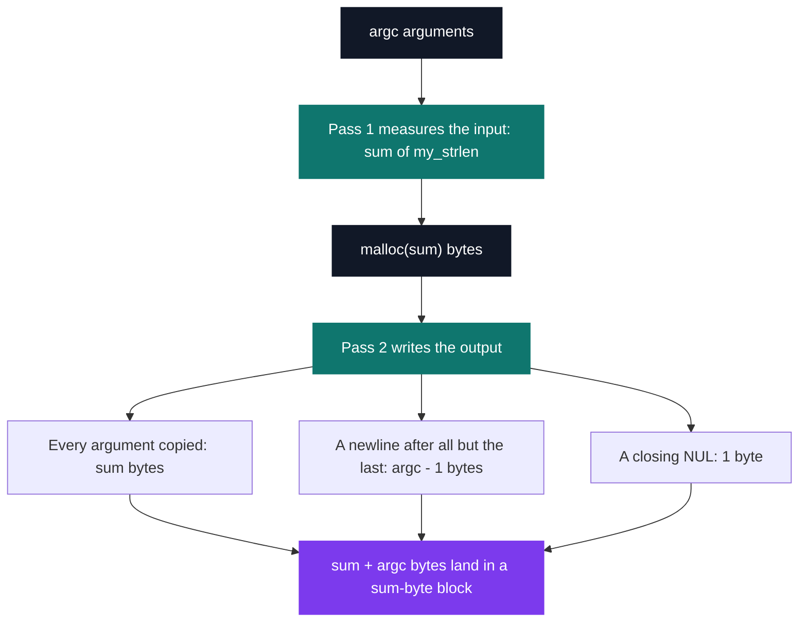

# C Pool — Day 08: compilation and dynamic allocation

[](https://antoinepoisson.github.io/Old-School-Projects/projects/cpool-day08-2018)

 

**Epitech project** · Unix & C Lab Seminar (Part I) (`B-CPE-100`) · Tek1 · 2018-2019 · 1 day · Grade B

> Asking the system for memory — and remembering to give it back.

## Overview

Two of the three functions kept here return a pointer to memory that outlives the call. Nothing in
the program tracks that block, the system will not reclaim it, and the caller inherits a debt it
never asked for.

Every buffer written in the days before this one was a fixed-size array: the compiler sized it, the
stack reclaimed it on return, and no mistake survived the end of the function. Not one of the 54 C
files the archive keeps from Days 03 to 07 calls `malloc`.

The allowed system functions are exactly `write`, `malloc` and `free`. No `strlen`, no `strcpy`, no
`realloc`. Every byte count is computed by hand before the request is made — and an under-sized
request does not print a wrong answer, it writes past the end of the block.


There is no `free` anywhere in the 509 lines of the repository. That is the convention the exercises
impose, not an oversight: a function that allocates its result hands ownership back with it, and the
leak branch above belongs to the caller.

## How it works

The day's five deliverables are `my_strdup`, `concat_params`, `my_show_word_array`,
`my_str_to_word_array` and `convert_base`. The repository keeps the first three, on top of the
30-function `libmy` carried over byte-for-byte from Day 07 — 33 `.c` files, 509 lines, two `malloc`
call sites.

| Delivered function | Heap it asks for | Lines |
| --- | --- | --- |
| `my_strdup` | `my_strlen(src) + 1` bytes | 23 |
| `concat_params` | one buffer holding every `argv` entry | 39 |
| `my_show_word_array` | nothing — it only walks | 21 |

`my_str_to_word_array` is the structuring exercise of the day. Its separators are *every*
non-alphanumeric character, so the number of words is unknown until the string has been read once:
one pass to count the words and size the pointer table, one to fill it, and a null pointer to close
the array.

That null terminator is what makes the array self-describing — the consumer needs no length
argument, exactly like `argv`. Here is the shape `my_show_word_array` walks, sized for
`"Hello, world 42!"` on a 64-bit target:

```text
  tab ──► [0] ──► "Hello\0"     6 bytes
          [1] ──► "world\0"     6 bytes
          [2] ──► "42\0"        3 bytes
          [3] ──► NULL          the sentinel the consumer stops on

  pointer table  4 * 8 = 32 bytes
  string bodies          15 bytes
  freeing tab alone releases 32 of the 47 — the words need their own loop
```

The consumer is ten lines and allocates nothing:

```c
int my_show_word_array(char * const *tab)
{
    int i = 0;

    for (i = 0; tab[i] != '\0'; i++) {
        my_putstr(tab[i]);
        my_putchar('\n');
    }
    return (0);
}
```

That loop compares a `char *` against the character constant `'\0'`. It behaves correctly because
both spell integer zero, but the intent is `!= NULL`, and the two only coincide by convention.

**The same two-pass shape, and where it slips.** `concat_params` is built like the word array — one
pass to size, one pass to write — except the sizing pass measures the *input* while the write pass
emits more than the input:

```c
for (a = 0; a < argc; a++)
    size_str = size_str + my_strlen(argv[a]);
memoireAlloue = malloc(sizeof(char) * (size_str));
```

The write loop appends `'\n'` after every argument but the last, then a final `'\0'`, so the block
is short by exactly `argc` bytes. `concat_params(3, {"ls", "-l", "/tmp"})` asks for 8 and writes 11.
The separator and the terminator exist only in the output, and a pass that measures the input cannot
see them; `my_strdup`, in the same delivery, reserves the terminator with `malloc(size_str + 1)`.



## What this project demonstrates

- Splitting a string into a word array, a building block reused in every parsing project
- First contact with memory leaks and buffer overruns

## Key features

- my_strdup and my_show_word_array: the pool's first dynamic allocations
- concat_params assembles argv into a single allocated string
- The my library is carried over and extended

## Technical stack

- **Languages** — C
- **Tools** — gcc, Git
- **Concepts** — dynamic allocation, NULL-terminated string array, base conversion

## Engineering constraints

- system functions allowed: write, malloc and free only
- imposed locations: libmy in lib/my/, headers in include/
- do not deliver your own main
- Epitech coding standard

Two of those bite together. With no `main` delivered, the grader links these files against its own
test harness, so nothing may depend on a private entry point.

And with no header committed anywhere in the repository, each file re-declares what it needs at the
top: `concat_params.c` opens with three forward declarations — `my_putchar`, `my_putstr`,
`my_strlen` — where one `#include` would do.

## Verification

Day graded by the school's autograder, no tests written.

Re-reading the code is the verification this archive can offer today: 2 `malloc` sites, 0 `free`,
one sizing pass provably short by `argc` bytes. Linking the three files against a throwaway driver
confirms the arithmetic — `ls -l /tmp` asks for 8 bytes and writes 11 into them.

## Build & run

Pool day delivered without a Makefile: each exercise compiles on its own.

```bash
# a driver of your own, since the subject forbids delivering a main
gcc -o demo main.c my_strdup.c my_show_word_array.c \
    lib/my/my_strlen.c lib/my/my_putstr.c lib/my/my_putchar.c
```

`lib/my/my_putchar.c` calls `write` without including `<unistd.h>`. Compilers of 2018 accepted the
implicit declaration; current GCC and Clang reject it as an error, so `-include unistd.h` is what
makes the day build again.

---

[← C Pool — the entry bootcamp](../README.md) · [↑ Tek1](../../README.md) · [⌂ All projects](../../../README.md)
