# C Pool — Day 09: structures

[](https://antoinepoisson.github.io/Old-School-Projects/projects/cpool-day09-2018)

  

**Epitech project** · Unix & C Lab Seminar (Part I) (`B-CPE-100`) · Tek1 · 2018-2019 · 1 day · Grade B

> Grouping data that belongs together, and discovering that byte order is not universal.

## Overview

The last exercise of the day pins down something a C course can otherwise leave abstract: which
byte of a 32-bit integer actually sits at the lowest address. `get_color(r, g, b)` packs three
bytes into one word using nothing but bit shifts, and `swap_endian_color` reverses that word's
bytes — with arithmetic forbidden. It has to go through a `union`.

That constraint is the whole lesson. A `union` is the one construct in C that shows the same four
bytes as an `int` and as an array of `char` at once, so it is the only way to *observe* that the
machine, not the value, decides the order.

The word the exercise builds, read twice — as a number, then as four addressable bytes:

```text
get_color(0x33, 0x66, 0x99)   ->   0x00336699        A=00  R=33  G=66  B=99

memory address          +0      +1      +2      +3
little-endian (x86)    0x99    0x66    0x33    0x00     <- the pool machines
big-endian             0x00    0x33    0x66    0x99     <- network byte order

swap_endian_color()    ->   0x99663300        A=99  R=66  G=33  B=00
```

Read the bottom line: reversing the bytes of `0x00RRGGBB` pushes blue into the alpha slot. The
result is a valid 32-bit colour, and it is not the same colour. The subject pins the output order
to ARGB rather than leaving it implicit.

## How it works

The `union` is the pivot. One declaration, two views of four bytes, no cast and no copy.

```mermaid
flowchart LR
    A["r, g, b as three bytes"] -->|"bit shifts only"| B["one 32-bit word: 0x00336699"]
    B --> U["union: int view and 4-byte view of the same storage"]
    U --> M["byte view on a little-endian machine: 99 66 33 00"]
    M -->|"reverse the four cells"| S["read the int view back: 0x99663300"]

    classDef core fill:#0F766E,stroke:#0F766E,color:#ffffff;
    classDef alt fill:#111827,stroke:#111827,color:#ffffff;
    classDef accent fill:#7C3AED,stroke:#7C3AED,color:#ffffff;
    class U core
    class A,B alt
    class M,S accent
```



The day is six deliverables, and the subject constrains the *means* as tightly as the result:

| Deliverable | Produces | Imposed means |
| --- | --- | --- |
| `my_macro_abs.h` | `ABS(value)` | one line, preprocessor only |
| `my.h` | the public surface of `libmy.a` | must match `nm` exactly |
| `my_params_to_array` | an array of `info_param` | `malloc`; a cell with `str = 0` ends it |
| `my_show_param_array` | prints that array | `write` only |
| `get_color` | a 32-bit colour word | bit shifts, no arithmetic |
| `swap_endian_color` | the byte-reversed colour | a `union`, ARGB order out |

Two of the six survive in this directory — `include/my_macro_abs.h` and `include/my.h` — next to
the library they describe. The four exercise sources are not archived here, so everything below is
checked against what is.

`my_params_to_array` reuses the sentinel from Day 08, moved up one level. There a `NULL` pointer
closed an array of strings: `my_show_word_array` loops while `tab[i] != '\0'`. Here a *structure
whose `str` field is zero* closes an array of structures, and the consumer still needs no length
argument.

**The macro.** `ABS` has to fit on one line, and the file delivers it:

```c
/* include/my_macro_abs.h */
#define ABS(value) ((value) < 0) ? -(value) : (value)
```

The argument is parenthesised, so `ABS(a - b)` yields 5 for `a = 2, b = 7` — that is the trap the
file avoids. The body as a whole is not parenthesised, and `?:` binds looser than `+`, so
`ABS(-3) + 1` expands to `((-3) < 0) ? -(-3) : (-3) + 1` and yields 3, not 4. Macro hygiene is two
rules, because a text substitution inherits the precedence of wherever it lands.

**The header as a contract.** `my.h` is not documentation. It has to be the exact list of what
`libmy.a` exports, which is why the subject sends you to `man nm` rather than to your own memory:
the linker's symbol table is the authority, and anything marked `static` is absent from it.


The two sides match one for one: 30 prototypes in `include/my.h`, 30 `.c` files in `lib/my/`, no
symbol on either side without a twin. One file makes the point that `nm` reads symbols, not
filenames:

| On disk | Symbol in `libmy.a` | Prototype in `my.h` |
| --- | --- | --- |
| `my_showmen.c` | `my_showmem` | `int my_showmem (char const *str, int size);` |

**Audit finding — a symbol table proves a name resolves, not that it does anything.** Twelve of
the 30 files carry a real body; the other 18 are the pool's carried-forward skeleton, a signature
over an immediate return — `return (0);` in seventeen of them, a bare `return;` in the `void`
`my_sort_int_array`. Both kinds land in `libmy.a` and both appear in `nm`, so the header contract
holds either way.

Those sources are Day 08's: 29 of the 30 files are byte-identical, and `my_put_nbr.c` differs only
in a comment line and a trailing space. What is new on Day 09 is the `include/` directory.

None of the 30 sources includes `my.h`. `my_putstr.c` still re-declares `void my_putchar(char c);`
by hand, the way every previous day did — here the header is the thing delivered, not yet the thing
used.

## What this project demonstrates

- Bitwise manipulation of a 32-bit colour: composition by shifts, decomposition by masks
- Concrete discovery of endianness, observed through a `union` rather than taken on trust
- A header written against `nm` output instead of against memory
- The sentinel-terminated array pattern generalised from pointers to structures

## Key features

- Writing the my.h header gathering every prototype of the library
- my_macro_abs.h introduces preprocessor macros
- A day devoted to code organisation rather than new functions

## Technical stack

- **Languages** — C
- **Tools** — gcc, Git
- **Concepts** — structures and unions, bitwise operations, endianness

## Engineering constraints

| Rule | What it removes |
| --- | --- |
| System calls limited to `write`, `malloc`, `free` | no `printf`, no `memcpy`, no `htonl` |
| `get_color` through bit shifts only | no `* 256`, no arithmetic packing |
| `swap_endian_color` compulsorily through a `union` | no shift-and-mask reversal, ARGB order out |
| `my.h` must expose exactly the prototypes of `libmy.a` | see `man nm`; `static` symbols must not appear |
| Epitech coding standard | the school header block on every file, one job per function, short bodies |

The union clause is the interesting one. Reversing four bytes with `>>` and `&` is three lines and
works everywhere — but it returns the answer without ever showing you the memory. The `union`
forces the byte view into the open, and that is what is being measured.

## Verification

Day graded by the school's autograder, no tests written.

What this directory can still be checked against today:

| Counted here | Value |
| --- | --- |
| Prototypes in `include/my.h` | 30 |
| `.c` files in `lib/my/` | 30 |
| Functions with a real body | 12 |
| Sources byte-identical to Day 08 | 29 / 30 |
| Lines of C, headers included | 472 |

## Build & run

Pool day delivered without a Makefile: each exercise compiles on its own.

```bash
# 29 of the 30 sources rebuild; my_swap.c needs its int/pointer mix-up fixed first
gcc -std=gnu89 -w -c lib/my/*.c
ar rc libmy.a *.o
nm libmy.a | grep ' T '     # every line here needs a prototype in include/my.h
```

Four sources no longer compile under a 2025 toolchain's defaults. `my_putchar.c` calls `write`, and
`my_isneg.c` and `my_put_nbr.c` call `my_putchar`, with no declaration in scope; implicit
declarations have been invalid since C99 and are now rejected outright, which `-std=gnu89` waives.

`my_swap.c` is the fourth, and it fails on its own merits: it parks `*a` in an `int *` and hands it
back to an `int`. It still swaps correctly — an `int` survives the round trip through a 64-bit
pointer — which is precisely why only the compiler catches it.

---

[← C Pool — the entry bootcamp](../README.md) · [↑ Tek1](../../README.md) · [⌂ All projects](../../../README.md)
