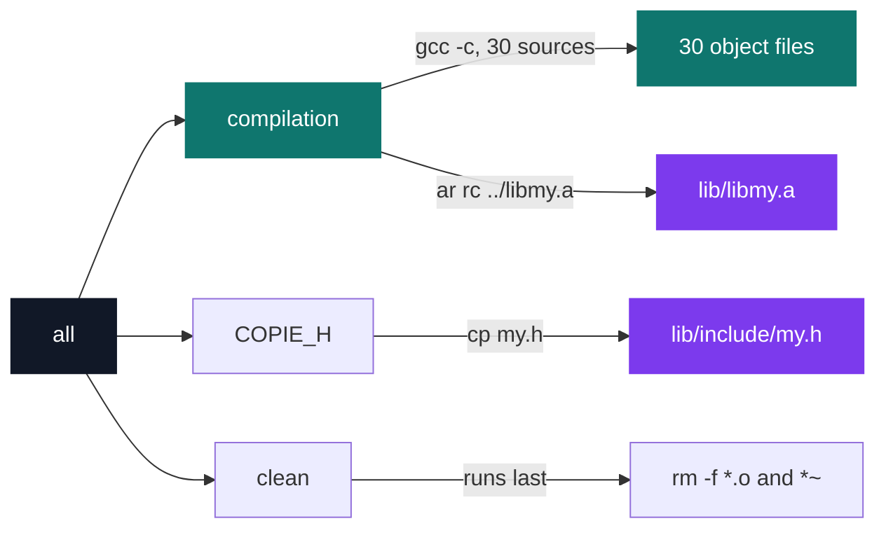

# C Pool — Day 10: Makefile and do_op

[](https://antoinepoisson.github.io/Old-School-Projects/projects/cpool-day10-2018)

 

**Epitech project** · Unix & C Lab Seminar (Part I) (`B-CPE-100`) · Tek1 · 2018-2019 · 1 day · Grade B

> Automating compilation, and letting the program itself choose the operation.

Nine days of compiling by hand end here. `lib/my/` holds 30 source files, and the subject bans the `build.sh` script that had been gluing them together — the build has to be declared as make targets, compiled to objects, archived with `ar`, and the header installed at an imposed path.

The calculator bolted on top is not graded on arithmetic. It is graded on garbage: `do-op 42friends - -----20toto12` has to print `62`, and all three arguments arrive as unvalidated strings.

## Overview

Two lessons in one day, and they are the same lesson seen twice: describe the work as data instead of writing it out by hand.

The Makefile stops a compilation line from ever being retyped. The dispatch turns *which operation* from a branch the programmer writes into a value the program reads.



`all` chains the three targets in that order and puts `clean` last, so the object files are deleted the moment the archive and the header are in place.

## How it works

**The library build.** One `SRC` variable lists the 30 files, a single `gcc -c` call compiles them, `ar rc ../libmy.a` builds the archive, and a separate `COPIE_H` target installs `my.h`.

The two headers are byte-identical, and that is the point: `include/my.h` is an install artefact, not a second source of truth. It declares 30 prototypes, one per source file.

One line rewards a close read: `OBJ = $(SRC: .c =.o)`. The spaces belong to the pattern, so make hunts for words ending in ` .c ` and finds none — `OBJ` expands to the 30 source names untouched, and `ar` is handed the `.c` files. A substitution reference is whitespace-sensitive and says nothing when it matches nothing.

**The calculator.** `do-op` validates, dispatches, then prints, with no link against `libmy.a` and no `printf` anywhere.


The five operators sit alone in `operators.c`, all behind the same signature:

| Operator | Function | Returns |
| --- | --- | --- |
| `+` | `addition(a, b)` | `a + b` |
| `-` | `substraction(a, b)` | `a - b` |
| `*` | `multiplication(a, b)` | `a * b` |
| `/` | `division(a, b)` | `a / b` |
| `%` | `modulo(a, b)` | `a % b` |

Each one returns `84` when the result leaves ±276 447 232, and the caller reads that `84` as "overflow". So `do-op 42 + 42` computes the right answer, meets the sentinel, and exits silently — the standard cost of carrying an error in the same channel as the value.

That outer guard earns its place elsewhere: `check_errors` rejects any operand parsing to `0` before `do_op` runs, which is what keeps `division()` from ever seeing a zero divisor, since `do_op` calls the operator *before* it tests for one.

**Reading a number out of noise.** `my_getnbr` takes the first run of digits it finds and ignores everything after it. The sign is never parsed — it is counted:

```c
/* do_op/function_usuel.c — the sign is the parity of every '-' in the string */
for (i = 0; chaine[i] != '\0'; i = i + 1) {
    if (chaine[i] == '-' || chaine[i] == '−')
        nbrimpair = nbrimpair + 1;
}
if (nbrimpair % 2 == 0)
    return (1);
else
    return (0);
```

Five dashes in front of `20toto12` is odd, so that operand is `-20`; `42friends` has none, so it is `42`; `42 - (-20)` is `62`.

## What this project demonstrates

- A library Makefile that compiles 30 sources with `gcc -c` and archives them with `ar`, replacing the `build.sh` the subject forbids
- A command-line calculator that reads three raw `argv` strings, pulls integers out of arbitrary noise, and signals every failure with exit code 84

## Key features

- `do-op` reads its three arguments straight from `argv`, and `check_errors` rejects both a wrong `argc` and any operand that parses to `0`
- Operator selection isolated from arithmetic: `do_op.c` chooses, `operators.c` computes
- A hand-written `my_getnbr` that survives letters, trailing junk and stacked minus signs
- Output built entirely on `write()` — `my_putchar`, `my_putstr` and `my_put_nbr`, with no `printf` and no libc string call

## Technical stack

- **Languages** — C
- **Tools** — Makefile, gcc, Git
- **Concepts** — function pointers, dispatch table, separate compilation

## Engineering constraints

| Imposed | What it forced in the repo |
| --- | --- |
| `build.sh` forbidden | an explicit `SRC` list of 30 files, plus `gcc -c` and `ar rc` |
| `libmy.a` in `lib/`, `my.h` in `include/` | `ar rc ../$(LIB)` and a `COPIE_H` target copying into `~/CPool_Day10_2018/lib/include/` |
| `all`, `clean`, `fclean`, `re`, no needless relink | the four rules present in `do_op/Makefile` |
| `Stop: division by zero`, `Stop: modulo by zero` | both strings written literally in `do_op.c`, one per branch, printed through `my_putstr` |
| Errors on the error output, return code 84 | `84` returned by `check_errors` and by `do_op`, carried up through `main`; the two messages go to fd 1 |
| Epitech coding standard | no `printf`: `my_putchar`, `my_putstr` and `my_put_nbr` rebuilt on raw `write()` |

The "no needless relink" rule is met by the bluntest reading available: `$(NAME)` is declared with no prerequisites, so once `do-op` exists `make` reports *nothing to be done* — including after a source file changes.

## Beyond the baseline

Five functions of identical shape, `int f(int, int)`, gathered in a single file is exactly the layout an array of function pointers needs. `do_op.c` still selects between them with a five-branch `if` chain on the operator character, so the table is one declaration away rather than a rewrite.

The distinction matters because the advanced version of the day removes the choice: it builds on a school-provided `my_opp.h` mapping each symbol to a function, and that header is allowed to define multi-character operators — which a comparison on `argv[2][0]` cannot express at all. Data-driven dispatch stops being a style preference the moment the operator is longer than one byte.

## Verification

Day graded by the school's autograder, no tests written.

Rebuilding today takes two concessions. `write()` is called with no `#include <unistd.h>`, an error since C99 unless `-Wno-error=implicit-function-declaration` is passed. And the sign counter compares a `char` against `'−'` — the Unicode minus U+2212 — which Apple clang 21 rejects outright as a character literal; the comparison was dead code anyway, since a `char` never equals a three-byte constant.

Behaviour of the binary, rebuilt with that dead comparison removed:

| Invocation | stdout | exit |
| --- | --- | --- |
| `do-op 42friends - -----20toto12` | `62` | 0 |
| `do-op 9 - 4` | `5` | 0 |
| `do-op 100 / 7` | `14` | 0 |
| `do-op 7 % 3` | `1` | 0 |
| `do-op 42 + 42` | *(nothing)* | 84 |
| `do-op 1000000 '*' 1000` | *(nothing)* | 84 |
| `do-op 10 / 0` | *(nothing)* | 84 |

The last row is the zero guard firing in `check_errors`: it returns 84 before the dispatch is reached, which is why the "Stop:" strings never make it to the terminal.

## Build & run

```bash
make            # in do_op/, produces the do-op binary
make -C lib/my  # builds lib/libmy.a and installs my.h
```

The library's `COPIE_H` target copies the header to a hard-coded `~/CPool_Day10_2018/lib/include/`, so it only works from a checkout sitting at that exact path — the repository name is baked into the build.

---

[← C Pool — the entry bootcamp](../README.md) · [↑ Tek1](../../README.md) · [⌂ All projects](../../../README.md)
