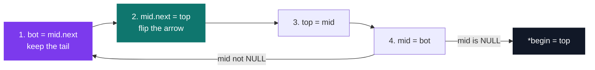

# C Pool — Day 11: linked lists

[](https://antoinepoisson.github.io/Old-School-Projects/projects/cpool-day11-2018)

  

**Epitech project** · Unix & C Lab Seminar (Part II) (`B-CPE-100`) · Tek1 · 2018-2019 · 1 day · Grade B

> C's flagship data structure: a chain of nodes linked by addresses.

Reversing a list in place is four assignments inside a loop. Swap two of them and the list is not
reversed — the tail is unreachable, permanently, because the only pointer to it was the one you
just overwrote.

There is no `main` here, by design. The grader appends its own `main.c`, compiles every `.c` in the
folder and links against `libmy.a` — the first program to walk these pointers is one you never see.

## Overview

Unlike an array, a linked list can grow and shrink anywhere without copying everything. In exchange
there is no more index: to reach the tenth element you have to walk through the first nine.

The whole day rests on one imposed structure. The subject prints it and demands it verbatim in a
file named `mylist.h` under `include/`, and the `void *` in it is the point — no type ever tells you
what a node holds.

```c
typedef struct linked_list
{
    void *data;
    struct linked_list *next;
} linked_list_t;
```

A list is that structure repeated, each node holding the address of the next, the last holding
`NULL` — the only thing that stops every loop in the file. Run `./a.out test arg2 arg3` and the
chain comes out like this:


## How it works

The day is eleven tasks building one toolbox. Three of them are archived here — 46 lines of code
across 3 files.

| Task | Idea | Here |
| --- | --- | --- |
| `my_params_to_list` | build a list from `ac` / `av` | yes |
| `my_list_size` | walk to `NULL` and count | yes |
| `my_rev_list` | reverse in place, allocate nothing | yes |
| `my_apply_on_nodes` | run `int (*f)(void *)` on every node | — |
| `my_apply_on_matching_nodes` | run `f` only where `cmp` returns `0` | — |
| `my_find_node` | first node whose data matches | — |
| `my_delete_nodes` | remove every node that matches | — |
| `my_concat_list` | link two lists, create nothing | — |
| `my_sort_list` | sort through a comparison pointer | — |
| `my_add_in_sorted_list` | insert while keeping the order | — |
| `my_merge` | fold one sorted list into another | — |

**The build order is the first trap.** The subject asks for `./a.out` placed on the list first, and
for a walk that reaches it *last*. Head insertion gives exactly that for free: each argument is
pushed in front of the previous one, so the traversal comes out reversed relative to `av`.

**The reversal is the second.** No second list, no allocation — the arrows are flipped one node at
a time, which means the address of the next node has to be saved *before* it is overwritten.



Three pointers, one pass, constant memory — and step 1 must precede step 2 or the tail is lost:

```c
    while (mid != NULL) {
        bot = mid->next;
        mid->next = top;
        top = mid;
        mid = bot;
    }
    *begin = top;
```

## What this project demonstrates

- **In-place list reversal** in a single pass, no extra allocation, no node dropped.
- **Head insertion** used on purpose: the required traversal order is the reverse of the input.
- **Manual memory discipline** — one `malloc` per node, every `next` a real node or `NULL`.

## Key features

- `my_params_to_list`, `my_list_size`, `my_rev_list` — tasks 01 to 03 of the eleven.
- `include/mylist.h` holds the imposed node type, where the subject wants every header: in
  `include/`, never beside the sources.
- `lib/my/` carries the day's own libc: 30 source files, 120 lines of code, 30 prototypes in `my.h`.

## Technical stack

- **Languages** — C
- **Tools** — gcc, Git
- **Concepts** — linked lists, function pointers, manual memory management

## Engineering constraints

| Constraint | What it removes |
| --- | --- |
| Allowed system functions: `write`, `malloc`, `free` | no `printf` to debug with, no `realloc`, no `calloc` |
| No `main` in the delivery | the grader compiles every `.c` with its own test program |
| `linked_list_t` imposed in `include/mylist.h` | `data` is a `void *`, so the type system never helps |
| `libmy.a` must be built by a Makefile in `lib/my/` | the library is linked, not copy-pasted per exercise |
| Errors on the error output, exit code 84 | the pool contract: `0` when nothing fails, `84` otherwise |

## Verification

The autograder graded the day and no tests were written, so the three files were recompiled for this
archive, eight years on.

`-Wall -Wextra` is silent on all three. The static analyzer is not:

```console
$ gcc --analyze my_params_to_list.c
my_params_to_list.c:20:23: warning: Assigned value is uninitialized [core.uninitialized.Assign]
   20 |         element->next = rev;
      |                       ^ ~~~
my_params_to_list.c:23:5: warning: Undefined or garbage value returned to caller [core.uninitialized.UndefReturn]
   23 |     return (rev);
      |     ^~~~~~~~~~~~
2 warnings generated.
```

One missing `= NULL`. The chain is linked correctly, but the first node pushed keeps whatever the
stack held, so the list has no terminator and every walk runs off the end — the fault is in the
sentinel, not in the algorithm, and the default warning set cannot reach it.

`my_rev_list` hides an ordering bug of the same family: its `if (begin == NULL)` guard sits three
lines below `linked_list_t *mid = *begin;`. Initialisers run in declaration order, so a null `begin`
has already been dereferenced by the time the check is read.

With `rev` initialised and a throwaway `main` (not in the repo), both algorithms are exact — the
insertion order is what the subject asks for, and the reversal loses nothing:

```console
$ ./a.out test arg2 arg3
built:        arg3 -> arg2 -> test -> ./a.out
size:         4
reversed:     ./a.out -> test -> arg2 -> arg3
```

## Build & run

Pool days ship as loose files. `libmy.a` is the only thing with a Makefile:

```bash
cd lib/my && make       # gcc -c on 30 sources, then ar rc libmy.a
gcc -Wall -Wextra -c my_params_to_list.c my_list_size.c my_rev_list.c
```

That Makefile carries its own lesson: the object list reads `$(SRC: .c =.o)`, and make's
substitution reference takes no spaces around the pattern. With them nothing matches, `ar` is handed
the `.c` names, and `libmy.a` ships without a single object — every link against it then dies on
undefined symbols. `$(SRC:.c=.o)` is the fix.

---

[← C Pool — the entry bootcamp](../README.md) · [↑ Tek1](../../README.md) · [⌂ All projects](../../../README.md)
