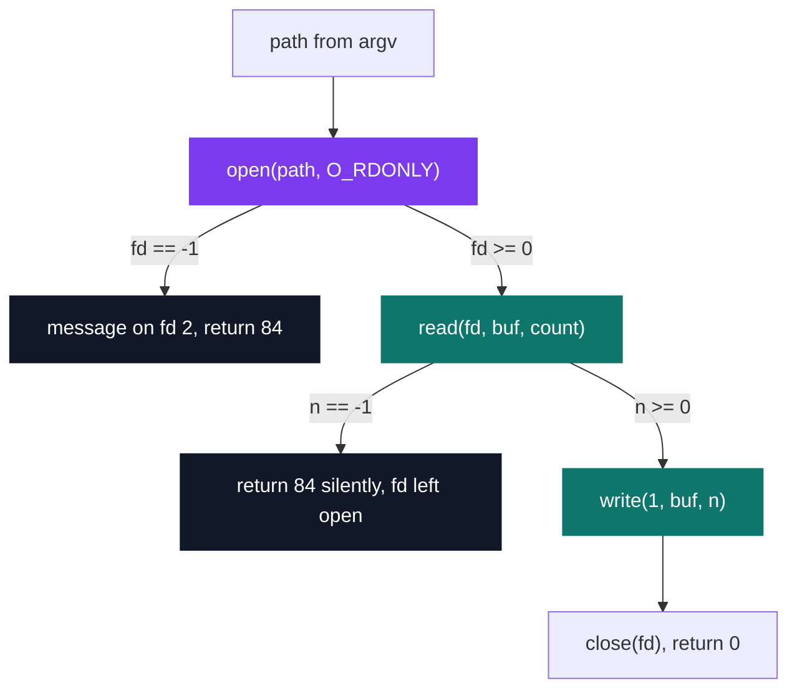
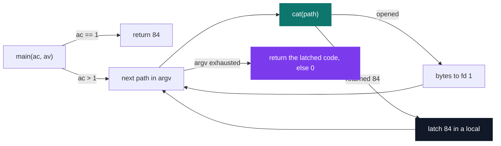

# C Pool — Day 12: file descriptors

[](https://antoinepoisson.github.io/Old-School-Projects/projects/cpool-day12-2018)

  

**Epitech project** · Unix & C Lab Seminar (Part I) (`B-CPE-100`) · Tek1 · 2018-2019 · 1 day · Grade B

> Re-coding `cat` with four system calls and nothing else: `open`, `read`, `write`, `close`.

`read()` does not return lines. It does not return files. It returns however many bytes the kernel
happens to have ready, and the caller learns how many only from the return value.

Every line-oriented Unix tool is built on top of that single uncertainty — `cat`, `grep`, and the
`get_next_line` project this day sets up. The whole exercise is learning to work a stream that never
stops where you want it to.

| fd | Stream | Role in this program |
| --- | --- | --- |
| `0` | `stdin` | unused — the program takes paths only |
| `1` | `stdout` | file bytes, one `write()` per `read()` |
| `2` | `stderr` | the `open()` failure line |

## Overview

Below libc there is no `FILE *`, no buffering, no `getline()`. There is a small integer, the file
descriptor, and four calls that move bytes across it.

This directory holds the `cat` half of the day: 3 C files, 104 lines, no header — every prototype is
redeclared by hand in `main.c` and in the test file. The `grep` clone the day also asks for is not in
this repository.

The result runs against real files and behaves like the system tool: it concatenates each argument in
order and adds nothing of its own, not even a trailing newline.

## How it works

**One `open`, one `read`, one `write`, one `close`.** Every path in `argv` goes through the same
four-call sequence, and the return value of `read()` — never the requested size — decides how many
bytes reach descriptor `1`.



There is no edge back from `write` to `read`: one call is expected to cover the whole file. That is
the shape the pool teaches you to leave behind, and the reason `get_next_line` gets a project of its
own a few days later.

**`count` and `buf` disagree.** The requested size and the array that receives it are declared on
consecutive lines, and they do not match:

```c
int cat(int ac, char *av[], int a)
{
    int fd;
    int count = 30000;
    char buf[500];
```

`read()` takes `count` as a promise about the buffer; the kernel never sees `sizeof(buf)`. Measured
on this code: a 500-byte file comes out byte-for-byte correct, and at 501 bytes the copy runs past the
end of the array — with the stack protector on, the process aborts as `cat()` returns. It is a clean
illustration of what the syscall boundary does and does not check for you.

**Errors without `perror`.** `perror` and `malloc` are both banned, so the diagnostic is assembled
from string literals and pushed out one byte at a time on descriptor `2`:

```c
    fd = open(av[a], O_RDONLY, S_IRWXU);
    if (fd == -1) {
        my_putstr("cat: ");
        my_putstr(av[a]);
        my_putstr(": No such file or directory");
        my_putchar('\n');
        return (84);
    }
```

`my_putchar` is hardwired to `write(2, &c, 1)`. That is a deliberate split: diagnostics never touch
descriptor `1`, so `./cat a b > out` keeps `out` byte-clean even when `a` does not exist.

The cost is that one literal has to cover every `open()` failure — a permission-denied file is still
reported as *No such file or directory*. With `errno` off the table, that is the whole vocabulary.

## What this project demonstrates

**One bad path does not abort the run.** `main` iterates over `argv`, calls `cat()` per argument, and
latches `84` in a local instead of returning early — the same contract as the system tool.



- Direct use of `open` / `read` / `write` / `close` with no libc stream on top
- A block read instead of the forbidden byte-at-a-time `read()`
- Content and diagnostics kept on separate descriptors, so redirection stays clean

## Key features

| Behaviour | Result |
| --- | --- |
| `./cat a b` | both files concatenated on `stdout`, in argument order |
| `./cat missing` | `cat: missing: No such file or directory` on `stderr`, exit `84` |
| `./cat missing ok` | error line, then `ok` printed anyway, exit `84` |
| `./cat adir` | `read()` fails on a directory: exit `84`, both streams silent |
| `./cat` | exit `84`, nothing written |

Nothing is appended to the output. The bundled fixture `cat/file` is 23 bytes with no trailing
newline, and neither has the program's output — the shell prompt lands right after the last byte.

## Technical stack

- **Languages** — C
- **Tools** — Makefile, gcc, Criterion, Git
- **Concepts** — open/read/close system calls, block reading, error handling and standard error output

## Engineering constraints

Each rule below deletes the comfortable solution and forces the low-level one.

| Rule | What it forces |
| --- | --- |
| Only `open`, `read`, `write`, `close` | no `fopen`, no `getline`, no libc buffering |
| `malloc` forbidden | the buffer is a fixed array on the stack |
| `perror` forbidden | the error string is built from literals by hand |
| `read()` of size 1 forbidden | one block read, not a byte-at-a-time loop |
| Errors on `stderr`, exit `84` | `stdout` stays clean under redirection |
| One Makefile per tool, plus `tests_run` | `cat/Makefile` builds and tests from its own directory |

## Beyond the baseline

- Criterion tests and a `tests_run` rule with coverage, not required at this level

## Verification

One Criterion test, calling `cat()` directly with both standard streams redirected so the assertion
can inspect them:

```c
Test(cat, cat_test_val, .init = redirect_all_stdout)
{
    char *t[3] = {"./a.out", "file", 0};
    cat(2, t, 1);
    cr_expect_stdout_eq_str("Bonjour, le test marche");
}
```

Byte-exact against the 23-byte fixture `cat/file`, so a single stray newline — the classic mistake
when re-coding `cat` — fails it. `tests_run` compiles `cat.c` with the test file alone, no `main.c`,
and links with `--coverage -lcriterion`.

## Build & run

```bash
make
```

Produces `cat`. A real session, output exactly as the program writes it:

```console
$ ./cat file
Bonjour, le test marche$ ./cat nope file
cat: nope: No such file or directory
Bonjour, le test marche$ echo $?
84
```

---

[← C Pool — the entry bootcamp](../README.md) · [↑ Tek1](../../README.md) · [⌂ All projects](../../../README.md)
