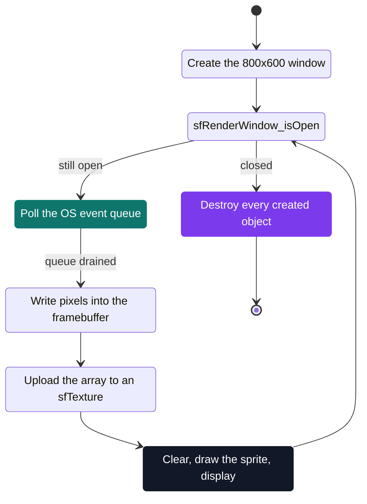

# C Pool — Day 13: discovering CSFML

[](https://antoinepoisson.github.io/Old-School-Projects/projects/cpool-day13-2018)

  

**Epitech project** · Unix & C Lab Seminar (Part I) (`B-CPE-100`) · Tek1 · 2018-2019 · 1 day · Grade B

> Opening a window and filling it one pixel at a time — the pool's first graphics day.

Day 13 puts an 800x600 window on screen and fills it one pixel at a time. The twelve pool days
before it stayed inside the terminal — start, compute, print, exit — and this program must not exit:
it sits in a loop asking the operating system what just happened, until the user closes the window.

That inversion is the lesson. The program no longer owns the schedule — the window system does, and
the code has to answer it every frame without ever blocking.

The day also hands out no ready-made sprites. Before anything reaches the screen you allocate the
image yourself: 800x600 is 480,000 pixels at four RGBA bytes each, 1,920,000 bytes — and the first
write primitive the subject asks for sets exactly one of them.

## Overview

After two weeks of terminal, this is the day something appears on screen. You open a window, draw
in it, and react to keyboard and mouse.

It is also the first contact with an external library: code written by other people, with its own
naming rules, its own object lifetimes, and a header layout you have to learn to read.

CSFML is the C binding of SFML, so there are no methods. Handles are opaque pointers passed back
into `sfThing_verb()` functions, and every `_create` has a matching `_destroy` that you own.

## How it works

The day is four tasks, each adding one layer between the pixel and the screen.

| Task | What it adds | Key symbol |
| --- | --- | --- |
| 01 | An 800x600 window that stays open | `sfRenderWindow` |
| 02 | A `framebuffer_t` pixel array, written per pixel | `put_pixel` |
| 03 | A 10x10 blue square drawn into that array | `draw_square` |
| 04 | An existing image read back from a file | raw file bytes |

**The loop.** A window is not a function you call, it is a queue you drain. Each frame pops every
pending event, updates state, then repaints the whole surface from scratch.



`sfEvtClosed` stops nothing by itself: popping it only tells you to call `sfRenderWindow_close()`,
and the loop condition catches up on the next turn. Two more failure modes sit in the same cycle —
skip the clear and the previous frame stays underneath the new one, skip the display and the back
buffer is never swapped, so nothing appears while the program runs perfectly happily.

**The pixel path.** Task 02 removes the shortcut. You do not draw a red dot — you write the four
bytes that pixel owns in the array you allocated (`(y * width + x) * 4` if you keep it flat), push
the whole array into a texture, and let a sprite place it on screen.


The three prototypes are imposed, and they carry the design:

```c
framebuffer_t *framebuffer_create(unsigned int width, unsigned int height);
void put_pixel(t_framebuffer *framebuffer, unsigned int x, unsigned int y, sfColor color);
void draw_square(t_framebuffer *framebuffer, sfVector2u position,
                 unsigned int size, sfColor color);
```

Read them closely: the subject names the typedef `framebuffer_t`, then writes `t_framebuffer` in the
next two signatures. Picking one and staying consistent is the first decision of the day, and it is
the kind of thing only a full read of the page catches.

From task 02 onward the library's own vocabulary lands in functions you wrote yourself — `sfColor`
first, then an `sfVector2u` for the square's position instead of two `unsigned int`.

**What is in the directory.** One file survives: `task01.c`, ten lines, three includes, no `main`.
All three come from SFML's *Window* module.

```c
#include <SFML/Window/VideoMode.h>
#include <SFML/Window/WindowHandle.h>
#include <SFML/Window/Window.h>
```

That split is the library's first real trap. SFML is five modules — System, Window, Graphics, Audio,
Network — and CSFML ships one library per module. Window gives you an OS window with a GL context
and nothing to draw with; `sfRenderWindow`, `sfTexture` and `sfSprite` all live in Graphics.

Two months later `my_hunter` has it sorted. One `include/include_csfml.h` gathers `<SFML/Graphics.h>`,
`<SFML/Audio.h>` and the System headers behind a single guard, and its Makefile links the four
modules the game touches:

```make
gcc -o $(NAME) $(MAIN) $(SRC) $(LIB) $(INCLUDE) -l csfml-graphics -lcsfml-system -lcsfml-window -lcsfml-audio -Wall --extra
```

| Type | Module | Role |
| --- | --- | --- |
| `sfVideoMode` | Window | resolution and bit depth of the window |
| `sfRenderWindow` | Graphics | the surface you can actually draw into |
| `sfEvent` | Window | one item popped off the event queue |
| `sfTexture` | Graphics | the pixel array, uploaded GPU-side |
| `sfSprite` | Graphics | a positioned, transformable handle on a texture |
| `sfColor` | Graphics | the RGBA quadruplet written per pixel |
| `sfVector2u` | System | unsigned 2D coordinate pair |

## What this project demonstrates

- First graphical output after two weeks of terminal
- Discovering the event / update / render loop, and giving up control of the schedule
- Reading code written by other people and plugging into it
- Manual memory ownership across a library boundary: one `_destroy` per `_create`
- That an image is nothing more than an array of bytes

## Key features

- Single exercise on two-dimensional array manipulation
- Very short deliverable, day cut short at the end of the pool
- BMP is the format the last task points at: a header that says where the pixels start, then raw rows

## Technical stack

- **Languages** — C
- **Frameworks / libraries** — CSFML
- **Tools** — gcc, Git
- **Concepts** — framebuffer and pixel array, texture and sprite, reading a BMP file

## Engineering constraints

- imposed library: CSFML
- Epitech coding standard
- imposed prototypes: the pixel array must be reachable from a single struct pointer
- no build system: the day is delivered without a Makefile

## Verification

Day graded by the school's autograder, no tests written.

The check is the window itself, and the expected result is unambiguous because the coordinates are
fixed: red pixels at (10;10), (100;100) and (250;400), then a blue square of 10 pixels by 10 pixels
at position (100;100).

## Build & run

Each exercise compiles on its own, against the CSFML modules a window-and-sprite program pulls in.

```bash
# the file kept here declares no main: it compiles to an object, it does not link
gcc -c task01.c

# a complete task from this day
gcc <task>.c -o <task> -lcsfml-graphics -lcsfml-window -lcsfml-system
```

---

[← C Pool — the entry bootcamp](../README.md) · [↑ Tek1](../../README.md) · [⌂ All projects](../../../README.md)
