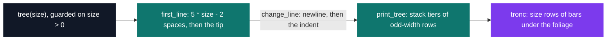
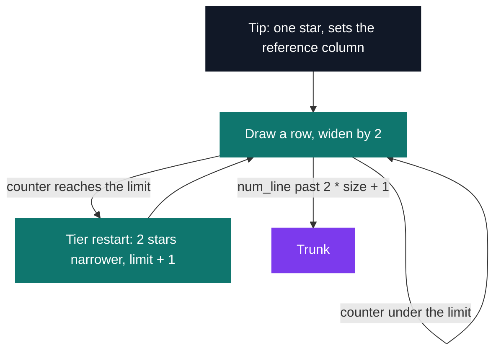

# Tree — ASCII fir tree

[](https://antoinepoisson.github.io/Old-School-Projects/projects/cpool-tree-2018)

 

**Epitech project** · Unix & C Lab Seminar (Part I) (`B-CPE-100`) · Tek1 · 2018-2019 · 1 day · Grade B

> Drawing a fir tree in characters, whose shape depends on a single size parameter.

One integer goes in. The column the tip sits in, the width of every row, where each tier
restarts and how wide the trunk is all have to be derived from that number by arithmetic.

The only output primitive allowed is `my_putchar`. No `printf`, no buffer, no string: the
picture exists only as a stream of single bytes, so every space has to be counted *before*
it is written. There is no going back to fix an alignment.

Exact output of `tree(1)` — 4 rows of foliage, one row of trunk:

```text
   *
  ***
 *****
*******
   |
```

At `tree(2)` the shape changes character. The foliage stops being one triangle and becomes
three stacked tiers, 16 rows of stars over a two-row trunk:

```text
        *
       ***
      *****
     *******
      *****       
     *******
    *********
   ***********
  *************
 ***************
  *************      
 ***************
*****************
*******************
*********************
***********************
       |||
       |||
```

## Overview

A day-4 pool exercise, decorative in appearance and very geometric in fact. The whole task is
turning a shape into arithmetic: find the formulas that, from one number, give the width of
each tier, the offset that centres the figure, and the size of the trunk.

The deliverable is a function with no `main`, compiled and run by the school's autograder.
139 lines of C across two files, 7 functions, no Makefile.



## How it works

`first_line` fixes the reference column once, at `4 * size + (size - 2)` spaces before the
tip. Every other row is then positioned relative to that single number — nothing in the
drawing is measured against anything else.

Measured on the compiled function, the geometry comes out like this:

| `size` | tip indent | foliage rows | tiers | widest row | trunk |
| --- | --- | --- | --- | --- | --- |
| 1 | 3 | 4 | 1 | 7 | 1 bar × 1 row |
| 2 | 8 | 16 | 3 | 23 | 3 bars × 2 rows |
| 3 | 13 | 23 | 4 | 33 | 3 bars × 3 rows |
| 4 | 18 | 25 | 4 | 37 | 5 bars × 4 rows |

The indentation primitive is nine lines long and carries the entire centring logic:

```c
int espace_line(int size, int num_line, int mid)
{
    int i = 1;
    int change_espace = mid - num_line;

    for (i = 1; i < change_espace; i++)
        my_putchar(' ');
    return (change_espace);
}
```

Because the loop starts at `1`, it prints `mid - num_line - 1` spaces — and nothing once that
count goes non-positive. Rows that would want columns left of the margin pile up on column 0
instead, so at `size` 2 and 3 the centre of the base lands three columns right of the tip. At
`size` 1, and from `size` 4 up, the figure comes out exactly symmetric.

`print_tree` is the loop that makes the tiers. Row width grows by 2 each step; when the counter
hits its limit the loop rewinds and redraws a row two stars narrower and one column further
right, then raises the limit by one. That overlap is what makes a fir instead of a plain cone.



The trunk is the one place where parity genuinely changes the answer. Foliage rows are always
odd (`print_star_line` writes `nbr + 2` stars with `nbr` odd), so the trunk must be odd too or
it cannot be centred on the tip. `tronc` gets there by starting the even-size loop one step
early — `for (i = -1; i < size; i++)` — which draws `size + 1` bars, indented by
`top_position - size / 2` so the middle bar falls on the tip column.

Two findings from re-reading the code. `first_line` branches on `size % 2 == 0 || size == 1`,
but both arms are byte-identical, so the test is vestigial — parity only ever matters in
`tronc`. And the tier restart writes its indent *before* the newline, so every tier-break row
ends in trailing spaces — two of them in the `tree(2)` block above, invisible on screen but
present in the bytes.

## What this project demonstrates

- Deriving the alignment formulas of a centred pattern from a single parameter
- Keeping a figure centred when the only primitive is a one-byte write, with no way to backtrack
- A trunk whose width depends on the parity of the size, handled as a separate case
- Reading the shape back out of the arithmetic: tier count, row widths and drift are all
  predictable from `size` alone

## Key features

- `tree(int size)` printing an ASCII fir tree tier by tier, foliage then trunk
- Reference column computed once, every row positioned relative to it
- Tier restart logic that stacks overlapping skirts instead of one plain triangle
- Trunk width and indentation adjusted for even and odd sizes
- Utility functions kept separate in `other_fonction.c`

## Technical stack

- **Languages** — C
- **Tools** — gcc, Git
- **Concepts** — discrete geometry, indentation computation, even/odd cases

## Engineering constraints

- **Only output primitive: `my_putchar`** — one byte per call, so spacing has to be computed
  ahead of the write rather than corrected afterwards
- **No `main` in the deliverable** — the autograder links its own harness against `tree()`
- **Epitech coding standard** — the 5-functions-per-file rule is why the helpers live in a
  second file; two bodies still run past the 20-line limit, `print_tree` at 32 lines and
  `tronc` at 23

## Verification

No tests were delivered with the exercise. The numbers in this README were re-derived by
linking the two source files against a four-line driver and measuring the output for `size` 1
to 10: tip indent, tier count, widest row, trunk width and trunk centring.

Every foliage row comes out odd-width across that range, and from `size` 1 to 6 every trunk
row lands centred on the tip column. One seam shows past that: `print_tree` can leave an unused
indent hanging after its last newline, and `tronc` writes its first row onto it — from `size` 7
up that one row sits 2 to 8 columns right of the rest of the trunk, which stays aligned.

`tree()` guards on `size > 0`, so 0 and negative values print nothing.

## Build & run

The pool day ships without a Makefile: each exercise compiles on its own. Since the deliverable
has no `main`, add a driver and the `my_putchar` the school provides.

```bash
cat > main.c <<'EOF'
#include <unistd.h>
void my_putchar(char c) { write(1, &c, 1); }
void tree(int size);
int main(void) { tree(3); return 0; }
EOF

gcc -Wno-implicit-function-declaration -o tree tree.c other_fonction.c main.c
./tree
```

The flag is not optional on a current toolchain. Neither source declares `my_putchar` before
calling it, and clang 21 turns that implicit declaration into a hard error — `-std=gnu89` does
not soften it.

---

[← C Pool — the entry bootcamp](../README.md) · [↑ Tek1](../../README.md) · [⌂ All projects](../../../README.md)
