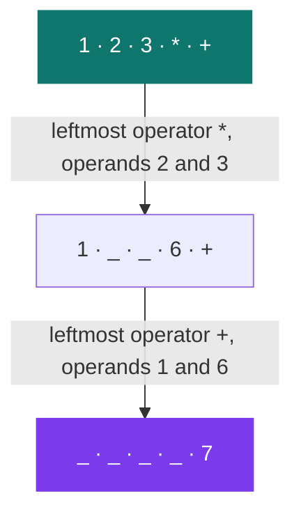

# Bistro-matic

[](https://antoinepoisson.github.io/Old-School-Projects/projects/cpool-bistro-matic-2018)

  

**Epitech project** · Unix & C Lab Seminar (Part II) (`B-CPE-101`) · Tek1 · 2018-2019 · 2 weeks · Grade B

> A calculator evaluating parenthesised expressions with a customisable operator alphabet.

The libc is off the table except `read`, `write`, `malloc`, `free` and `exit`. No `printf`, no `atoi`, no `strtol` — and no `long long` either, because the operands are integers of unbounded size.

`12345678901234567890 + 98765432109876543210` has to come out of a digit-by-digit carry loop over two strings. The expression around it still has to respect parentheses and precedence, and every failure has to print a fixed message instead of crashing.

**2,737 lines of C across 64 files**: 26 sources and 2 headers at the project root, a 23-file `libmy` rebuilt from scratch, and 13 Criterion test files holding 78 test cases.

## Overview

`calc` takes three arguments and reads the expression from standard input — nothing is typed on the command line.

| Argument | Meaning |
| --- | --- |
| `base` | the 10 symbols of the numeral base |
| `operators` | 7 symbols, in this order: `(`, `)`, `+`, `-`, `*`, `/`, `%` |
| `size_read` | how many bytes to read from stdin |

That third argument is not a convenience. `read(0, expr, size)` must return exactly `size` or the program stops with `error` — it never guesses where the expression ends.

## How it works

Four passes turn the input string into a result. The shunting-yard is only the second one.

```mermaid
flowchart LR
    A["read(0, expr, size)"] --> B["rework_string: validate, fold unary minus"]
    B --> C["my_rpn: shunting-yard over a char stack"]
    C --> D["my_str_to_word_array: postfix to tokens"]
    D --> E["array_manager: rewrite the tape in place"]
    E --> F["infin_add / sub / mul / div / mod"]

    classDef core fill:#0F766E,stroke:#0F766E,color:#ffffff;
    classDef alt fill:#111827,stroke:#111827,color:#ffffff;
    classDef accent fill:#7C3AED,stroke:#7C3AED,color:#ffffff;
    class C,E core
    class A alt
    class F accent
```



**Precedence is a string, not a switch.** `compare_precedence` ranks an operator by its index in a single array, `char precedence[] = "(/%*-+";`. Division, modulo and multiplication sit at lower indices than addition and subtraction, so they bind tighter; the open parenthesis sits first and stops the stack unwinding.

| Input | `my_rpn` output |
| --- | --- |
| `1+2*3` | `1 2 3 * +` |
| `(1+2)*3` | `1 2 + 3 *` |
| `1+5/4` | `1 5 4 / +` |
| `4*(1+4)` | `4 1 4 + *` |

**The unary minus never reaches the parser.** `rework_string` runs before the shunting-yard and folds negation into the literals: `-(1+2)` becomes `(-1+-2)`. The operator stack then only ever sees binary operators, which removes the classic `-` ambiguity from the parser entirely.

The fold matches on `-` followed by `(` without asking whether that `-` was unary or binary, so `5-(1+2)` rewrites to `5(-1+-2)` and the leading operand drops out of the expression. The subtraction case needs a look at what precedes the sign; the rewrite only looks at what follows it.

**Evaluation without a second stack.** The postfix string is split into tokens and rewritten in place. Each round finds the leftmost operator, takes the two nearest live tokens to its left, blanks them, and writes the result into the operator's own slot:

```c
for (a = 0; is_operator(array[a][0]) == 0 || array[a][1] > 47; a++);
current_operator = array[a][0];
index_to_rewrite = a;
for (--a; array[a][0] == ' '; a--);
second_number = array[a];
array[a] = " ";
for (--a; array[a][0] == ' '; a--);
first_number = array[a];
array[a] = " ";
result = calculator(first_number, current_operator, second_number);
array[index_to_rewrite] = result;
```

The `array[a][1] > 47` test is what tells the operator `-` apart from a negative literal: in `"-5"` the second character is a digit, so the token is skipped rather than applied.



**Where the alphabet stops.** `check_base` demands exactly 10 symbols and rejects any that collides with the five operator characters; `check_ops` demands exactly 7 and refuses anything that is neither an operator nor a parenthesis. `check_multiple_symboles` then sweeps `!` through `~` over each argument to prove no symbol repeats inside it.

Past that gate the evaluator reads `'0'`–`'9'` and `()+-*/%` directly. `base` and `ops` reach `eval_expr` and are never consulted, so a non-decimal alphabet is validated and then ignored:

```console
$ echo -n '1+2' | ./calc 'ABCDEFGHIJ' '()+-*/%' 3; echo
3
```

The engine is one substitution table away from the generality the validation layer already enforces.

## What this project demonstrates

- A clean separation between lexical analysis and evaluation — `rework_string` and `my_rpn` never compute, the `infin_*` kernels never parse.
- A generic engine driven by configuration rather than hard-coded cases: precedence is a string, and operator dispatch is one lookup in `calculator.c`.

## Key features

Five operations, all written over decimal strings, all sign-aware.

| Operation | File | Method |
| --- | --- | --- |
| `+` | `infin_add.c` | carry propagation over reversed strings |
| `-` | `infin_sub.c` | borrow propagation, sign cases dispatched back to `infin_add` |
| `*` | `infin_mul.c` | long multiplication with accumulated partial sums |
| `/` | `infin_div.c` | repeated subtraction |
| `%` | `infin_mod.c` | `a - (a / b) * b`, over `infin_div`, `infin_mul` and `infin_sub` |

Division by repeated subtraction costs one subtraction per unit of quotient. Rather than let a large dividend hang the grader, `infin_div` and `infin_mod` refuse a dividend longer than 7 digits and print `exit: will time out` — a declared budget instead of a stall.

## Technical stack

- **Languages** — C
- **Tools** — Makefile, gcc, Criterion, Git
- **Concepts** — arbitrary-precision arithmetic, arbitrary numeral bases, shunting-yard and reverse Polish notation, operator precedence

## Engineering constraints

- imposed binary: `calc`, called with base, operators and length to read; expression read from stdin
- libc forbidden except `read`, `write`, `malloc`, `free` and `exit`
- integers of infinite size, in a base given at runtime: no native integer type usable for the operands
- error messages imposed by the `SYNTAX_ERROR_MSG` and `ERROR_MSG` macros, return code 84
- Makefile with `re`, `clean` and `fclean` rules; bonus in a `bonus/` folder

Every failure path prints a fixed message and leaves through `exit`, never through a crash:

| Situation | Message | Exit |
| --- | --- | --- |
| character outside the alphabet | `syntax error` | 84 |
| base or operator set of the wrong size, duplicate symbol | `syntax error` | 84 |
| `malloc` failure or short `read` | `error` | 84 |
| division by zero | `division by 0` | 84 |
| modulo by zero | `modulo by 0` | 84 |
| dividend longer than 7 digits | `exit: will time out` | 84 |
| unbalanced parentheses | `syntax error` | 0 |

The last row is the one bug worth naming. `bistromatic.h` opens with eight `OP_*_IDX` position constants and then twelve exit codes, every one of them `84`; the parenthesis check reaches for the wrong family and calls `exit(OP_OPEN_PARENT_IDX)`, which is `0`. The message prints, the shell reads success — two blocks of `#define` in one header, and only the name tells them apart.

## Beyond the baseline

- Infinite division and modulo implemented, when only addition was strictly required
- Thirteen Criterion test files, one per operation

2,700 lines: this is the largest deliverable of the pool.

## Verification

`make tests_run` rebuilds the whole source tree against Criterion with `--coverage` and runs it.

78 test cases across 13 files, one file per unit: the five arithmetic kernels, the `calculator` dispatch, `my_rpn` checked on its postfix output, `eval_expr` checked end to end, and the helpers `word_count`, `my_str_to_word_array`, `is_operator`, `is_alpha` and `my_itoa`.

## Build & run

```bash
make
```

Produces `calc`.

```console
$ echo -n '1+2*3' | ./calc '0123456789' '()+-*/%' 5; echo
7
$ echo -n '(1+2)*3' | ./calc '0123456789' '()+-*/%' 7; echo
9
$ echo -n '2*3+4*5' | ./calc '0123456789' '()+-*/%' 7; echo
26
$ echo -n '12345678901234567890+98765432109876543210' | ./calc '0123456789' '()+-*/%' 41; echo
111111111011111111100
$ echo -n '10/0' | ./calc '0123456789' '()+-*/%' 4; echo "  (exit $?)"
division by 0  (exit 84)
$ echo -n '123456789/3' | ./calc '0123456789' '()+-*/%' 11; echo "  (exit $?)"
exit: will time out  (exit 84)
```

---

[← C Pool — the entry bootcamp](../README.md) · [↑ Tek1](../../README.md) · [⌂ All projects](../../../README.md)
