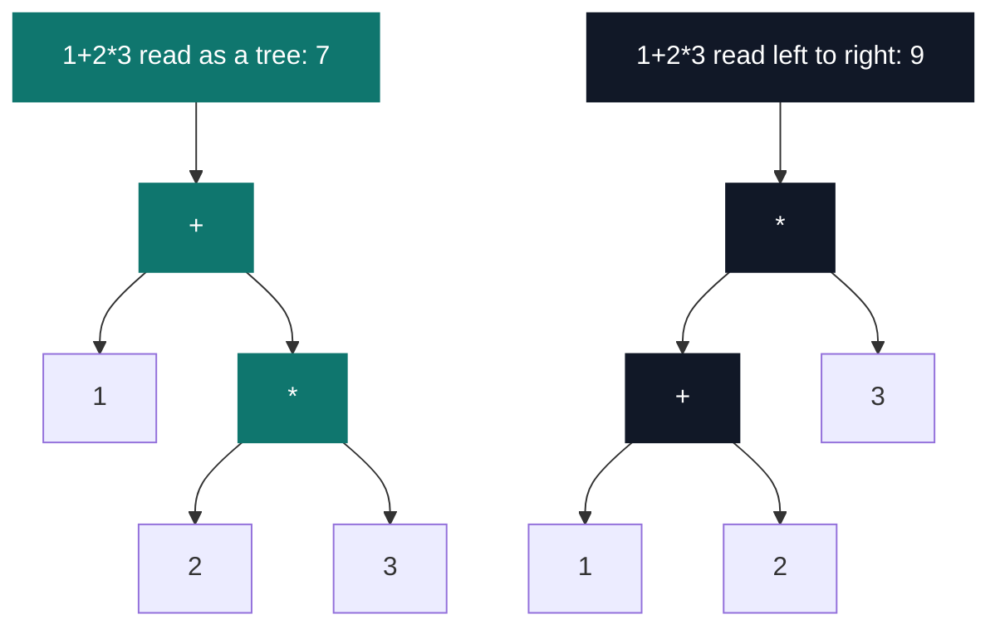

# EvalExpr

[](https://antoinepoisson.github.io/Old-School-Projects/projects/cpool-evalexpr-2018)

   

**Epitech project** · Unix & C Lab Seminar (Part II) (`B-CPE-101`) · Tek1 · 2018-2019 · 2 weeks · Grade B

> Evaluating a mathematical expression given as text, precedence included.

## Overview

`1+2*3` is 7, not 9. A human sees that without thinking. A program reading the string left to right gets 9, and no number of extra `if` statements fixes it: the two answers come from two different trees, and the naive scan builds the wrong one.

`eval_expr` receives the expression as `argv[1]` and prints its value. The subject fixes the prototype, hands over the `main`, and allows no system function other than `write`, `malloc` and `free` — precedence has to be built, not called.



Same five tokens in the same order, two different trees. The 458 lines of C that the Makefile compiles exist to build the left one.

## How it works

`my.h` still declares `number()`, `summands()` and `factors()` — the grammar functions of a recursive-descent evaluator. Only `number.c` was ever written, and the Makefile does not compile it.

The route that shipped is Dijkstra's shunting-yard. The infix string is rewritten into reverse Polish notation, where precedence is already baked into token order, so the evaluation that follows is a plain stack walk with no precedence logic left in it.


**Precedence is a string.** `compare_precedence` keeps the operators in `"(/%*-+"` and compares *positions*: whichever character sits earlier binds tighter, so a table lookup replaces a switch. An opening parenthesis never loses a comparison either — the function returns 1 immediately when the stack top is `(`, before the table is read at all.

```c
    char precedence[] = "(/%*-+";
    ...
    for (a = 0;precedence[a] != '\0'; a++)
        if (precedence[a] == str[i])
            position_str = a;
    for (a = 0;precedence[a] != '\0'; a++)
        if (precedence[a] == is_top_pile(pile))
            position_pile = a;
    if (position_pile > position_str)
        return (1);
    return (0);
```

The intermediate form, dumped from `result_rpn` before evaluation, next to what the binary prints:

| Expression | RPN produced | Printed |
| --- | --- | --- |
| `(3+2)*5` | `3 2 + 5 *` | `25` |
| `1+2*3` | `1 2 3 * +` | `7` |
| `(1+2)*3` | `1 2 + 3 *` | `9` |
| `12+34*2` | `12 34 2 * +` | `80` |
| `(2+3)*(4+5)` | `2 3 + 4 5 + *` | `45` |
| `2*(4-9)` | `2 4 9 - *` | `-10` |

Evaluation then runs on the token array: `array_rewriter` finds the leftmost operator, blanks the two tokens before it, and writes the result into the operator's slot. `array_manager` counts the operators in the RPN string once, runs exactly that many passes, and reads the survivor back through `my_getnbr`.

**The minus problem, solved in one comparison.** After `4-9` the array holds the token `-5`, and the next scan must not mistake it for a subtraction. The guard is `is_operator(array[a][0]) == 0 || array[a][1] > 47` — a `-` whose second character is a digit is a number, not an operator. That one test is what keeps subtraction and negation apart inside the reduction loop.

Encoding precedence as a position in a string makes it a *strict total order* over operators that belong in two equality classes. Between `+` and `-` the inversion is harmless, since `a + (b - c)` always equals `(a + b) - c`; between `*`, `/` and `%` it is not, and `3*5/2` returns 6 where C returns 7.

That same fixed order also drives the closing parenthesis: `is_extension_operator_pile` re-emits the popped operators in `/ % * - +` sequence rather than in stack order. `1*(2+3)` prints 5, and wrapping it as `(1*(2+3))` prints 7. The stack machine underneath is right; what is missing is a pop loop that respects the stack instead of re-sorting it.

## What this project demonstrates

- A first expression parser: infix to reverse Polish conversion through shunting-yard, driven by an explicit stack instead of the call stack
- A hand-written linked stack — `push`, `pop`, `is_top_pile`, three files and 55 lines — carried straight into Bistro-matic in the same two-month window, changed only by a `pile` to `pile_t` rename and an added include

## Key features

| Capability | Carried by |
| --- | --- |
| Five binary operators `+ - * / %` | `calculator.c` |
| Infix to RPN over a linked stack | `my_rpn.c`, `push.c`, `pop.c` |
| Parenthesised groups | `is_operator_pile()` in `my_rpn.c` |
| Multi-digit operands | `is_extension_my_rpm_three()` |
| Negative intermediate results | `my_itoa(nbr, neg)` |

## Technical stack

- **Languages** — C
- **Tools** — Makefile, gcc, Criterion, Git
- **Concepts** — shunting-yard, reverse Polish notation, linked stack, operator precedence

## Engineering constraints

- imposed binary: `eval_expr`, with the main provided by the subject
- imposed prototype: `int eval_expr(char const *str)`
- system functions allowed: `write`, `malloc` and `free` only — hence the 32-file `libmy` linked in for `my_getnbr`, `my_put_nbr`, `my_putchar`, `my_strlen` and `my_strncpy`
- the received expression is guaranteed valid: no syntax error and no division by zero to handle
- Makefile with `re`, `clean` and `fclean` rules

## Beyond the baseline

- Going through an intermediate RPN form (`my_rpn.c`) rather than a direct recursive evaluation, which turns evaluation into a stack walk that carries no precedence logic
- Four Criterion test files, wired into a `tests_run` rule that also builds with `--coverage`

## Verification

| Test file | Unit under test | Tests |
| --- | --- | --- |
| `test_my_calculator.c` | the five operators, including negatives | 10 |
| `test_my_is_operator.c` | operator recognition | 6 |
| `test_my_word_count.c` | token counting | 3 |
| `test_my_str_to_word_array.c` | splitting the RPN string | 2 |

21 Criterion test cases over the leaf helpers; the shunting-yard itself is exercised end to end through the binary.

The RPN string lands in `result_rpn`, a 9,999,999-byte global declared in `my.h`, so every run reserves roughly 10 MB of zero-filled memory for a string that never needs more than twice the input length. `eval_expr.c` computes that bound on line 51 and discards it on line 52.

## Build & run

```console
$ make
$ ./eval_expr "(3+2)*5"
25
$ ./eval_expr "1+2*3"
7
$ ./eval_expr "1+(2*(3+4))-5"
10
```

Produces `eval_expr`. `make tests_run` builds the Criterion suite with `--coverage` and runs it.

---

[← C Pool — the entry bootcamp](../README.md) · [↑ Tek1](../../README.md) · [⌂ All projects](../../../README.md)
