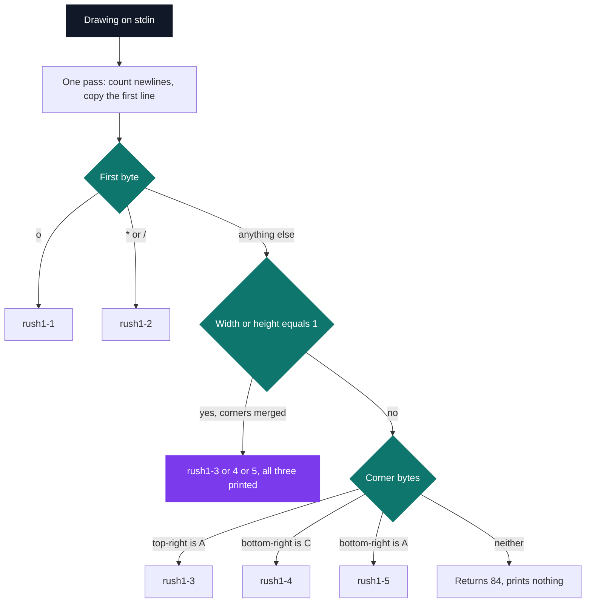

# Final Stumper — rush3

[](https://antoinepoisson.github.io/Old-School-Projects/projects/cpool-finalstumper-2018)

 

**Epitech project** · Unix & C Lab Seminar (Part II) (`B-CPE-101`) · Tek1 · 2018-2019 · 1 afternoon · Grade B

> The pool's closing exam: given a drawing, name the rule that produced it.

Rush 1 asked for a program that draws a rectangle. Final Stumper asks for the inverse: the program is
handed the finished drawing on stdin and must name which of five rules produced it, and at what size.

The subject lands at the start of the session and the binary is due at the end of the afternoon.
`malloc`, `free`, `read` and `write` are the only calls allowed — no `stdio`, no string helpers.

## Overview

The five rules being inverted are the five rush 1 variants, all sitting in the neighbouring folder.
Here they are at 5×4, exactly as their binaries print them:

```text
   rush1-1     rush1-2     rush1-3     rush1-4     rush1-5

   o---o       /***\       ABBBA       ABBBC       ABBBC
   |   |       *   *       B   B       B   B       B   B
   |   |       *   *       B   B       B   B       B   B
   o---o       \***/       CBBBC       ABBBC       CBBBA
```

Read them as a set and the exam collapses. Every variant is already settled by its corners: `o` opens
rush1-1, `/` opens rush1-2, and the last three all open on `A`.

Those three then split on two more bytes. rush1-3 is the only one whose top-right corner is `A`;
rush1-4 and rush1-5 share the same top row and separate on the bottom-right corner, `C` against `A`.

So the classifier never rebuilds a candidate figure to compare against. It measures the rectangle,
then decides on three bytes: the top-left corner, the top-right one and the bottom-right one. The
bottom-left corner is redundant and is never read.



## How it works

**Reading input of unknown size.** With no `stdio`, the drawing arrives through an accumulating
`read()` loop into a single stack buffer of `BUFF_SIZE + 1` bytes, with `BUFF_SIZE` set to 10 000.
Each call is capped at `BUFF_SIZE - offset`, so an oversized figure is truncated instead of
overrunning the buffer.

That ceiling is exact. A 99×100 figure is 10 000 bytes and comes through whole; one column more and
the tail is lost, so a 100×100 drawing comes back as `[rush1-3] 100 99` and a 150×150 one as
`[rush1-3] 150 66` — the honest answer for the bytes that actually arrived.

**Measuring.** One walk over the buffer counts the newlines to get the height and copies everything
before the first one into a variable-length array to get the width. `malloc` is never called: the
whole program runs on the stack.

**Deciding.** Then the corner tests, in the order shown above.

| Test | Reads | Verdict |
| --- | --- | --- |
| First byte is `o` | `buff[0]` | `rush1-1` |
| First byte is `*` or `/` | `buff[0]` | `rush1-2` |
| Width or height is 1 | dimensions | ambiguous, all three printed |
| Last byte of line 1 is `A` | top-right corner | `rush1-3` |
| Byte before the final newline is `C` | bottom-right corner | `rush1-4` |
| Byte before the final newline is `A` | bottom-right corner | `rush1-5` |
| None of the above | — | returns 84 |

**The ambiguity.** A degenerate figure — width 1, height 1, or both — has no distinct corners left. A
1×1 drawing from `rush1-3`, `rush1-4` or `rush1-5` is the single character `B`. Nothing can separate
them, so the correct answer is all three, joined on one line.

`is_extension()` emits that triple with one loop that advances its own counter, so the separator lands
between the matches and never after the last one:

```c
int is_extension(int a, int size_line_x, int size_line_y)
{
    for (int i = 0; i <= 5; i++) {
        if (i == a) {
            my_display_rush(a, size_line_x, size_line_y);
            if (a != 5)
                my_putstr(" || ");
            a++;
        }
    }
    write(1, "\n", 1);
    return (345);
}
```

## What this project demonstrates

- An inverse problem: the rule is deduced from its output instead of being applied to produce it.
- Finding the invariant that makes the search unnecessary — three corner bytes out of a whole rectangle.
- A validation exam at the end of the pool: subject read, program written and delivered in one afternoon.

## Key features

| Behaviour | Detail |
| --- | --- |
| Identification | Prints `[rush1-N] <width> <height>` |
| Ambiguity | Every plausible match on one line, joined by ` \|\| ` |
| Input | `read()` loop, no `stdio`, 10 000-byte ceiling, truncation-safe |
| Decision | Three bytes read — top-left, top-right, bottom-right |
| Allocation | None — a stack buffer and a VLA, `malloc` unused |
| Size | 7 files, 205 lines, 9 functions |

## Technical stack

- **Languages** — C
- **Tools** — Makefile, gcc, Git
- **Concepts** — pattern recognition, reading input of unknown size, ambiguity handling

## Engineering constraints

| Constraint | What it removed |
| --- | --- |
| Binary named `rush3`, drawing on stdin | No argv, no path: the program is a filter |
| Only `malloc`, `free`, `read`, `write` | No `stdio`: `my_putstr`, `my_put_nbr` and `my_strlen` written by hand |
| `none` if nothing matches, always end with `\n` | Every path has to reach a `write` |
| Errors on stderr, exit code 84 | The exit status carries the failure, not stdout |
| Makefile with `re`, `clean`, `fclean` | The delivery had to rebuild from scratch, not from leftover objects |

## Verification

No test files were delivered — the exam lasted an afternoon. The check that matters is a round trip,
and the material for it is the neighbouring rush 1 folder: `./rush1-N x y | ./rush3` must answer
`[rush1-N] x y`. All five variants round-trip at 5×4, 4×4 and 3×7, and the three A/B/C variants
collapse to the ambiguous triple at 1×1.

The one arm no round trip reaches is the failure arm: `is_square()` returns 84 for a figure matching
nothing, but `main()` drops that value and writes no `none`, and its `if (len > 0) return (84)` sits
after a loop that only ends when `len <= 0`. Both sit on the single path the exam never piped anything
down — the branch no test takes is the branch that stays wrong.

## Build & run

```console
$ make
$ ./rush1-1 5 4 | ./rush3
[rush1-1] 5 4
$ ./rush1-4 1 1 | ./rush3
[rush1-3] 1 1 || [rush1-4] 1 1 || [rush1-5] 1 1
```

Produces `rush3`.

---

[← C Pool — the entry bootcamp](../README.md) · [↑ Tek1](../../README.md) · [⌂ All projects](../../../README.md)
