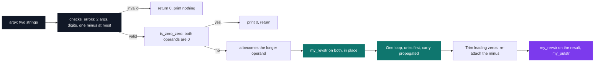

# InfinAdd — big number addition

[](https://antoinepoisson.github.io/Old-School-Projects/projects/cpool-infinadd-2018)

 

**Epitech project** · Unix & C Lab Seminar (Part II) (`B-CPE-101`) · Tek1 · 2018-2019 · 2 weeks · Grade B

> Adding numbers that no integer type on the machine can hold.

The widest integer a 64-bit CPU handles is `18446744073709551615`. Hand that number to this program
twice and it answers `36893488147419103230` — a value that fits in no register, no `long long`, no
variable at all.

It gets there because the operands never become numbers. They stay the `char *` strings `argv`
handed over, reversed in place, and the arithmetic is the one from primary school: line up the
columns, add from the right, carry the one.

## Overview

The machine's limits are a hard wall, and crossing them changes the data structure. Once an integer
is a string of digits, `+` no longer exists and every step has to be rebuilt.

| Representation | Largest value |
| --- | --- |
| `int` (32-bit) | `2147483647` |
| `long long` (64-bit) | `9223372036854775807` |
| `unsigned long long` | `18446744073709551615` |
| `infin_add` strings | bounded by `malloc` |

The school removed the shortcuts too: `write`, `malloc` and `free` are the only system functions
allowed. No `printf`, no `strlen`, no `atoi`. Everything else comes from `libmy`, the hand-written
pool library the Makefile compiles into `libmy.a` before it links the binary.

The adder itself is **221 lines across 4 `.c` files and one header**, holding **10 functions**. It
calls four of the 30 functions in `libmy`: `my_strlen`, `my_revstr`, `my_putstr` and `my_putchar`.
Grep the whole tree for `write(` and there is exactly one hit — the `write(1, &c, 1)` inside
`my_putchar`, which every character printed passes through.

## How it works

Addition runs right to left, but C strings read left to right. The chosen fix is to reverse both
operands with `my_revstr` — in place, in the `argv` strings themselves — walk them forward from
index `0`, and reverse the result before printing it.



**The column loop.** This is the whole adder, and the interesting part is what is missing around it
— no padding pass, and no second loop to drain the digits the shorter operand does not have.

```c
for (i = 0; !(end_b == 0 && end_a == 0); i++) {
    if (av[b][i + exit_negative] == '\0')
        end_b = 0;
    if (av[a][i + exit_negative] == '\0')
        end_a = 0;
    r = ((av[a][i] - 48) * end_a) + ((av[b][i] - 48) * end_b) + retenue;
    is_extension_retenue(&r, &retenue);
    chaine_three[i] = (r + 48);
}
```

`end_a` and `end_b` are used as **multipliers, not as conditions**. When an operand is exhausted its
flag drops to `0`, its term is zeroed, and the same loop keeps consuming the longer number. Operands
of different lengths cost nothing extra. (`retenue` is the carry.)

The `+ exit_negative` offset is the second trick. Reversal parks the minus sign at the *end* of the
string, so when both operands are negative the loop looks one character ahead and stops feeding
digits just before reaching it. The sign is re-attached after the digits are done — no stripping
pass, no copy.

**The carry, on paper.** `4821 + 979` exercises both: unequal lengths and a carry chain that
crosses every column.

```text
$ ./infin_add 4821 979
5800

carry      1  1  1  .
           4  8  2  1     a  (the longer operand, chosen by main)
        +     9  7  9     b  (end_b drops to 0 once i reaches this gap)
          -------------
           5  8  0  0
       i = 3  2  1  0     the loop starts at i = 0, the units digit
```

**Sizing the output.** The buffer is one `malloc` of `my_strlen(av[a]) + 2` bytes: the digits of the
longer operand, one slot for a carry that creates a new leading digit, and the `'\0'`. `99999 + 1`
answers `100000` — six digits and a terminator, exactly the seven bytes requested.

Negatives need no second formula. `my_strlen` already counts the `-`, so the `+ 2` still buys the
same two things it buys on positive input — the carry digit and the terminator. `-500 + -500` fills
its six bytes with `-1000` and the closing `'\0'`.

**Audit note.** The formula is exact; the trim scan that follows it is not. When the carry adds a
leading digit, the positive branch starts scanning one index past the last digit written, so the
terminator lands on byte 8 of that 7-byte buffer — AddressSanitizer flags `99999 + 1` at
`infin_add.c:49`, while the negative branch, which decrements first, stays inside.

Mixed signs are the other edge: the `-` is skipped only when *both* operands carry one, so a lone
minus enters the column sum as `'-' - 48`, and `./infin_add -5 3` prints `--8`. Subtraction needs a
magnitude comparison before the first column to decide the result's sign, and a single carry loop
has nowhere to hold it.

## What this project demonstrates

- Going beyond the limits of native integer types — the result of `2^64 - 1` doubled, printed exactly
- Absolute memory rigour: the output buffer is sized to the byte, and one byte off is corruption
- Rebuilding `+`, digit alignment and carry propagation with `write`, `malloc` and nothing else

## Key features

Every row below was reproduced by building the binary and running the case.

| Behaviour | Verified case |
| --- | --- |
| Arbitrary length | 100 nines `+ 1` → a 101-digit result |
| Carry creating a new digit | `99999 + 1` → `100000` |
| Operands of different lengths | `4821 + 979` → `5800` |
| Long operands | 24 digits `+` 47 digits → a 47-digit sum |
| Both operands negative | `-500 + -500` → `-1000` |
| Invalid input | `infin_add 42 abc` → prints nothing, exits `0` |

## Technical stack

- **Languages** — C
- **Tools** — Makefile, gcc, Git
- **Concepts** — arbitrary-precision arithmetic, carry propagation, buffer sizing

## Engineering constraints

Each rule below removed an obvious solution, which is the point of the exercise.

| Rule | What it takes away |
| --- | --- |
| Binary named `infin_add`, two string arguments | no stdin, no interactive parsing |
| Only `write`, `malloc`, `free` allowed | no `printf`, no `strlen`, no `atoi` — `libmy` supplies them |
| No spaces, no leading zero, one `-` for negatives | output formatting is graded like the arithmetic |
| `main` must always return `0` | errors are signalled by silence, never by an exit code |
| `all`/`clean`/`fclean`/`re`, no needless relink, builds `libmy` | the Makefile is part of the deliverable |

The coding style adds one more: five functions per file, twenty lines per function. The body of
`infin_add` is exactly twenty lines, which is why the carry normaliser sits in `is_extension.c` as
`is_extension_retenue` — inlining its five lines in place of the call would push the body to 24.

That file holds four helpers. `infin_add` calls two of them and keeps its own end-of-string tests
inline, so the extracted twins of those tests, `is_extension_end_a` and `is_extension_end_b`, are
never reached.

## Verification

No test suite ships with the project. Validation lives inside the program: `checks_errors` demands
exactly two arguments made of digits with at most one `-`, and `main` returns before a single byte is
allocated when that check fails.

A differential run settles the arithmetic itself: 400 random same-sign pairs of up to 50 digits each,
compared against an arbitrary-precision reference, all match.

That check needed its own function. `libmy` already has `my_str_isnum`, but it rejects the `-`, so
`checks_errors.c` carries a `my_str_isnum_custom` that tolerates exactly one minus sign per operand.

`is_zero_zero` is a dedicated short-circuit for `0 0`, and the path it intercepts is still reachable.
`./infin_add 00 00` slips past it — neither operand is one character long — and the leading-zero pass
after the loop trims the answer down to an empty line.

## Build & run

```bash
make    # builds lib/my/libmy.a first, then links infin_add
```

```console
$ ./infin_add 18446744073709551615 18446744073709551615
36893488147419103230
$ ./infin_add 123456789 987654321
1111111110
$ ./infin_add -99 -99
-198
```

---

[← C Pool — the entry bootcamp](../README.md) · [↑ Tek1](../../README.md) · [⌂ All projects](../../../README.md)
