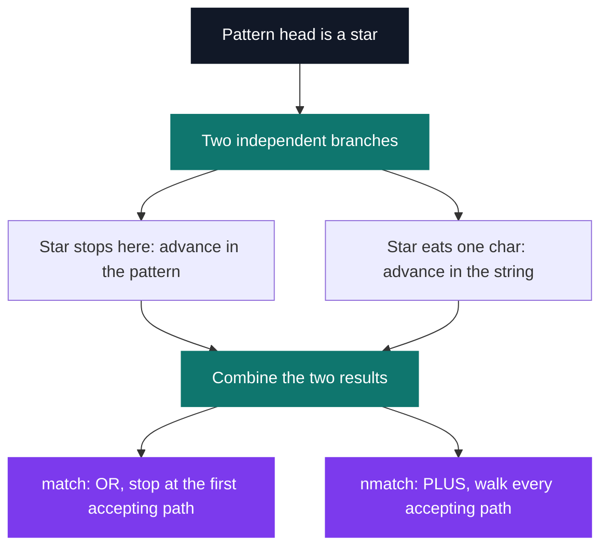

# match & nmatch

[](https://antoinepoisson.github.io/Old-School-Projects/projects/cpool-match-nmatch-2018)

 

**Epitech project** · Unix & C Lab Seminar (Part I) (`B-CPE-100`) · Tek1 · 2018-2019 · 2 weeks · Grade B

> Re-coding wildcard pattern matching, the `*.txt` kind — then counting every way it matches.

A `*` has no width. It can stand for nothing at all or for the entire string, so deciding whether
`main.c` matches `*.c` is not a scan — it is a search over every possible split.

Then the subject asks the harder question. Not *does it match*, but *in how many ways*. Same search
tree, different answer, and this one is not allowed to stop at the first success.

## Overview

When a shell expands `*.txt`, something decides which filenames survive. This project is that
something, written from scratch in C with `write` as the only system call allowed.

Two functions ship as two separate deliverables. `match(s1, s2)` returns 1 or 0. `nmatch(s1, s2)`
returns how many distinct ways the stars can absorb characters and still rebuild the string.

| String | Pattern | `match` | `nmatch` |
| --- | --- | --- | --- |
| `main.c` | `*.c` | 1 | 1 |
| `abcbd` | `*b*` | 1 | 2 |
| `abc` | `a**` | 1 | 3 |
| `abc` | `***` | 1 | 10 |
| `hello` | `*z*` | 0 | 0 |

The `abc` / `a**` row is the whole exercise in one line. The two stars have to share `bc`, and
there are exactly three ways to cut it:

```text
abc  vs  a**

           a   star 1   star 2
           -   ------   ------
split 1    a   ""       "bc"
split 2    a   "b"      "c"
split 3    a   "bc"     ""
```

Push the same string to `***` and the count is 10 — the number of ways to spread 3 characters
across 3 ordered slots. The answer is combinatorial, which is exactly why `nmatch` can never
short-circuit.

## How it works

The reference solution is a recursion. At every star it faces one binary choice, and both sides
have to be explored before anything can be concluded.



That merge node is the entire difference between the two deliverables. `match` joins the branches
with `||` and short-circuits. `nmatch` joins them with `+`, which forces the full tree to be
enumerated. One operator, and a yes/no oracle becomes a counter.

The stopping conditions are where a wrong version stays wrong quietly: an empty pattern accepts
only an empty string, a star must still be allowed to absorb nothing once the string is exhausted,
and a pattern of nothing but stars matches anything. This is the same backtracking a regex engine
runs on `.*`.

**What the archive holds.** One file, `match.c` — 74 lines, five functions, no `nmatch.c`. It takes
a different route from the search above: rather than exploring branches, it *materialises* one
candidate expansion of the pattern and then compares that against the string.

```mermaid
flowchart LR
    A["match(ac, av)"] --> B["check_errors: ac must equal 3"]
    B --> C["s2(): one pass over the pattern"]
    C -->|"star: copy s1 until the next literal"| D["s2_bis, one materialised expansion"]
    C -->|"literal: copy it as is"| D
    D --> E["checkage(): compare only strlen(s1) bytes"]
    E --> F["returns 1 or 0"]

    classDef core fill:#0F766E,stroke:#0F766E,color:#ffffff;
    classDef alt fill:#111827,stroke:#111827,color:#ffffff;
    classDef accent fill:#7C3AED,stroke:#7C3AED,color:#ffffff;
    class C,D core
    class A alt
    class E accent
```



```c
    for (i = 0; s1[constance] != '\0' || s2[a + compteur] != '\0'; i++) {
        if (s2[a + compteur] == '*') {
                save_carac[b] = s2[a + compteur + 1];
            for (i; save_carac[b] != s1[i] && s1[i] != '\0'; i++)
                 s2_bis[i] = s1[i];
            b++;
            compteur++;
        }
        s2_bis[i] = s2[a + compteur];
        a++;
```

`save_carac` holds the character that follows the star, and the inner loop copies from the string
until it reaches that character. One pass, one guess, no way back — a greedy expander instead of a
search.

That block lives in a function named `s2` whose second parameter is also named `s2`; inside the
body the parameter shadows the function, which is why the expander cannot call itself.

## What this project demonstrates

- The shell's wildcard engine rebuilt by hand
- Counting the possible splits when several `*` share the same string

## Key features

- String comparison against a wildcard pattern, contained in a single file
- The `*` character consumes zero or more characters, so every split length has to be tried

## Technical stack

- **Languages** — C
- **Tools** — gcc, Git
- **Concepts** — pattern matching, recursion, stopping conditions

## Engineering constraints

| Constraint | Detail |
| --- | --- |
| Deliverables | `match.c` and `nmatch.c`, compiled separately against the school's own `main` |
| Prototypes | `int match(char const *s1, char const *s2)` and `int nmatch(char const *s1, char const *s2)` |
| System calls | `write` and nothing else |
| Library | `libmy` in `lib/my/`, built by `build.sh`, headers in `include/` |
| Style | Epitech coding standard |

## Verification

No tests were delivered, so the check here is a re-run. The archived entry point takes `argc`/`argv`
rather than the two `char const *` of the imposed prototype, so a small driver calls it with
`ac = 3` and feeds it the subject's own examples.

```text
main.c     *.c      -> 1   (expected 1)
abc        abc      -> 1   (expected 1)
abc        abd      -> 0   (expected 0)
abcbd      *b*      -> 1   (expected 1)
abc        a**      -> 1   (expected 1)
aab        *ab      -> 0   (expected 1)   <-- DIFF
hello      h*o      -> 1   (expected 1)
hello      *z*      -> 1   (expected 0)   <-- DIFF
```

Both divergences come from the single-pass design. The greedy scan halts at the first occurrence of
the character that follows the star, so on `aab` the star in `*ab` absorbs nothing and the compare
fails one character later.

`checkage()` then walks only as many bytes as the input string, so whatever the expansion pushed
past that point is never looked at — which is why `*z*` is accepted by a string containing no `z`.
Those two cases are exactly what backtracking exists to catch.

Both scratch buffers are VLAs sized `my_strlen(s1)`, yet the loop index keeps climbing past that
bound — it reaches 10 on the six-character `main.c`. `-fsanitize=address` aborts on the very first
example, at the `s2_bis[i] = s2[a + compteur]` write.

## Build & run

No Makefile. The harness collects every `.c` in the delivery folder and links it against its own
`main` and against `libmy`:

```bash
cd lib/my && ./build.sh && cd ../..
gcc -o match  *.c test_files/match_main.c  -I./include -L./lib/my -lmy
gcc -o nmatch *.c test_files/nmatch_main.c -I./include -L./lib/my -lmy
```

Neither the `main` nor `lib/my/` belongs to the delivery — the subject forbids pushing the main —
so this folder holds `match.c` alone. It also compiles without the library: the file declares no
include and carries its own `my_strlen`.

---

[← C Pool — the entry bootcamp](../README.md) · [↑ Tek1](../../README.md) · [⌂ All projects](../../../README.md)
