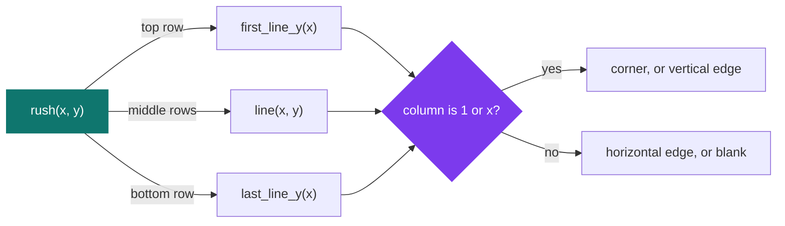
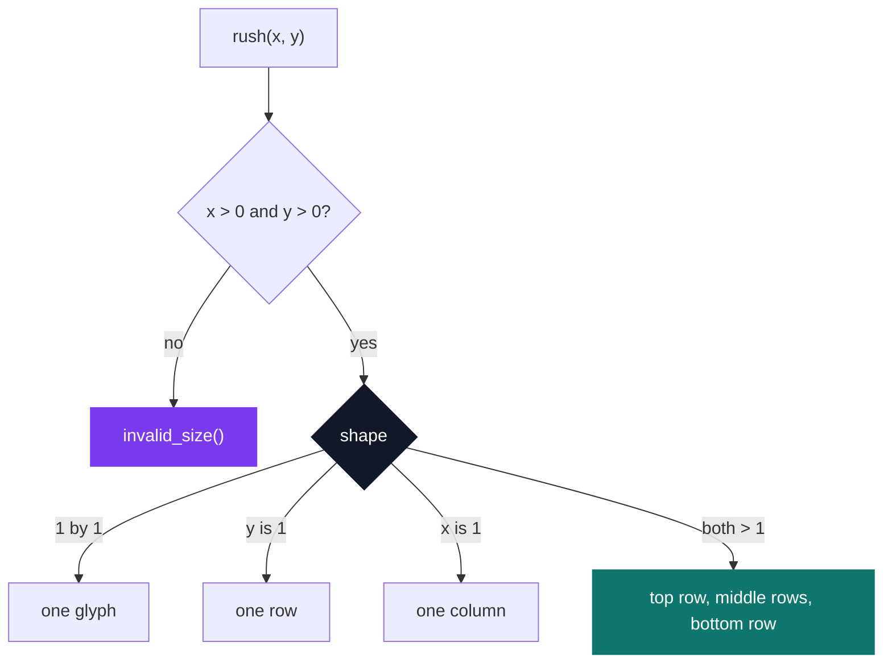

# Rush 1 — The Squares

[](https://antoinepoisson.github.io/Old-School-Projects/projects/cpool-rush1-2018)

 

**Epitech project** · Unix & C Lab Seminar (Part I) (`B-CPE-100`) · Tek1 · 2018-2019 · 1 afternoon · Team project · Grade B

> A first team project: five ways to draw the same rectangle, with `write` as the only function allowed.

One week after the first line of C, the team was handed a prototype it could not change —
`void rush(int x, int y)` — and nothing else. No `main`, no `printf`, no `malloc`, no header file:
the school compiles the delivered folder with its own `main.c` and `my_putchar.c` bolted on.

Five deliverables, all mandatory, one folder each. Same rectangle every time, a different glyph
set. The whole exercise is one question: given a position in the grid, which character goes there?

Here is what the five folders in this repository print for `rush(5, 3)`:

```text
rush1-1     rush1-2     rush1-3     rush1-4     rush1-5

o---o       /***\       ABBBA       ABBBC       ABBBC
|   |       *   *       B   B       B   B       B   B
o---o       \***/       CBBBC       ABBBC       CBBBA
```

## Overview

A rush is the pool's group exercise, and it lands one week after the class writes its first line of
code. The code is the smaller half of it: the deliverable is shared, one repository and one grade,
and the oral defence is graded on the weakest explanation in the group.

Fourteen `.c` files, 619 lines, 32 functions, spread over five folders. No single line is hard; the
hard part is agreeing on one shape of solution before anyone has read someone else's C.

## How it works

The glyph for a cell comes out of two tests, and the code splits them across two levels. `rush()`
decides the row class and calls one helper per class; the helper walks the columns and decides on
`a == 1`, `a == x`, or neither.



Two folders never write a `last_line_y`. `rush1-1` and `rush1-4` are the two whose bottom row is
identical to their top row — `o---o` and `ABBBC` — so both call `first_line_y` a second time
instead. The other three need a distinct bottom row and get their own file for it.

The subject's closing note points one step further: a single `rush_generic` taking the glyph set as
parameters, each `rush` reduced to one call. What shipped keeps the five apart, which is why the
same three-branch column loop appears five times across `rush1-2`, `rush1-4` and `rush1-5`.

Splitting on the row first is also what makes the degenerate rectangles work. A 1-row or 1-column
rectangle is all corner and no edge, so it gets its own branch rather than a special case buried in
the drawing loop.



Each `rush()` writes those five tests as five independent `if`s, never an `else`. The conditions are
exclusive by construction, so exactly one of the five bodies runs for any pair of arguments.

The corner writers are the part worth reading twice — here is `rush1-2/rush.c`, verbatim:

```c
void first_line_y(int x)
{
    int a = 1;

    for (a = 1; a <= x; a = a + 1) {
        if (a == x)
            my_putchar(92);
        if (a == 1)
            my_putchar('/');
        if(a > 1 && a < x)
            my_putchar('*');
    }
}
```

Three independent `if`s again, not a chain. When `x` is 1 the first two both fire and the loop emits
two characters into a one-cell row. That never happens, because `rush()` routes every width-1
rectangle to another branch before this function is called. The shape recurs in four more functions,
and in three of them — `rush1-2/last_line.c`, `rush1-4/first_line_y.c`, `rush1-5/last_line_y.c` —
the guard that keeps it safe now lives in another file. `92` is the backslash, as its ASCII code.

Next door, `invalid_size()` spells "Invalid size" out one letter at a time: twelve `my_putchar`
calls and a thirteenth for the newline. With `write` as the only allowed function, one character at
a time is the entire toolbox.

## What this project demonstrates

- First group project, one week after the first line of code, on a shared deliverable defended orally
- From a cascade of special cases to one rule applied twice: the row test in `rush()`, the column test in the helper
- Degenerate inputs treated as their own branch rather than as an exception inside the loop

## Key features

| Folder | Corners, clockwise from top-left | Edges | Files |
| --- | --- | --- | --- |
| `rush1-1` | `o o o o` | `-` and `\|` | 2 |
| `rush1-2` | `/ \ / \` | `*` | 3 |
| `rush1-3` | `A A C C` | `B` | 3 |
| `rush1-4` | `A C C A` | `B` | 3 |
| `rush1-5` | `A C A C` | `B` | 3 |

`invalid_size.c` is byte-identical in all five folders: the one file the team agreed on.

Three of the four extra files are forced by the coding style. It caps a file at 5 functions, and
`rush.c` already holds exactly 5 in `rush1-2`, `rush1-3` and `rush1-5`, so the sixth helper had
nowhere to go but a file of its own. It also caps a function body at 20 lines: the dispatchers of
`rush1-1` and `rush1-2` sit on exactly 20, `rush1-3`'s on 21. The file layout is the constraint, drawn.

## Technical stack

- **Languages** — C
- **Tools** — gcc, Git
- **Concepts** — problem decomposition, team work, grid rendering

## Engineering constraints

- team work, with an oral defence graded on the group's weakest explanation
- five deliverables in five separate folders, rush-1-1 to rush-1-5, all mandatory
- imposed prototype: void rush(int x, int y), main provided by the autograder
- only function allowed: write
- « Invalid size » on the error output if the dimensions are invalid
- segfault, bus error or floating exception: disqualification

## Verification

No test suite: a rush is graded by the school's autograder and an oral defence. The subject is the
fixture instead — it prints the expected output for five sizes (5×3, 5×1, 1×1, 1×5, 4×4) in each of
the five assignments. Recompiling the five folders and running all 25 reproduces 23 of them,
character for character.

Both misses are the same size in two different folders, `rush x 1`, and both come from one
unanswered question: who emits the trailing newline, the helper or the caller?

| Folder | `one_line_y` emits `\n` | `rush()` adds `\n` | `rush 5 1` prints |
| --- | --- | --- | --- |
| `rush1-2` | once, at the end | yes | `*****` then a blank line |
| `rush1-3` | never | yes | `BBBBB` |
| `rush1-4` | once per column | no | five `B`, one per line |
| `rush1-5` | once, at the end | no | `BBBBB` |

`rush1-1` has no `one_line_y` at all: the subject wants `o---o` for the flat case, corners kept, so
`rush()` reuses `first_line_y` and adds the newline itself. Four folders wrote the same small helper
four different ways, and the one input that exposes it is the one nobody re-tested.

Second finding: `invalid_size()` goes through the same `my_putchar` as the drawing, so the message
lands on whichever descriptor the drawing uses, where the subject asks for standard error. The
allowed-function list held the fix: `write` takes the descriptor as its first argument.

## Build & run

The folders ship no `main`, no `my_putchar` and no Makefile — the school adds its own `main.c` and
`my_putchar.c`, then compiles the directory with `clang *.c`:

```bash
# main.c calls rush(x, y); my_putchar.c is a single write(1, &c, 1)
gcc rush1-3/*.c main.c my_putchar.c -o rush && ./rush 5 3
```

---

[← C Pool — the entry bootcamp](../README.md) · [↑ Tek1](../../README.md) · [⌂ All projects](../../../README.md)
