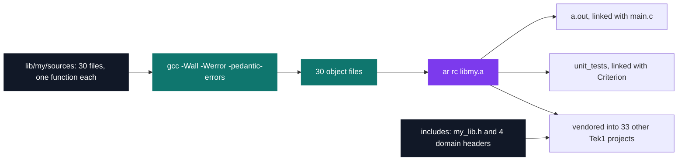
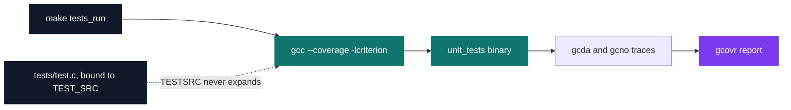

# WorkshopLib — building libmy

[](https://antoinepoisson.github.io/Old-School-Projects/projects/cpool-workshoplib-2018)

   

**Epitech project** · Unix & C Lab Seminar (Part I) (`B-CPE-100`) · Tek1 · 2018-2019 · 1 day · Grade B

> Two weeks of pool functions consolidated into `libmy.a`: 30 functions, one per object file, behind headers that 33 other Tek1 projects went on to vendor.

## Overview

Two weeks of pool exercises leave a pile of loose `.c` files. This day turns them into `lib/my/libmy.a` — 30 functions, one per translation unit, behind headers that stop being free to change.

That freeze is what makes it an engineering exercise rather than an algorithmic one. A broken exercise costs one grade. A library function with the wrong return value costs every program that links it, and you find out months later, inside a project about something else.

The reach is measurable in this repository: 34 Tek1 project directories carry their own copy of `lib/my/`, and 29 of them link the archive straight from a Makefile.

## How it works

**One function, one object file.** Each of the 30 sources defines exactly one public symbol, so the archive's granularity is the function. A caller that needs `my_strlen` pulls in one 18-line object, not the whole 782-line library.

Listing the built archive shows the layout directly:

```console
$ ar t lib/my/libmy.a | head -8
counter_argument.o
my_compute_power_rec.o
my_compute_square_root.o
my_find_prime_sup.o
my_getnbr.o
my_isneg.o
my_is_prime.o
my_putchar.o
```

30 members, 30 exported symbols, no duplicates — the archive is a flat index the linker can pick from.



**The interface is split by domain, not dumped in one file.** A caller that only prints things includes `my_put.h` and gets four declarations instead of thirty. `my_lib.h` is the aggregate for everything else.

| Header | Declares | Covers |
| --- | --- | --- |
| `my_string.h` | 21 | `my_strlen`, `my_strncpy`, `my_strstr`, `my_str_isalpha`, `my_revstr`, `my_sort_int_array` |
| `my_math.h` | 4 | `my_compute_power_rec`, `my_compute_square_root`, `my_is_prime`, `my_find_prime_sup` |
| `my_put.h` | 4 | `my_putchar`, `my_putstr`, `my_putnbr`, `my_puterror` |
| `my_struct.h` | 0 | an empty `variable_t` placeholder for shared types |
| `my_lib.h` | 30 | the aggregate: the three above plus `count_arg` |

All five headers redefine `EXIT_SUCCESS` and `EXIT_ERROR` (84) under `#ifndef` guards, so any combination of them can be included together without a redefinition error.

**The library never includes its own headers.** The 30 sources pull in `<stddef.h>` or `<unistd.h>` and nothing else; the nine that call a sibling declare it inline, four distinct prototypes in all. The headers exist for callers, which is exactly why nothing forces the two to agree.

So the agreement was checked instead of assumed. Recompiling the 30 sources with `-include my_lib.h` forced — which makes the compiler cross-check every definition against the public declaration — produces no conflict: parameter order, `const` qualification and return types all agree.

That is the part that took the day. The file headers still carry their origin as `D1` to `D7` markers, six distinct pool days whose conventions had to be reconciled into one.

## What this project demonstrates

- Refactoring a large set of functions towards a coherent API
- A personal library reused in nearly every subsequent C project

## Key features

- Complete personal library compiled into a static archive: strings, mathematics, output, structures
- Headers split by domain (my_string.h, my_math.h, my_put.h, my_struct.h)
- A second library level in lib/my_ containing get_next_line and my_printf

## Technical stack

- **Languages** — C
- **Tools** — Makefile, ar, gcc, Criterion, gcovr, Valgrind, Git
- **Concepts** — static library, API design, regression testing

## Engineering constraints

- entirely optional project, not counted in the unit's grade, but reviewed at least once a day
- imposed deliverable: lib/libmy.a
- the library must contain the 30 functions listed by the subject
- imposed locations: lib/my/ for sources and the Makefile, include/ for my.h
- Makefile with re, clean and fclean rules

## Beyond the baseline

- Integrating my_printf and get_next_line into the library, well beyond the required functions
- Coloured Makefile and a Criterion test suite

`lib/my_/` is the second archive: 43 sources and 1,473 lines for 36 declared functions — the required 30 plus `my_printf`, `get_next_line`, `my_strdup`, `my_str_to_word_array` and two zeroing allocators.

`my_printf` contains no `switch`, and neither does any file around it. Epitech's style rules cap a function at 20 lines and a file at 5 functions, so the format dispatch is spread over three files and five handlers chained by index: each handler returns the position it consumed up to, and an index that did not move means no conversion matched, so the character is printed as-is.

```c
while (str[i] != '\0') {
    if (previous == i)
        i++;
    if (str[i] == '\0')
        break;
    previous = i;
    i = is_extension_my_printf(str, i);
    i = is_extension_printf(str, i, ap);
    i = is_extension_printf_two(str, i, ap);
    i = is_extension_printf_three(str, i, ap);
    i = is_extension_printf_four(str, i, ap, previous);
}
```

Numeric bases collapse into one function: `my_put_nbr_base(nb, base)` takes the digit set as a string, so four conversions are four literals.

| Conversion | Implementation |
| --- | --- |
| `%d` `%i` `%ld` `%li` | `my_putnbr`, `my_put_long` |
| `%u` `%lu` | `my_unsigned_putnbr` |
| `%b` `%o` `%x` `%X` | `my_put_nbr_base` with `"01"`, `"01234567"`, `"0123456789abcdef"`, `"0123456789ABCDEF"` |
| `%#o` `%#x` `%#X` | the same helper, after emitting the `0` or `0x` prefix |
| `%p` | a literal `0x`, then `my_put_adress`, a separate `long` recursion hardcoded to base 16 |
| `%S` | a byte outside 32-127 becomes a `\NNN` octal escape |
| `%s` `%c` `%%` `%n` | `(null)` on a null pointer; `%n` prints the global `return_printf` |

The zero-padded spellings `%0d`, `%0i`, `%0X`, `%0o`, `%0x` and `%0u` get their own branch, and `is_extension_my_printf.c` carries the `-`, `+` and space flags on top of that.

`get_next_line` reads in 300-byte chunks and keeps the remainder in a `static` buffer between calls, resetting its line counter when the file descriptor changes.

Nearly 2,800 lines across 76 `.c` and 17 `.h` files, split between the two archives — and two thirds of the 50 Tek1 projects in this repository ship a copy of `lib/my/`.

## Verification

Unit tests with Criterion, in `tests/`. `make tests_run` is a complete pipeline for 2018: `--coverage` on the compile line, Criterion as the runner, `gcovr` for the report.



The audit finding is that the pipeline runs green while testing nothing. The recipe expands `$(TESTSRC)` where the variable is named `TEST_SRC`, so `tests/test.c` never reaches the link line — and because Criterion supplies the `main`, the binary still links and then runs zero test cases.

The cost shows up in `lib/my/sources/`. `my_str_islower`, `my_str_isnum` and `my_str_isupper` each reject with a conjunction of the form `str[i] < low && str[i] > high`, which no character satisfies, so all three return 1 for any non-empty string. `my_str_isalpha`, written with a negated range instead, is correct.

One assertion per predicate would have caught it in 2018. A modern compiler catches it for free, and the library's own `-Werror` turns it into a build failure:

```console
$ gcc -Wall -Werror -pedantic-errors -c sources/my_str_islower.c
sources/my_str_islower.c:17:26: error: non-overlapping comparisons always evaluate to false [-Werror,-Wtautological-overlap-compare]
   17 |         if (str[i] < 'a' && str[i] > 'z')
      |             ~~~~~~~~~~~~~^~~~~~~~~~~~~~~
1 error generated.
```

## Build & run

```bash
make            # builds lib/my/libmy.a, then links a.out against it
make debug      # full rebuild with -g3, then runs the binary under Valgrind
make tests_run  # builds unit_tests with --coverage -lcriterion, then gcovr
make fclean     # removes objects, archives, core dumps and editor backups
```

Produces `libmy.a`. The archive is built with `-Werror`; the top-level binary that links it is not, so a warning in the library is a build failure while a warning in the caller is not.

---

[← C Pool — the entry bootcamp](../README.md) · [↑ Tek1](../../README.md) · [⌂ All projects](../../../README.md)
