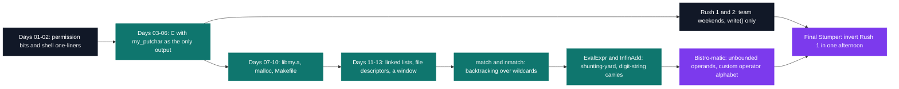

# C Pool — the entry bootcamp

[← Tek1](../README.md) · [⌂ All projects](../../README.md)

One month, 22 deliverables, and a list of allowed functions that starts at exactly one: `my_putchar`, which writes a single byte to file descriptor 1. Everything above it — `strlen`, `printf`, `malloc` — is either rebuilt by hand or unlocked on a later day.

The heaviest piece is Bistro-matic: 2,737 lines of C across 64 files, a calculator whose numeral base and seven operator symbols arrive as command-line arguments, whose operands are integers too large for any register, and whose entire libc allowance is `read`, `write`, `malloc`, `free` and `exit`.

The month ends on Final Stumper — one afternoon to write the inverse of the first team rush: read a drawing off stdin and name the rule that produced it.

| Project | What it is | Size | Grade |
| --- | --- | --- | --- |
| [Day 01 — Unix environment](CPool_Day01_2018) | Filesystem, permission bits, and one `find` with no `;` and no `&&` | 1 day | B |
| [Day 02 — shell scripting](CPool_Day02_2018) | Seven shell scripts, one to three lines each | 1 day | B |
| [Day 03 — first steps in C](CPool_Day03_2018) | `my_putchar` as the entire allow-list | 1 day | B |
| [Day 04 — pointers](CPool_Day04_2018) | Pass by address: `my_swap`, `my_strlen`, `my_putstr` | 1 day | B |
| [Day 05 — recursion](CPool_Day05_2018) | Each function written twice, iterative and recursive, up to N queens | 1 day | B |
| [Day 06 — strings](CPool_Day06_2018) | `strcpy`, `strncpy`, `strstr` and `revstr` rebuilt, with Criterion tests | 1 day | B |
| [Day 07 — libmy and arguments](CPool_Day07_2018) | 30 symbols archived with `ar`, linked back in as `-lmy` | 1 day | B |
| [Day 08 — dynamic allocation](CPool_Day08_2018) | `malloc` and the ownership that leaves with the pointer | 1 day | B |
| [Day 09 — structures](CPool_Day09_2018) | ARGB packing, and byte order seen through a `union` | 1 day | B |
| [Day 10 — Makefile and do_op](CPool_Day10_2018) | A build as a dependency graph, plus dispatch over unvalidated argv | 1 day | B |
| [Day 11 — linked lists](CPool_Day11_2018) | A singly linked list over a `void *` node | 1 day | B |
| [Day 12 — file descriptors](CPool_Day12_2018) | `cat` on `open`, `read`, `write`, `close` | 1 day | B |
| [Day 13 — discovering CSFML](CPool_Day13_2018) | An 800x600 framebuffer, written pixel by pixel | 1 day | B |
| [Rush 1 — The Squares](CPool_rush1_2018) | Five rectangle variants, `write` the only call allowed | 1 afternoon · team | B |
| [Rush 2 — What language is this?](CPool_rush2_2018) | Language identification from letter frequencies, no floats | 1 afternoon · team | B |
| [WorkshopLib](CPool_workshoplib_2018) | `libmy.a`: 30 functions, one per object file | 1 day | B |
| [Tree](CPool_Tree_2018) | An ASCII fir tree derived from a single integer | 1 day | B |
| [match & nmatch](CPool_match-nmatch_2018) | Wildcard matching, then a count of every way it matches | 2 weeks | B |
| [Bistro-matic](CPool_bistro-matic_2018) | Bignum calculator with a configurable base and operator set | 2 weeks | B |
| [EvalExpr](CPool_evalexpr_2018) | Shunting-yard evaluator for infix expressions | 2 weeks | B |
| [InfinAdd](CPool_infinadd_2018) | Addition on digit strings of arbitrary length | 2 weeks | B |
| [Final Stumper](CPool_finalstumper_2018) | Reads a drawing and names the rule that drew it | 1 afternoon | B |

Read in order, the month is one long escalation: the allow-list widens by a few functions a day, and the projects at the end are the ones that need everything built before them.

## Projects (22)

### Unix & C Lab Seminar (Part I) (`B-CPE-100`)

- **[C Pool — Day 01: the Unix environment](CPool_Day01_2018)** — *1 day · Grade B*
  Eight deliverables, 358 bytes, marked on the permission bit as much as on the text.

- **[C Pool — Day 02: shell scripting](CPool_Day02_2018)** — *1 day · Grade B*
  Seven scripts of one to three lines each, and a subject that ships enciphered.

- **[C Pool — Day 03: first steps in C](CPool_Day03_2018)** — *1 day · Grade B*
  One allowed function, and 120 increasing digit triples printed with no buffer to back up into.

- **[C Pool — Day 04: pointers](CPool_Day04_2018)** — *1 day · Grade B*
  Pass by address: the day where getting it wrong still compiles and silently changes nothing.

- **[C Pool — Day 05: recursion](CPool_Day05_2018)** — *1 day · Grade B*
  Every function written twice, as a loop and as a call to itself, up to counting queen placements.

- **[C Pool — Day 06: strings](CPool_Day06_2018)** — *1 day · Grade B*
  `strcpy`, `strncpy`, `strstr` and `revstr` re-coded, each shipped with its own Criterion file.

- **[C Pool — Day 07: libmy and arguments](CPool_Day07_2018)** — *1 day · Grade B*
  Thirty functions archived with `ar` — and the binary that links them carries two.

- **[C Pool — Day 08: compilation and dynamic allocation](CPool_Day08_2018)** — *1 day · Grade B*
  `write`, `malloc`, `free`, and every byte count computed by hand before the request goes out.

- **[C Pool — Day 09: structures](CPool_Day09_2018)** — *1 day · Grade B*
  Three bytes packed into one ARGB word, then reversed through a `union` rather than arithmetic.

- **[C Pool — Day 10: Makefile and do_op](CPool_Day10_2018)** — *1 day · Grade B*
  A build written as a dependency graph, and a calculator that has to read `42friends` as 42.

- **[C Pool — Day 11: linked lists](CPool_Day11_2018)** — *1 day · Grade B*
  A twelve-line `void *` node, walked by a `main` the grader supplies and you never see.

- **[C Pool — Day 12: file descriptors](CPool_Day12_2018)** — *1 day · Grade B*
  `cat` rebuilt on four system calls, 104 lines, with no `FILE *` and no buffering underneath.

- **[C Pool — Day 13: discovering CSFML](CPool_Day13_2018)** — *1 day · Grade B*
  An event loop that must not exit, and 480,000 pixels written one `sfColor` at a time.

- **[Rush 1 — The Squares](CPool_rush1_2018)** — *1 afternoon · Team · Grade B*
  Five ways to draw the same rectangle, one week after the first line of C, five people, one grade.

- **[Rush 2 — What language is this?](CPool_rush2_2018)** — *1 afternoon · Team · Grade B*
  Naming a text's language from letter frequencies, in fixed-point integers because floats are banned.

- **[WorkshopLib — building libmy](CPool_workshoplib_2018)** — *1 day · Grade B*
  `libmy.a`, one function per object file — 69 Makefiles under `Tek1/` end up linking it.

- **[Tree — ASCII fir tree](CPool_Tree_2018)** — *1 day · Grade B*
  Every row width, tier restart and trunk size derived by arithmetic from one integer.

- **[match & nmatch](CPool_match-nmatch_2018)** — *2 weeks · Grade B*
  Wildcard matching, then the harder question: how many distinct ways the stars can absorb the string.

### Unix & C Lab Seminar (Part II) (`B-CPE-101`)

- **[Bistro-matic](CPool_bistro-matic_2018)** — *2 weeks · Grade B*
  A calculator over unbounded integers whose numeral base and seven operators arrive as arguments.

- **[EvalExpr](CPool_evalexpr_2018)** — *2 weeks · Grade B*
  Shunting-yard: precedence becomes token order, so the evaluation is a plain stack walk.

- **[InfinAdd — big number addition](CPool_infinadd_2018)** — *2 weeks · Grade B*
  Column addition on digit strings, past `unsigned long long` and bounded only by `malloc`.

- **[Final Stumper — rush3](CPool_finalstumper_2018)** — *1 afternoon · Grade B*
  Names which of five rules drew a figure by reading three of its corners, and nothing else.
