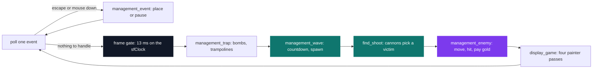
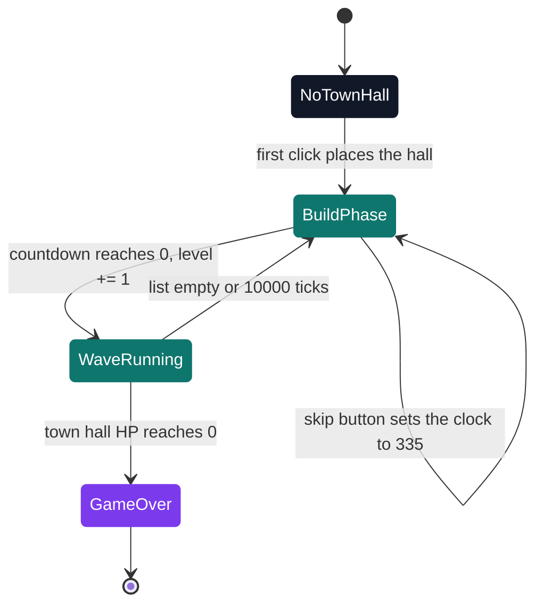

# My Defender — tower defense

[](https://antoinepoisson.github.io/Old-School-Projects/projects/mul-my-defender-2018)

  

**Epitech project** · C Graphical Programming (`B-MUL-200`) · Tek1 · 2018-2019 · 2 weeks · Grade A

> A complete tower defense in C: place the town hall, spend the gold, survive the waves.

## Overview

Five systems have to agree on the same set of entities inside a single frame. The spawner adds enemies, the traps and cannons take health off them, the economy pays out the moment one dies, and the renderer draws whatever survived — in C, with CSFML for pixels and sound and nothing else. No engine, no scene graph, no destructor.

The map is not authored either. The player drops the town hall with the first click, and that point becomes the target every enemy trajectory converges on. Put it in a corner and every spawn line in the game changes.

3,824 lines across 43 sources and 11 headers, plus 534 lines of `libmy.a` re-implementing the string and number helpers the allowed function list leaves out. A 1600×800 window capped at 60 fps, and 9.1 MB of art and audio kept under a ~15 MB repository budget.



Input and simulation are exclusive: a frame that handles a click does not advance the world. The rest of the order is fixed on purpose — traps resolve before the spawner adds this wave, and the renderer only ever sees a world that has finished changing.

Frame cost is a product, not a sum. `find_shoot` walks the whole enemy list once per cannon, and `management_enemy` re-walks the building list at least twice for every enemy, so the two populations multiply.

## How it works

**Two lists, one payload.** `add_element_list` pushes every placed object into the `obj` list, and when the id falls in 10–19 it pushes a *second* node into the `build` list. Both nodes point at the same `data_t`.

The renderer then walks `obj` and the simulation walks `build`, and that id window is the filter between them. Everything the game places sits inside it — 11 town hall, 12 wall, 13 cannon, 14 bomb, 15 trampoline — so scenery outside the range would be drawn without ever reaching the combat code. Two indexes over one entity, assembled by hand.

**Trajectories are solved once.** At spawn, `find_coef` derives the line from the enemy to the town hall and stores its slope and intercept in the entity. After that `move_enemy` only steps `x` one pixel toward the hall and reads `y` off the line: no pathfinding, no per-frame trigonometry. The guard `if ((hdv.x - posi.x) == 0) hdv.x += 0.001;` keeps a perfectly vertical approach from dividing by zero.

**Orientation is a lookup, not a rotation.** `calcul_angle` calls `atan2` once and normalises to 0–360°; `find_right_angle` sorts that into eight sectors which resolve to only five rows of 71×71 cells. The three mirrored sectors reuse a row and start at a different column, so the atlas carries eight facings for the price of five. Attacking adds 355 px to the same `rect.top` — five rows down, identical column logic.



The wave clock refuses to start until the town hall exists — `management_wave` reads `hdv.x == 0` as "not ready" — because without a target `find_coef` has no line to compute. Then 2,000 ticks of building, which the HUD divides by 60 and shows as `0 : 33`, a wave of `5 + 5 × level / 2` enemies (7 on the first round, 12 on the third), and a hard stop at 10,000 ticks.

| Building | Cost · HP | Behaviour |
| --- | --- | --- |
| Town hall | free · 620 | One per game; every trajectory converges on it, its death ends the run |
| Wall | 2 · 240 | No attack; twelve enemy strikes at 20 damage to break it |
| Cannon | 20 · 80 | 4 damage inside 180 px, and the barrel swings round to face what it hit |
| Bomb | 6 · 100 | 40 damage to *every* enemy inside 50 px, then 150 ticks of recharge |
| Trampoline | 4 · 100 | 999999 damage to the first enemy inside 50 px, then 110 ticks of recharge |

**Targeting is a counter, not a queue.** Each cannon walks the enemy list computing a Euclidean distance, and every live enemy inside 180 px bumps that cannon's `status` by one. The shot lands on whoever is under examination when `status` reaches 10, so a crowded field makes the cannon fire faster, and the walk exits early only on the frame it actually fires.

First match, not nearest. One cannon alone needs 37 shots to grind 145 HP down at 4 damage a hit — about six seconds at 60 fps — so what the choice costs per frame matters more than who it picks. Kills pay 5 gold, so a 20-gold cannon repays itself in four.

**Placement is four inequalities.** There is no grid: buildings land wherever the mouse is, and the playable ground is an isometric diamond, so a rectangle test would let the player build on the sky. `click_in_map` bounds it with the diamond's own edges:

```c
int click_in_map(sfVector2i posi)
{
    float equation_one = -0.75 * posi.x + 407.35;
    float equation_two = 0.75 * posi.x - 412.38;
    float equation_three = -0.75 * posi.x + 1192.18;
    float equation_four = 0.75 * posi.x + 384.79;

    if (equation_one > posi.y || equation_two > posi.y ||
        equation_three < posi.y || equation_four < posi.y)
        return (0);
    return (1);
}
```

A click clears that test, then an overlap test against every placed building, then `control_money` — which is also where the price is debited, so a rejected placement never charges.

**`--hitbox` costs nothing at runtime.** Every in-game sprite — buildings, enemies, HP bars, the cursor, the button highlights — is an `sfIntRect` into one 1553×2843 atlas. The flag swaps `resources.png` for `debug.png`: the same artwork at the same pixel size, with the transparency flattened onto solid blue.

So every rect the game draws becomes a visible box, and those boxes are exactly the rectangles the overlap test compares. One `if` at texture load buys the whole debug view; nothing else in the codebase knows the mode exists.

**No `time()`.** The allowed libc is `malloc`, `free`, `memset`, `rand`/`srand`, `getline`, `fopen`/`fread`/`fclose`, `write` and the `opendir` family — no clock. `is_create_enemy` seeds `srand` from the CSFML frame timer instead, once per wave.

That expression reduces to the frame's own duration in milliseconds, which at a 60 fps cap lands in a narrow band, and the spawn zone is redrawn only every fifth enemy. Waves repeat their entry pattern far more than `rand() % 12` suggests — and the index runs 0–11 against a table written for 1–12, so the twelfth zone never comes up and index 0 answers with the origin.

## What this project demonstrates

- The player places the town hall themselves, and it becomes the convergence point of every enemy trajectory
- Enemy sprites oriented on eight directions from the atan2 angle towards the target
- Random seed taken from the CSFML clock, time() being forbidden by the subject
- A --hitbox mode to visualise collision areas during development
- The first project where architecture weighs more than algorithmics, and where the absence of objects in C concretely motivates the move to OOP

## Key features

- CSFML tower defense: tower placement, enemy waves, resource management
- Successive waves with rising difficulty, enemies following a defined path
- Health bars in nine steps, tower range shown under the cursor before placement, build buttons with idle / hover / clicked states
- Start menu, in-game help panel, pause menu with resume / quit-to-menu / quit-to-desktop

## Technical stack

- **Languages** — C
- **Frameworks / libraries** — CSFML
- **Tools** — Makefile, gcc, Criterion, gcovr, Valgrind, Git
- **Concepts** — entity linked lists, trajectory by line equation, sprite orientation by atan2 angle, targeting by Euclidean distance and cadence, game economy

## Engineering constraints

| Imposed | What it forced |
| --- | --- |
| Binary `my_defender`, repo `MUL_my_defender_$ACADEMIC_YEAR` | Fixed entry point and directory layout |
| CSFML only | Sprites, audio, clock and events all come from one C API |
| Closed libc list, no `time()` | Seed drawn from the CSFML clock; `libmy.a` for the missing helpers |
| ≥ 4 building types, priced build menu, start and pause menus | Five buildings; the pause menu carries the three required buttons |
| ≥ 2 sound effects and looping background music | Five effects plus a menu track with `sfMusic_setLoop` |
| Errors on stderr, exit code 84 | `my_puterror` writes to fd 2 and hands back 84 from every failure path |
| ~15 MB repository, assets included | 9.1 MB of art and audio, one shared atlas instead of per-sprite files |
| Epitech coding standard | Short functions everywhere — the reason for 43 small files and the `is_extension_*` continuations |

## Beyond the baseline

- Placeable traps in addition to towers (`management_trap.c`) and area-effect bombs (`management_bombe.c`)
- Best scores written to disk (`write_file.c`, `is_highscore.c`) as a `score|bird|level|` record, with a leaderboard screen
- A built-in "how to play" screen (`management_how_to_play.c`)
- Tower range drawn under the cursor before the building is committed
- A 250-gold repair that restores every structure except the town hall — the hall itself can never be healed

4,380 lines of C in total, one of the most complete games of the year.

## Verification

`make tests_run` compiles the game objects with `--coverage -lcriterion` and runs `gcovr` afterwards; the suite is a single Criterion test asserting that the `-h` path returns 0.

The working safety net was `make debug`, a target that rebuilds with `-g3` and launches the game directly under Valgrind — the practical way to watch a `data_t` that two lists can both reach.

That aliasing also decides teardown: `destroy_game` frees the head of each list and stops, because one payload sitting behind two nodes has to be released from exactly one of them. Ownership is the price the two-list trick charges.

## Build & run

```bash
make
```

Produces `my_defender`.

```console
$ ./my_defender -h
DESCRIPTION :
	./my_defender			:  Launch game.
	./my_defender --hitbox		:  Launch game with hitbox.
	./my_defender -h		:  Show help.
USER INPUTS :
	Mouse	: Play.
	Echap	: Pause the game.
	Q	: To quit the pause game.
```

---

[← Graphics — 2D games in C](../README.md) · [↑ Tek1](../../README.md) · [⌂ All projects](../../../README.md)
