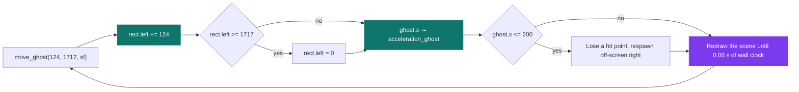
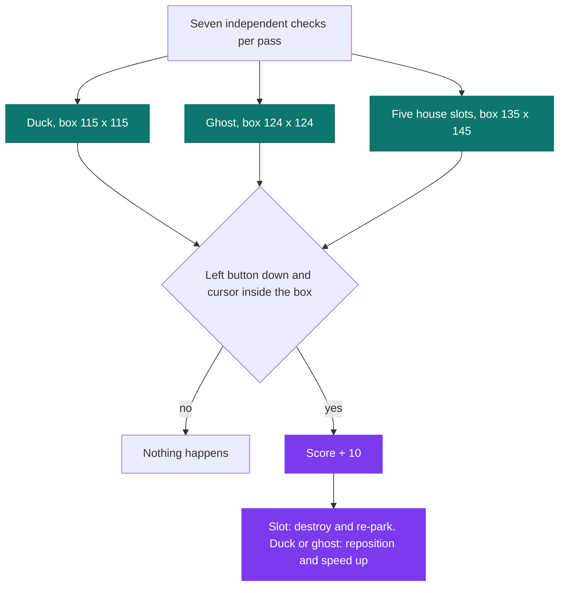

# My Hunter

[](https://antoinepoisson.github.io/Old-School-Projects/projects/mul-my-hunter-2018)

  

**Epitech project** · C Graphical Programming (`B-MUL-100`) · Tek1 · 2018-2019 · 2 weeks · Grade A

> A Duck Hunt-style shooting gallery with a western makeover: ten targets pop up at the windows and doors of a house, and it is up to you to draw.

## Overview

Ten western characters, five places they can appear, and no target list anywhere in the code. One `variable_t` holds the entire game state, and each slot is a single `sfSprite *` field that either shows a character or shows `Void.png` — a 1 x 1 fully transparent pixel parked at a negative coordinate.

That one decision deletes the visible/hidden state machine. `is_extension_main_boucle()` calls the five `kill_*()` functions back to back with no guard in front of them: a parked slot fails the comparison on its own, because its 135 x 145 hit box sits entirely at negative coordinates.

| Slot | Character position | Parked position |
| --- | --- | --- |
| Window one | `850, 196` | `-842, -181` |
| Window two | `1036, 196` | `-842, -181` |
| Door one | `1475, 103` | `-1475, -475` |
| Door two | `117, 444` | `-1475, -475` |
| Behind the house | `787, 379` | `-1475, -475` |

Any of the ten characters can appear at any of the five slots, and every pairing gets its own routine: 50 `create_<character>_<slot>()` functions, ten per slot, each hardcoding one texture path and the slot's coordinates.

A duck and a ghost cross the screen on top of that, both animated from sprite sheets, and a crosshair replaces the mouse pointer. Menu, five lives, score, timer, game-over screen: 34 C files, 22 headers and 3,174 lines in all, on a 1600 x 900 window capped at 70 fps.

## How it works

CSFML hands you no animation system. A sprite sheet is a single texture, and the only thing that actually moves is the `sfIntRect` you look through.

```text
Duck.png    331 x 110    move_duck(110, 330, sf)     rect 110 x 110, 3 frames
+---------+---------+---------+
| left=0  | left=110| left=220|
+---------+---------+---------+

Ghost.png   1717 x 130   move_ghost(124, 1717, sf)   rect 124 x 130, step +124
+-----+-----+-----+--- ... ---+------+
|  0  | 124 | 248 |           | 1612 |
+-----+-----+-----+--- ... ---+------+
```

The rect advances on a **clock**, not on a frame counter. `move_ghost()` creates its own `sfClock`, steps the rect once, then keeps redrawing the whole scene until 0.06 s of wall time has gone by — so the ghost flaps at the same rate whether the machine is rendering 20 frames per second or 70.

The same call also walks the ghost left by `acceleration_ghost` pixels and takes a hit point once it slips past `x = 200`, which is why the graph below has two exits before it loops.



`rand_ghost_x()` puts it back between 2310 and 4499, far off the right edge of a 1600 px window, so it takes a second or two of walking before it is shootable again.

The body of `move_ghost()`, verbatim:

```c
    clock_ghost = sfClock_create();
    sf->rect.ghost.left += offset;
    is_extension_move_ghost(max_value, sf);
    while (seconds < 0.06 && sf->var_norm.end_game == 0) {
        time_ghost = sfClock_getElapsedTime(clock_ghost);
        seconds = time_ghost.microseconds / 1000000.0;
        sfSprite_setTexture(sf->sprite.ghost, sf->texture.ghost, sfTrue);
        sfSprite_setTextureRect(sf->sprite.ghost, sf->rect.ghost);
        sfSprite_setPosition(sf->sprite.ghost, sf->vector.ghost);
        sfRenderWindow_clear(sf->win.dow, sfBlack);
        sfRenderWindow_drawSprite(sf->win.dow, sf->sprite.bg, NULL);
        is_extension_move_ghost_two(sf);
        is_extension_move_ghost_three(sf);
        sfRenderWindow_display(sf->win.dow);
    }
```

The timing loop sits inside the render path, which is what makes it work without a delta-time parameter threaded through every call — and also what makes the ghost's 60 ms step the pace of the whole scene.

Shots are read from the polled button state, not from the event queue. `sfEvtMouseButtonPressed` only fires the muzzle flash and the gunshot sound; the real test lives in seven functions that each call `sfMouse_isButtonPressed(sfMouseLeft)` and `sfMouse_getPositionRenderWindow()` for themselves.



The slot boxes are 135 x 145 and no character sprite is wider than 128 px or taller than 138 px; the duck gets 115 x 115 for a 110 x 110 frame. A few pixels of slack in the player's favour, which is the difference between a game and a precision test.

Each slot schedules its own next appearance: `pause = seconds + rand() % (10 - acceleration) + acceleration`. Nothing in the program seeds `rand()`, so that schedule replays the same sequence on every launch. Leave a character up for 5 seconds without hitting it and one of the five hit points goes, redrawn from one of the five gauge PNGs.

`acceleration` is meant to climb by `0.2` per hit. The four window and door counters are declared `int`, so the increment truncates and they hold their starting value of 2 for the whole run, while the fifth doubles as the "slot occupied" flag that the other four keep in a separate `choose_person*` field. Fractional increments into an integer counter, and one variable doing two jobs: the pace at minute five is the pace at minute one.

## What this project demonstrates

- A complete game delivered end to end: menu, five lives, score, timer and a game-over screen
- Ten characters over five spawn slots, plus a duck and a ghost, all animated by slicing sprite sheets
- Criterion tests on the `-h` option and on the hand-written `my_itoa`, unusual for a first graphics project

## Key features

- Western shooting gallery in CSFML: targets cross the screen and you shoot with the mouse
- Five hit points, decremented at every missed target, displayed at the top of the screen
- Welcome menu, end screen, cursor replaced by a crosshair
- Sprites animated by slicing sprite sheets and moving a texture rectangle

## Technical stack

- **Languages** — C
- **Frameworks / libraries** — CSFML
- **Tools** — Makefile, gcc, Criterion, Git
- **Concepts** — sprite sheets, bounding-box collision detection, paced game loop

## Engineering constraints

| Rule | Detail |
| --- | --- |
| Binary | `my_hunter`, produced by the project's own Makefile |
| Library | CSFML imposed, no SFML C++ |
| Options | `-h` mandatory, printing the description and the controls |
| Animation | animated sprites must come from a sprite sheet |
| libc | closed list: `malloc`, `free`, `memset`, `rand`, `srand`, `time` (for `srand` only), `(f)open/(f)read/(f)write/(f)close`, `getline` |
| Errors | error output, return code 84 |
| Repository | about 15 MB including assets — this one ships 32 images and two audio tracks, 8.7 MiB in all |
| Style | Epitech coding standard |

The coding standard is why the file list reads the way it does: functions are capped at 20 lines and files at 5 functions, which is how one target-spawning routine becomes `create_w_o.c` plus `create_w_o_two.c`. 144 functions end up spread over 34 files, and 25 of those files sit at exactly five.

## Beyond the baseline

- A full menu with transitions, beyond the simple game required
- Several target types with distinct trajectories and speeds
- Criterion tests on the utility functions

`change_cursor_mouse()` reloads `viseur.png` from disk and builds a fresh sprite on every draw. The crosshair itself is right — drawn last so it stays above every sprite, and offset by exactly half its 85 x 68 size so the click lands at its centre — but that is a file read per frame, and the texture is never destroyed. Loading it once at startup is the habit carried into the graphics projects that followed.

## Verification

Six Criterion tests across two files in `tests/`, run with `make tests_run` and compiled with `--coverage`.

`test_my_itoa.c` holds five of them: two on the `is_case_zero()` guard and three on the hand-written integer-to-string conversion — zero, `1234`, and `-1234` — because the on-screen score and timer are both strings built by it.

`test_option_h.c` is the sixth. It runs the binary through `system()` and matches what `option_h()` prints, byte for byte:

```text
USAGE
      ./my_hunter
DESCRIPTION
       This is a small video game based on the rules of Duck Hunt.
```

## Build & run

```bash
make            # builds ./lib/my, then links against csfml-graphics/system/window/audio
./my_hunter     # run from the project root: textures load from ./images
./my_hunter -h
```

Produces `my_hunter`.

---

[← Graphics — 2D games in C](../README.md) · [↑ Tek1](../../README.md) · [⌂ All projects](../../../README.md)
