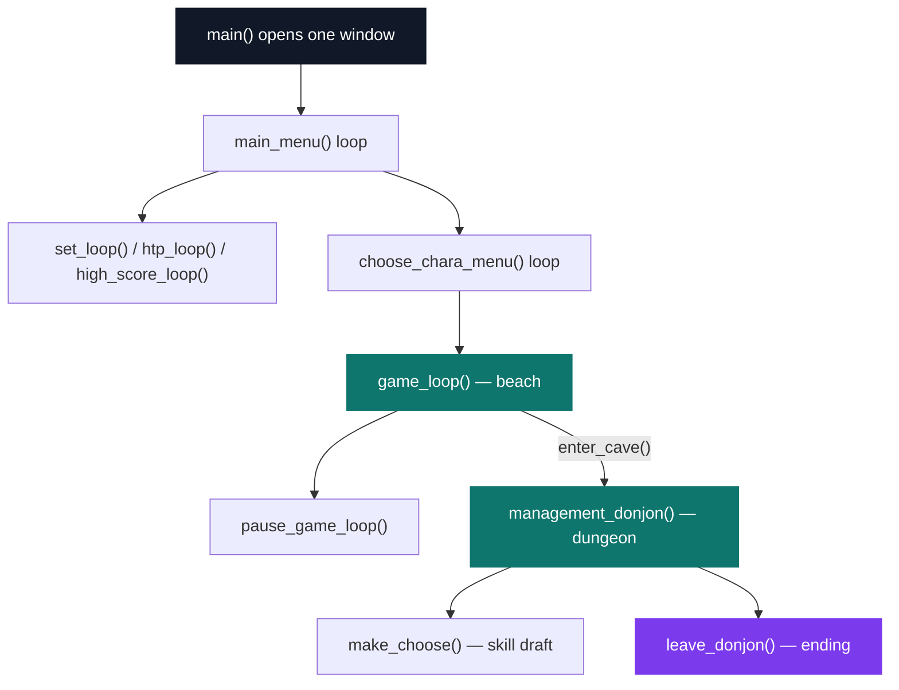
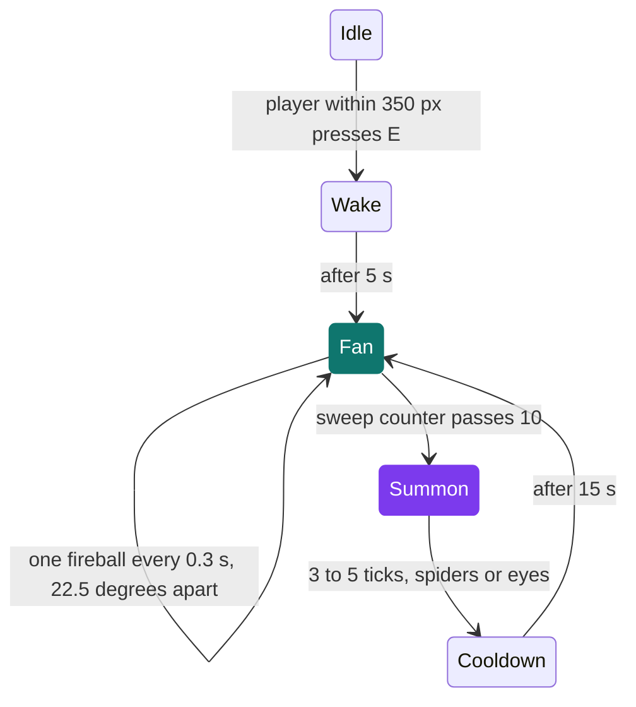

# My RPG

[](https://antoinepoisson.github.io/Old-School-Projects/projects/mul-my-rpg-2018)

  

**Epitech project** · C Graphical Programming (`B-MUL-200`) · Tek1 · 2018-2019 · 2 weeks · Team project · Grade A

> A 2D role-playing game in 9,200 lines of C: two zones, 500 enemies, a skill draft, an inventory and a boss.

## Overview

There is no engine here and no objects. `main()` opens one CSFML window, and every screen after
that — menu, character select, settings, beach, dungeon, skill draft, end credits — is a plain
`while (sfRenderWindow_isOpen(...))` loop that **calls** the next one. There are ten of them.

The state machine is therefore the C call stack. Walking into the cave does not set a state:
`enter_cave()` calls `management_donjon(game)` from inside the beach loop, and the dungeon runs on
top of the beach's frame. When the run ends the stack unwinds screen by screen back to the menu.



The two pause screens are the only ones that resume their caller: they are `while (1)` loops that
return on a flag. One `game_t *` threaded through every function — 30 members, 12 of them heads of
singly linked lists — is what keeps the player coherent across all of it.

118 C files across 19 modules, 401 functions, 7,772 lines under `src/` and 9,224 counting the
headers and the in-house `lib/my`. Two weeks, in a group, as the last graphics project of first year.

## How it works

**Balance lives outside the binary.** Twenty-one `key=value` lines in `.conf` are matched against a
31-entry name table (`includes/my_tab.h`), and the matching index is dispatched through a chain of
four `switch` functions into the right struct member.

```ini
game->var.player_hp=100
game->var.spell_dmg=50
game->var.enemy_eye_agro_range=450
game->var.enemy_spider_dmg=7
game->var.enemy_evil_tick_range=180
```

The keys are the C member paths they write to. That is not decoration: `write_in_file()` emits the
`.safe` save in the same syntax, so `find_var()` is the only reader either file has. One format,
one parser, two purposes — tuning and resuming.

**Two zones, two collision techniques.** The beach is a text grid of `0` and `1`, 170 rows of 182
to 183 cells, one cell per 14.1 × 12 pixels, walked by index. The dungeon could not be: its geometry
is organic, so it is a 2458 × 2296 RGBA mask queried per pixel with `sfImage_getPixel`.

The interesting part is that the mask does not just say *wall or floor*. The colour carries the
whole semantics of the tile, so the level designer edits gameplay in an image editor instead of in
C:

| Pixel | Meaning | Pixels in the mask |
| --- | --- | --- |
| `253,253,253` | rock — movement refused | 3,629,984 |
| `2,2,2` | floor — and a legal enemy spawn | 1,991,794 |
| `255,0,0` | trap — 4 HP every 0.4 s | 20,658 |
| `0,255,0` | save point — writes `.safe` | 926 |

```c
color = sfImage_getPixel(game->texture->donjon_hitbox, posi.x, posi.y);
if (color.r == 255 && color.b == 0 && color.g == 0 &&
    research_skill(game, 8) == 0)
    management_trap(game);
if (color.r == 0 && color.b == 0 && color.g == 255)
    save_file(game);
```

The same test places the population. `create_dungeon_enemy()` draws a random pixel, rejects rock,
trap and save-point colours, and repeats until 500 enemies stand somewhere legal — no hand-placed
spawn list, and nothing spawns inside a rock.

**The boss is the one real state machine.** It sits inert until the player walks within 350 px and
presses `E`; from there `attack_status` drives 1,200 hit points through a fireball fan and three
different summons, chosen at random each cycle.



**Levelling is a draft, not a tree.** Each of the first four level-ups pauses the dungeon, offers
two of the eleven skills at random and writes the pick into one of four slots — an empty slot holds
the sentinel `20`.

Once a one-shot effect fires, its slot value is negated. The HUD takes the absolute value, so the
icon keeps showing; `research_skill()` compares the raw value, so a spent skill stops counting as
held. Trap immunity is the only skill with no case in `management_skill()`, and that is exactly why
it is the only permanent one.

## What this project demonstrates

| Problem | What it took |
| --- | --- |
| World, combat, inventory and menus in one binary | 19 modules and 401 functions over a single `game_t`, in C without objects |
| Tuning without recompiling | `.conf` and `.safe` share a name table and one parser |
| Collision in two very different zones | text grid for the beach, per-pixel image mask for the dungeon |
| Rain, spells and boss projectiles | four hand-written particle systems, singly linked lists stepped every 30 ms |
| Three window sizes and a moving camera | every coordinate scaled by `win.ratio`, 692 uses of it, drawn through an `sfView` |

## Key features

Everything below is counted from the code and the shipped assets, not from the design document.

| Content | Shipped |
| --- | --- |
| Zones | 2 — beach (170-row grid), dungeon (2458 × 2296 mask) |
| Classes | 5 selectable — knight, priest, sorcerer, thief, wizard; 7 skin sheets shipped |
| Enemies | 500 placed, 4 families, plus a 1,200 HP boss |
| Skills | 11 available, 4 slots, 2 offered per level-up |
| Quest items | 7 hidden in the dungeon; holding all 7 changes the ending |
| Combat | left click melee, right click spell at 20 mana, 8 facing directions |
| Audio | 4 streamed tracks, 6 sound effects |
| Art | 61 PNG sprite sheets, 2 fonts, 27 MB of assets |

## Technical stack

- **Languages** — C
- **Frameworks / libraries** — CSFML (graphics, window, system, audio)
- **Tools** — Makefile, gcc, Criterion, gcovr, Valgrind, Git
- **Concepts** — game state machine, particle system, score persistence, modular architecture

## Engineering constraints

- imposed library: CSFML
- group project
- Epitech coding standard

The coding standard is visible in the shape of the code, not just in its formatting. It caps a file
at five functions and a function body at twenty lines, which is why 401 functions are spread over
118 files, why `assign_value()` is four functions falling through to each other instead of one
31-case `switch`, and why the 40-rectangle sprite table is filled by two paired functions.

## Beyond the baseline

- Homemade particle system (`src/particule`) — rain, spell trails and boss projectiles, each a
  linked list stepped every 30 ms; spell and boss particles lose 5 alpha a step and are freed at
  zero, rain is recycled at the screen edge
- Dungeon traps (`src/trap`) and four enemy families with distinct behaviour: chasing eyes, bombs
  that burst into more eyes, spiders, evil ticks
- Best scores persisted to `src/highscore/.Highscore.txt`, obfuscated by storing every digit as its
  two-digit ASCII code
- Settings screen (`src/settings`) with fullscreen, vsync, volume and three window scales
- Scenery hitboxes described in external files (`assets/img/map/hitbox`) rather than hard-coded

The committed high-score file is thirteen bytes:

```text
54|495650|52|
```

Read back through `char_to_dec()`, that is a score of 6, a run of 182 seconds and 4 kills. When the
file is missing the game writes `48|48|48|` — three zeros in the same encoding.

## Verification

`make debug` rebuilds and launches the binary under Valgrind, which is where the real checking
happened on a project hanging twelve linked lists off one struct. Criterion is wired in too, in
`tests/`: one file, one assertion, and `make tests_run` names 78 of the 118 sources for a
`--coverage` build piped through `gcovr` — two of those paths have since drifted out of the tree.

One audit finding worth keeping visible. The dispatch chain closes into a cycle:
`assign_value_third()` falls back to `assign_value()` instead of `assign_value_four()`, so every
name-table index from 24 up recurses until the stack gives out, and the fourth function is
unreachable.

`.conf` only ever reaches index 19 and loads fine; a reloaded `.safe` reaches `regen_hp` at index
24. Two parallel lists — a table and a `switch` chain — are exactly what one generated source would
have kept in step.

## Build & run

```bash
make            # compiles the objects, builds lib/my, links my_rpg
./my_rpg        # 1920x1080 fullscreen, 60 fps cap, vsync on
./my_rpg 2      # 1664x936 windowed
./my_rpg 3      # 1280x720 windowed
./my_rpg -h     # controls and usage
```

Assets are opened by relative path, so run the binary from the project root. `make fclean` also
deletes `.safe`, which is the intended way to start a fresh game.

---

[← Graphics — 2D games in C](../README.md) · [↑ Tek1](../../README.md) · [⌂ All projects](../../../README.md)
