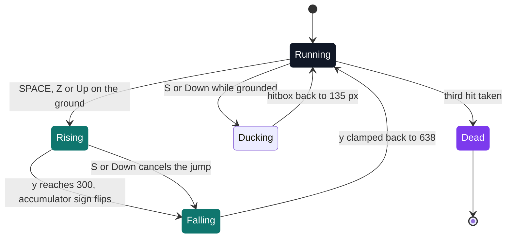

# My Runner

[](https://antoinepoisson.github.io/Old-School-Projects/projects/mul-my-runner-2018)

 

**Epitech project** · C Graphical Programming (`B-MUL-100`) · Tek1 · 2018-2019 · 2 weeks · Grade A

> A Chrome Dino-style runner whose courses are described in a text file — with an optional endless mode.

## Overview

The whole level is one line of text. Each character is a 350 px slot of track: a digit from `1` to `9` drops an obstacle into that slot, anything else leaves it empty ground.

So a new course is a new file, not a recompile. The map is a mandatory `argv[1]`, and `main` looks for it twice — once inside `open_file`, once on its own — so a bare launch prints both complaints before returning 84.

```console
$ ./my_runner
Not enough argument.
Invalid Argument.
$ echo $?
84
```

**The format, as the project's `.legend` documents it — the level is line 1, and only line 1**

```text
 1  24  5 1  6 2   1 55  9 4  1  6 2  1   5  6    8 11  5  8
```

| In the file | On screen |
| --- | --- |
| `1` … `9` | one obstacle, cell `(n-1) × 73 px` of `cactus.png` |
| space (or any non-digit) | 350 px of empty ground |

That example line is 60 characters long and produces 23 obstacles. Position comes from the character's index, never from a coordinate: `x = (index + 1) * 350 + 1600 + rand() % 20`.

The `1600` is one window width, so slot 1 starts a full screen past the right edge and the rest queue up behind it. Each width is rolled at load time, 70 px or 143 px: a single cactus or a double clump.

## How it works

**Nine parallax layers, and not one of them moves.**

The background is a circular linked list of nine sprites, all pinned at `(0, 0)`. Scrolling slides each layer's *texture rectangle* across a 6400 × 900 tile and wraps it back at 4800 px. Depth is nothing more than a percentage of the base speed.

```c
int acceleration = 9;

for (int i = 1; i <= 9; sf->bg = sf->bg->next, i++, acceleration--) {
    sf->bg->offset = ((sf->var_norm.speed_background *
        gestion_acceleration_bg(acceleration)) / 100);
    sf->bg->rect.left += sf->bg->offset;
    sfSprite_setTextureRect(sf->bg->sprite, sf->bg->rect);
    sfRenderWindow_drawSprite(sf->win.dow, sf->bg->sprite, NULL);
    if (sf->bg->rect.left > 4800)
        sf->bg->rect.left = 0;
}
```

Because the list is circular, the loop walks exactly nine nodes and lands back on its own head — no index, no reset, no bounds check.

| Draw order | Layer | Scroll |
| --- | --- | --- |
| 1 | `ground.png` | 0 % |
| 2 | `sun.png` | 10 % |
| 3 | `mountain.png` | 20 % |
| 4 | `wind.png` | 30 % |
| 5 | `wind_two.png` | 30 % |
| 6 | `rock.png` | 40 % |
| 7 | `degrade.png` | 0 % |
| 8 | `mini_mountain.png` | 65 % |
| 9 | `floor.png` | 100 % |

The base speed starts at 10 px per frame in a 1600 × 900 window capped at 40 fps. The floor therefore travels 400 px per second and the sun 40.

**The jump is an accumulator, not a precomputed curve.**

A fixed step moves the dino (-30 px rising, +33 px falling) while a float velocity `dino_sinus` grows by 0.7 on the way up and 0.8 on the way down, and is added on top of the step.

At the apex the accumulator's sign is flipped, so the same variable that braked the climb now holds the fall back for a few frames before letting it run.



Ducking is not cosmetic: it swaps the dino's source rectangle for a shorter one, 84 px tall instead of 135, so the bird passes over a genuinely smaller box.

**Collisions test three points, once per drawn frame.** `damage_dino_check` walks the obstacle ring and tests three points of the dino's box — top-left, top-right, mid-left — against each cactus, and three more (left-top, left-mid, bottom-left) against each of the two birds when `-bi` is on. `obstacle_touch` records the index of the cactus that landed the hit and skips it afterwards, so one obstacle cannot drain all three hit points while the player is still passing through it.

**Endless mode replays the same file, reflected.** There is no second generator: when every obstacle has left the screen, each `x` goes through `x → 1454 - x + 2i`, which sends the course back on stage in reverse order, with fresh widths and a faster floor.


**The best score is decided by a majority vote.** `Highscore.txt` holds three `|`-separated fields, read with `open`/`read` and rewritten with `fopen`/`fwrite`. A save fires when two of the three comparisons pass — but the writer lays the record out as `score|bird|level` while the reader consumes field 2 as the level and field 3 as the bird flag, so two of the three votes are cast on swapped meanings. The delivered file still reads `15064|1|12|` from the defence.

## What this project demonstrates

- Levels described by file rather than hard-coded, with semi-random generation to break repetition
- Built-in development tooling: hitbox display, god mode and endless mode as command-line options
- Nine parallax layers at proportional speeds, and best-score persistence across sessions

## Key features

- Side-scrolling CSFML runner: the character jumps over ground obstacles and flying birds
- Finite mode by default (the level ends), -i option for endless mode
- Main menu, score screen, animated transitions between screens
- Current score displayed in game, dedicated hitbox for collisions

| Flag | Effect |
| --- | --- |
| `-i` | endless mode: the course loops and gains 5 px/frame each lap |
| `-bi` | two birds at y = 540 and y = 370, respawning at random distances |
| `-g` | god mode — the hit test lives inside the health bar's draw call, so hiding the bar disables damage |
| `-hi` | swaps the dino, cactus and bird sheets for their hitbox sheets |
| `-h` | prints the usage and exits, recognised only as the single argument |

`-bo` is parsed into the state struct as well, and nothing reads it back.

## Technical stack

- **Languages** — C
- **Frameworks / libraries** — CSFML
- **Tools** — Makefile, gcc, Git
- **Concepts** — parallax scrolling, configurable level format, jump physics, score persistence

## Engineering constraints

- imposed library: CSFML
- mandatory -h option
- map file mandatory as an argument, otherwise exit with code 84
- Epitech coding standard

That last one shaped the file tree more than any design decision: 2,667 lines spread over 34 `.c` files and 129 functions, because no function may exceed 20 lines and no file may hold more than five. The 22 `is_extension_*` helpers are the visible seam — each one is the overflow of a function that hit the 20-line ceiling.

## Beyond the baseline

- Best score persisted to disk in Highscore.txt, read back at launch through get_next_line — the score survives closing the game
- A dedicated leaderboard screen (is_menu_highscore.c)
- Flying birds in addition to ground obstacles

The delivered Highscore.txt still holds the score from the oral defence.

## Verification

tests_run rule present in the Makefile, but no test file is delivered in the repository.

Verification was visual instead, and the tooling for it shipped with the game: `-hi` renders every sprite as its hitbox sheet so a collision can be checked by eye, and `-g` removes damage so a course can be watched end to end.

## Build & run

```bash
make                          # builds ./lib/my/libmy.a, then links CSFML
./my_runner map.txt           # any file whose first line is a course
./my_runner map.txt -i -bi    # endless mode, with birds
```

Produces `my_runner`. Every asset path is relative (`./images`, `./font`, `./music`), so the binary runs from the project directory.

---

[← Graphics — 2D games in C](../README.md) · [↑ Tek1](../../README.md) · [⌂ All projects](../../../README.md)
