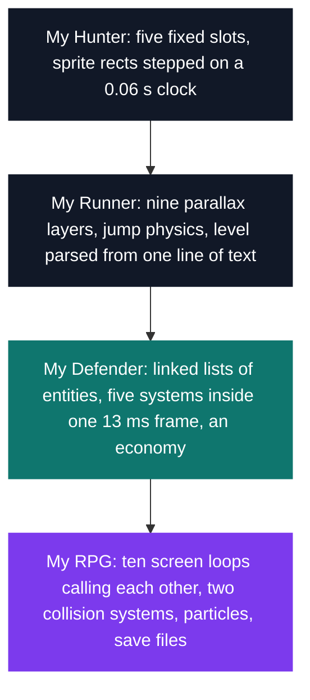

# Graphics — 2D games in C

[← Tek1](../README.md) · [⌂ All projects](../../README.md)

CSFML hands you a window, a texture and a sound, and stops there. Animation, collision, scrolling, entity lists, save files and screen transitions are written by hand in these four games, in C, with no engine and no objects.

The hardest of them is My RPG: 8,743 lines where the state machine *is* the C call stack — walking into the dungeon calls the dungeon's loop from inside the beach's, and the beach resumes when it returns.

| Project | What it is | C + headers | Size | Grade |
| --- | --- | --- | --- | --- |
| [My Hunter](MUL_my_hunter_2018) | Duck Hunt-style shooting gallery, western set | 3,174 | 2 weeks | A |
| [My Runner](MUL_my_runner_2018) | Side-scrolling runner, courses read from a file | 3,131 | 2 weeks | A |
| [My Defender](MUL_my_defender_2018) | Tower defense with waves, gold and buildings | 3,824 | 2 weeks | A |
| [My RPG](MUL_my_rpg_2018) | Two-zone RPG with combat, inventory and a boss | 8,743 | 2 weeks · team | A |

Six months separate the first from the last, and what a single game loop has to hold grows the whole way:

## Projects (4)

### C Graphical Programming (`B-MUL-100`)

- **[My Hunter](MUL_my_hunter_2018)** — *2 weeks · Grade A*
  A Duck Hunt-style shooting gallery with a western makeover: ten targets pop up at five slots around a house, and it is up to you to draw.

- **[My Runner](MUL_my_runner_2018)** — *2 weeks · Grade A*
  A Chrome Dino-style runner whose whole course is one line of text in a file, scrolling over nine parallax layers.

### C Graphical Programming (`B-MUL-200`)

- **[My Defender — tower defense](MUL_my_defender_2018)** — *2 weeks · Grade A*
  A tower defense where you place the town hall yourself, and every enemy trajectory becomes a line solved once towards it.

- **[My RPG](MUL_my_rpg_2018)** — *2 weeks · Team · Grade A*
  A 2D role-playing game with two zones, spells, an inventory and a boss, held together by a `game_t *` and the call stack.
