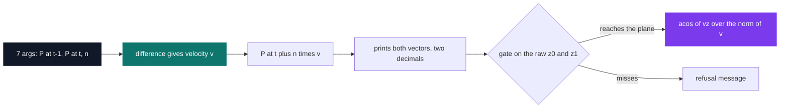

# 101pong — vectors and bounces

[](https://antoinepoisson.github.io/Old-School-Projects/projects/mat-101pong-2018)

  

**Epitech project** · Mathematics (`B-MAT-100`) · Tek1 · 2018-2019 · 2 weeks · Grade A

> The maths of a ball in flight: speed, future position and angle of arrival on the paddle.

## Overview

Give the program two snapshots of a ball in 3D, one instant apart. It answers three questions:
how fast is it moving, where will it be `n` instants from now, and at what angle will it meet
the paddle — or does it never meet it at all.

Nothing is drawn and nothing is animated. Seven numbers go in, five or six lines of text come
out, and those lines are compared against the expected output. A wrong second decimal is a
failed test; so is a missing space before `degrees`.

The paddle is the (Oxy) plane, `z = 0`, and bouncing is deliberately out of scope. What is left
is the block every game engine runs before it can decide anything: turn positions into a
velocity, project that velocity forward, and measure it against a surface.

## How it works

Everything sits in one struct — three `float` fields, `x`, `y`, `z` — and four primitives that
build, add, subtract and scale it. The entire program is those four calls chained in one order,
233 lines across four `.c` files and one header.



| Stage | Operation | Formula |
| --- | --- | --- |
| Velocity | difference of the two positions | `v = P(t) − P(t−1)` |
| Extrapolation | scale by a real, then add | `P(t+n) = P(t) + n·v` |
| Incidence | Euclidean norm, then arc cosine | `90° − acos(vz / ‖v‖)` |

**The angle is measured from the plane, not from its normal.** `acos(vz / ‖v‖)` returns the
angle between the velocity and the z axis; subtracting it from 90° turns that into the angle
against the paddle's surface, and `fabs` folds both half-spaces onto the same 0–90 range.

```c
float result = sqrt(powf(vector->x, 2) + powf(vector->y, 2) +
                    powf(vector->z, 2));

if (result == 0) {
    printf("The ball won’t reach the bat.\n");
    exit(EXIT_ERROR);
}
result = acos(vector->z / result);
result = 90 - (result) * 180 /M_PI;
result = fabs(result);
```

The null-norm test comes first for a reason: a stationary ball would hand `acos` a division by
zero, and the answer would propagate as a `nan` straight into the graded output rather than
failing loudly.

Whether the ball ever reaches the plane is settled before any trigonometry, from `z0` and `z1`
alone. The gate accepts when the two altitudes share a sign and `z0 >= z1`; otherwise the refusal
message is printed and the arc cosine is never evaluated.

**Audit finding.** `z0 >= z1` is the right test above the plane and its exact mirror below it, so
the lower half-space comes out inverted: `./101pong 0 0 -1 10 10 -5 3` answers `15.79 degrees` for
a ball diving away from the paddle, while `./101pong 0 0 -10 10 10 -5 3`, climbing straight at it,
is refused. The vector maths behind the gate holds in every quadrant — it is the sign test in
front of it that is one-sided.

## What this project demonstrates

- Recovering a velocity from two sampled positions, then deriving a whole trajectory from it — the building block underneath every game engine's physics step
- Deciding from `z0` and `z1` alone whether the ball will ever meet the paddle's plane, before spending a single call on trigonometry
- Treating hundredth-precision output as part of the specification: `float` rounding is graded, not incidental

## Key features

- Vector algebra applied to the flight: difference, scaling, sum, Euclidean norm, angle of incidence
- Output reproduced to the imposed format, two decimals, angle folded into 0–90 degrees
- `my_getfloat` added to the personal library to read the coordinates straight from `argv`
- `-h` usage screen, plus argument-count and per-character validation that rejects with the school's `84` code

Real runs — the arriving case, then the one that never lands:

```console
$ ./101pong 0 0 10 10 10 5 3
The velocity vector of the ball is:
(10.00, 10.00, -5.00)
At time t + 3, ball coordinates will be:
(40.00, 40.00, -10.00)
The incidence angle is:
19.47 degrees

$ ./101pong 0 0 5 10 10 10 3
The velocity vector of the ball is:
(10.00, 10.00, 5.00)
At time t + 3, ball coordinates will be:
(40.00, 40.00, 25.00)
The ball won’t reach the bat.
```

That apostrophe is not ASCII `'`. It is U+2019, bytes `e2 80 99` in the source string — the
kind of detail a byte-comparing grader catches and a human reader never sees.

## Technical stack

- **Languages** — C
- **Tools** — Makefile, gcc, Criterion, Git
- **Concepts** — vector algebra, Euclidean norm and arc cosine, trajectory extrapolation, libm mathematical library

## Engineering constraints

- Imposed binary name `101pong`, seven positional arguments, no options beyond `-h`
- Output compared byte for byte: fixed wording, two decimals, exact spacing
- Free choice of language among those available at the school; C was chosen, with `-lm` for `acos`, `sqrt` and `powf`

There is no `atof`, `strtod` or `sscanf` anywhere in the tree. Reading `"10"` or `"-7"` out of
`argv` goes through `my_getfloat`, written for this project and added to the 31-file, 812-line
`libmy` carried over from the C pool.

It collects the digit run, reverses it, then walks the reversed digits assigning ascending powers
of ten — exact on every integer argument. The index of the decimal point, though, is recorded
before the reversal and reused after it, so the exponent flips on the wrong digit: `8.25` reads
back as `12.80`, and `1.5` as `5.10`.

## Beyond the baseline

- 14 Criterion tests over the vector primitives, the error paths and the printed output, built by a separate `make tests_run` target with `--coverage` enabled

## Verification

The 268-line test file redirects the standard streams with `cr_redirect_stdout()` and then
asserts on the printed bytes with `cr_stdout_match_str`. Testing the emitted strings rather
than the return values is the right shape for a program whose entire contract is its output.

The 14 cases reach the four vector primitives, the `-h` screen, the argument checks and both
angle outcomes. Five of them still match the binary byte for byte — the four primitives and the
usage screen. The other nine assert text the code does not print for the arguments they pass, one
of them expecting `The incidence angla is:` against the program's `The incidence angle is:`, so
the file records the intended contract more closely than it guards the shipped one.

```bash
make tests_run
```

## Build & run

```bash
make
./101pong x0 y0 z0 x1 y1 z1 n
```

Produces `101pong`. Arguments are the ball's coordinates at `t-1`, then at `t`, then the
integer time shift `n`.

---

[← Maths — applied mathematics in C](../README.md) · [↑ Tek1](../../README.md) · [⌂ All projects](../../../README.md)
