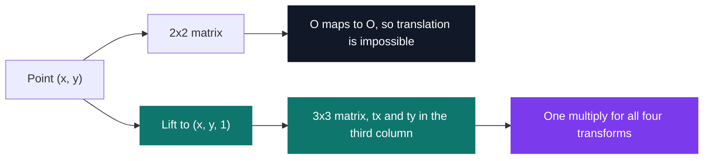
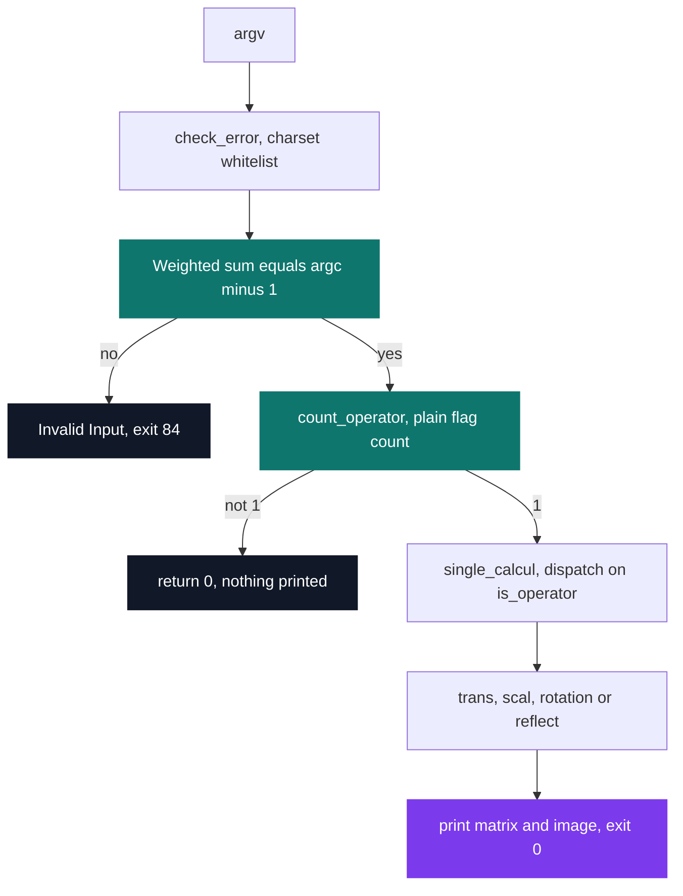
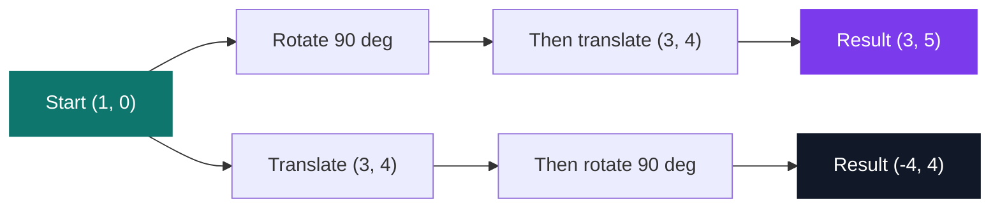

# 102architect — transformations and homogeneous coordinates

[](https://antoinepoisson.github.io/Old-School-Projects/projects/mat-102architect-2018)

 

**Epitech project** · Mathematics (`B-MAT-100`) · Tek1 · 2018-2019 · 2 weeks · Grade A

> Moving, rotating and resizing shapes — the foundation of all computer imagery.

## Overview

Rotation and scaling are matrix multiplications. Translation is not: every 2×2 matrix sends the
origin to the origin, so no linear map in the plane can move a point by a vector. Three of the
four transformations live in one world and translation lives outside it.

Homogeneous coordinates remove the split. Write the point as `(x, y, 1)`, move up to 3×3 matrices, and
the translation vector fits in the third column — moving becomes a multiplication like everything
else. One uniform operation for four different geometric ideas.



The binary is the demonstration: give it a point and one of four flags, and it prints the 3×3
matrix that flag builds, then the image of the point. The same trick is why a vertex shader still
passes 4×4 matrices around today — the fourth coordinate in 3D does what the third one does here.

## How it works

Eight C files, 321 lines, no matrix library allowed. `sin` and `cos` from libm carry the whole of
the trigonometry; every coefficient of every matrix is written out by hand. Each flag builds its
matrix, prints it to two decimals, then applies it to the point.

| Flag | Transformation | Matrix rows built |
| --- | --- | --- |
| `-t i j` | translation along `(i, j)` | `1 0 i` · `0 1 j` · `0 0 1` |
| `-z m n` | scaling by `m` and `n` | `m 0 0` · `0 n 0` · `0 0 1` |
| `-r d` | rotation about O by `d` degrees | `cos -sin 0` · `sin cos 0` · `0 0 1` |
| `-s d` | reflection over the axis at `d` degrees through O | `cos2d sin2d 0` · `sin2d -cos2d 0` · `0 0 1` |

Real output, imposed format — matrix first, then the image of the point:

```console
$ ./102architect 1 0 -r 90
Rotation by a 90 degree angle
0.00 -1.00 0.00
1.00 0.00 0.00
0.00 0.00 1.00
(1, 0) => (0.00, 1.00)

$ ./102architect 3 4 -s 30
Reflection over an axis with an inclinaison angle of 30 degrees
0.50 0.87 0.00
0.87 -0.50 0.00
0.00 0.00 1.00
(3, 4) => (4.96, 0.60)
```

**The reflection is the one that lies about its angle.** Mirroring across a line inclined at `d`
does not use `cos d` — it uses `cos 2d`, because reflecting rotates the point by twice the angle
between it and the axis. Missing that factor of two produces a matrix that looks plausible and is
wrong at every angle but zero.

```c
y = sin((2 * atof(str_four) * M_PI) /180);
x = cos((2 * atof(str_four) * M_PI) / 180);
c = (x * a) + (y * atof(str_two));
b = (y * a) + (-x * atof(str_two));
```

**Argument checking is one integer comparison.** `check_error()` gives each flag a weight — 5 for
`-t` and `-z`, 4 for `-r` and `-s` — counting the flag, its arguments and the two coordinates of
the point. That sum must equal `argc - 1`; otherwise the program prints `Invalid Input` and exits
84. A single arithmetic test replaces per-flag arity checking.



**The same checksum is the ceiling.** Each weight already includes the point, so a second
transformation counts it twice: `1 2 -t 3 4 -r 90` sums to 9 against an `argc - 1` of 7 and is
refused at the door.

Solve the equation and it balances only when the loose numbers are twice the flag count — for one
flag, exactly the point. Two angle flags plus two spare numbers also balance, which is the case
`count_operator()` exists to catch. The deeper reason sits in the representation: the code prints a
matrix but computes the image with the equivalent scalar arithmetic, so there is no 3×3 value to
multiply two of them together.

That is where the interesting mathematics sits, because the product does not commute:



Same two transformations, opposite order, two different points. A composed matrix has to be built
in the order the transforms are meant to apply, which is the rule that catches every beginner
writing a scene graph.

**Display and arithmetic use different parsers.** Every printed coefficient goes through `atof`,
every computed one through `atoi`. So `-t 3.5 4` prints `1.00 0.00 3.50` and then moves the point
by 3, and `-r 90.7` rotates by exactly 90 — the matrix on screen and the point under it stop
describing the same map.

## What this project demonstrates

- Homogeneous coordinates: unifying translation, rotation and scale
- The direct mathematical basis of the 3D and shader work done in Tek5

## Key features

- 2D geometric transformations: translation, rotation, scaling and axial symmetry
- Homogeneous 3×3 matrices, so translation is a multiplication like rotation and scaling
- Printing the transformation matrix in the imposed format, then the transformed point
- Input validation by arity checksum, with `Invalid Input` and exit code 84 on anything malformed

## Technical stack

- **Languages** — C
- **Tools** — Makefile, gcc, Git
- **Concepts** — homogeneous coordinates, 3×3 transformation matrices, trigonometry and degree/radian conversion, libm mathematical library

The Makefile links the pool's 30-function `libmy`, but no symbol from it is referenced: the eight
files build and run against libc and libm alone. The real dependency surface is `printf`,
`atoi`/`atof`, `exit`, `sin` and `cos`.

## Engineering constraints

- imposed binary: 102architect
- any matrix computation library (such as numpy) is forbidden
- imposed matrix display format, coefficients to two decimal places and angles in degrees
- free choice of language among those available at the school

The display rule reaches into the arithmetic. Nine coefficients per matrix, each one a `%.2f`,
then the `(x, y) => (x', y')` line — and angles stay in degrees, so every handler converts with an
inline `* M_PI / 180` before it can call into libm.

## Verification

Checking was manual, against the imposed format: nine coefficients to two decimals, the arrow
line, exit 0 on success and 84 on a malformed command line. The eight source files compile with
no warnings under `-Wall -Wextra`.

The Makefile carries the wiring for a suite — a `tests_run` rule linking a `unit_tests` binary
against Criterion with `--coverage` — but the `tests/` directory never shipped.

## Build & run

```bash
make
```

Produces `102architect`. The committed build line passes `--extra` to the compiler, which today's
clang rejects — compile the eight files directly with `-Wall -lm` if `make` stops there.

The usage line the program prints for `-h`, which it accepts only as its sole argument, above the
four-flag description block. The bracketed repetition at the end is the composition the subject
builds toward:

```text
./102architect x y transfo1 arg11 [arg12] [transfo2 arg12 [arg22]] ...
```

---

[← Maths — applied mathematics in C](../README.md) · [↑ Tek1](../../README.md) · [⌂ All projects](../../../README.md)
