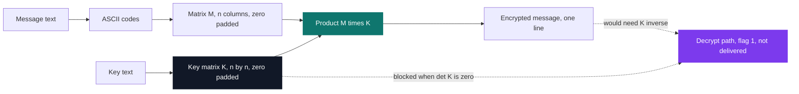

# 103cipher — matrix cipher

[](https://antoinepoisson.github.io/Old-School-Projects/projects/mat-103cipher-2018)

 

**Epitech project** · Mathematics (`B-MAT-100`) · Tek1 · 2018-2019 · 2 weeks · Grade A

> Encrypting a message by multiplying it by a matrix — and finding out that getting it back depends on a determinant.

## Overview

Encryption here is one line of linear algebra. Turn the message into ASCII codes, lay them out in a matrix `M`, build a key matrix `K` from the key string the same way, compute `M × K`.

Decryption is the hard direction. It needs `K⁻¹`, and a matrix assembled from an arbitrary text string has no guarantee of having one.

The project makes that concrete instead of theoretical. The rule that pads the key square with zeros produces, for **six of the sixteen non-empty key lengths the program accepts**, a matrix with an entirely empty row: determinant zero, no inverse, message encrypted past recovery.



No `numpy`, no matrix library of any kind — the module forbids them. 323 lines of C across six source files and a header, plus a three-function `libmy`.

## How it works

**Sizing the key.** The key string decides everything. Its length gives the side of the smallest square that can hold it — an integer `ceil(sqrt(len))` written as a bare loop — and every cell is zeroed before a single character is copied in.

```c
if ((math->key = malloc(sizeof(float *) + 1)) == NULL)
    exit(EXIT_ERROR);
math->size_key = 1;
for (; (math->size_key * math->size_key) < my_strlen(key);
math->size_key++);
for (int i = 0; i < math->size_key; i++)
    if ((math->key[i] = malloc(sizeof(float) *
        (math->size_key + 1))) == NULL)
        exit(EXIT_ERROR);
for (int y = 0; y < math->size_key; y++)
    for (int x = 0; x < math->size_key; x++)
        math->key[y][x] = '\0';
```

A key of 17 characters or more returns `84` before the key matrix is built, so `K` never exceeds 4×4. The message then gets `size_key` columns and `ceil(len / size_key)` rows, padded with zeros the same way, and the product is printed as one flat line.

A real run, byte for byte:

```console
$ ./103cipher "Hello World" "key" 0
Key matrix:
107     101
121     0

Encrypted message:
19925 7272 24624 10908 15749 11211 22740 8787 25266 11514 10700 10100
```

Every number in it is reproducible by hand:

```text
key "key"      3 chars, smallest n with n*n >= 3 is 2
               K = | 107  101 |    'k' 'e'
                   | 121    0 |    'y' + padding

"Hello World"  11 ASCII codes, 2 columns, ceil(11 / 2) = 6 rows
               M = | 72 101 | 108 108 | 111 32 | 87 111 | 114 108 | 100 0 |

row 0 of M x K = 72*107 + 101*121 = 19925
                 72*101 + 101*0   =  7272
```

**Where the inverse dies.** That zero padding is not cosmetic. A matrix with a row of zeros has determinant zero, and the padding rule guarantees one whenever the key stops exactly on a row boundary.

| Key length | Key matrix | What padding leaves |
| --- | --- | --- |
| 1 | 1×1 | nothing |
| 2 | 2×2 | row 1 empty → det 0 |
| 3–4 | 2×2 | at most one cell |
| 5–6 | 3×3 | row 2 empty → det 0 |
| 7–9 | 3×3 | at most two cells |
| 10–12 | 4×4 | row 3 empty → det 0 |
| 13–16 | 4×4 | at most three cells |

Repeated characters kill it for a second reason: `aaaa` builds two identical rows, so its determinant is zero as well. Both keys encrypt perfectly and both destroy the message.

The delivered binary implements the encrypt direction; flag `1` is accepted by the argument checker and returns without output. What the other direction needs is legible from here — a determinant, a transposed cofactor matrix, and exact division, because a rounding error of 0.5 on one coefficient shifts a recovered character by one.

## What this project demonstrates

- Linear algebra used as a cipher, with the determinant as the gate between reversible and lost
- Sizing and zero-padding a matrix from a raw string, then reading what that padding costs
- Matrix products written by hand in C, one unrolled path per key size, no library

## Key features

- Key matrix derived from the key string, sized to the smallest square that holds it
- Message laid out in `size_key` columns and `ceil(len / size_key)` rows, zero-padded
- Product unrolled explicitly for each key size, 1×1 through 4×4
- `-h` usage screen; exit code `84` on a missing argument or a flag outside `0`/`1`

## Technical stack

- **Languages** — C
- **Tools** — Makefile, gcc, Git
- **Concepts** — matrix product, text / ASCII conversion and block splitting, matrix invertibility

## Engineering constraints

| Constraint | What it forced |
| --- | --- |
| Binary must be named `103cipher` | fixed Makefile target and fixed usage string |
| Matrix libraries forbidden (`numpy` and friends) | every product written out by hand |
| Three imposed arguments: message, key, flag | `Invalid Input` on stderr, exit `84`, on anything else |
| Strict output format | `Key matrix:` block first, then the product on a single line |

## Verification

No test suite was delivered. What stands in for one is a checkable contract: for a given message and key the product is deterministic, so any run can be recomputed by hand — which is how the session above was confirmed.

The module's own worked example is the stronger check. Its key `Homer S` is seven characters, so a 3×3 matrix, and its 58-character message fills 20 rows: 60 integers of expected output. This implementation reproduces all 60, down to the final `3312 5106 5014`.

Reaching that needed one repair. Rebuilt today on arm64 — clang rejects the link line's `--extra`, a typo for `-Wextra` — any key of 5 to 16 characters faults: the row-pointer array is allocated as `sizeof(float *) + 1`, nine bytes and room for one pointer, where `sizeof(float *) * size_key` was meant. Changing that one operator makes 3×3 and 4×4 run and match. The math was right; the allocation was one character short of it.

## Build & run

```bash
make
./103cipher "Hello World" "key" 0
```

Produces `103cipher`. Arguments are message, key, and flag — `0` to encrypt, `1` to decrypt.

---

[← Maths — applied mathematics in C](../README.md) · [↑ Tek1](../../README.md) · [⌂ All projects](../../../README.md)
