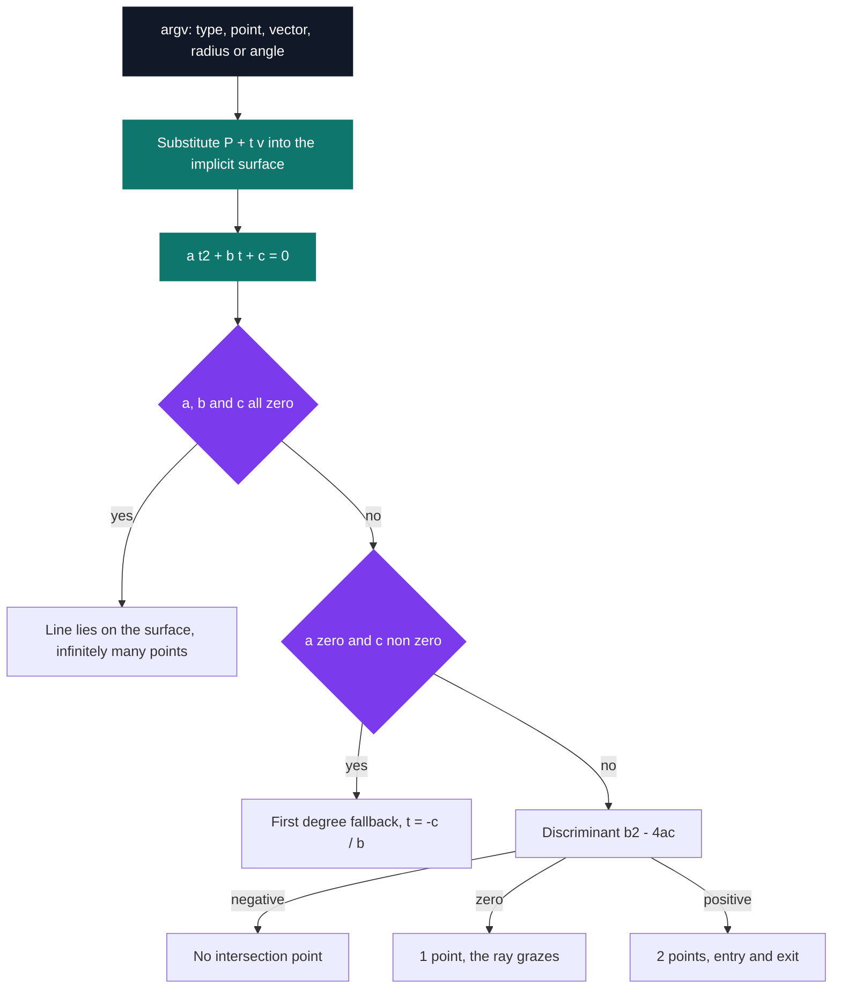

# 104intersection — lines and quadrics

[](https://antoinepoisson.github.io/Old-School-Projects/projects/mat-104intersection-2018)

 

**Epitech project** · Mathematics (`B-MAT-100`) · Tek1 · 2018-2019 · 2 weeks · Grade A

> Computing where a light ray hits a sphere, a cylinder or a cone.

## Overview

A ray tracer asks the same question millions of times per frame: does this ray hit that object, and where? This program answers it in closed form for the three quadrics that fill most ray-traced scenes — sphere, cylinder, cone.

No iteration, no ray marching, no search. The line is written as `P + t·v`, that expression is substituted into the implicit equation of the surface, and the whole geometric problem collapses into `a·t² + b·t + c = 0`.

The payoff is that the answer is never a plain yes or no. The sign of the discriminant *is* the geometry — miss, graze, or pass straight through — and the two degenerate branches around it say where the line sits relative to the surface.



391 lines of C across 8 files. The Makefile links `libm` for `powf`, `sqrtf` and `tan`, plus a hand-written `libmy.a` built from 30 sources. There is no scene file and no renderer here — only the kernel a renderer would call.

## How it works

The binary takes eight arguments and documents them itself. The wording is the code's own:

```console
$ ./104intersection -h
USAGE
	./104intersection opt xp yp zp xv yv zv p

DESCRIPTION
	opt		surface option: 1 for a sphere, 2 for a cylinder, 3 for a cone
	(xp, yp, zp)	coordinates of a point by which the light ray passes through
	(xv, yv, zv)	coordinates of a vector parallel to the light ray
	P		parameter: radius of the sphere, radius of the cylinder, or
	   		angle formed by the cone and the Z-axis
```

All three surfaces sit at the origin, and the cylinder and the cone take Oz as their axis of revolution. That is the constraint that keeps the algebra small enough to expand by hand: no transform matrix, no change of basis, three coefficients per surface.

| Surface | Implicit equation | Leading coefficient `a` |
| --- | --- | --- |
| Sphere | `x² + y² + z² = r²` | `vx² + vy² + vz²` |
| Cylinder | `x² + y² = r²` | `vx² + vy²` |
| Cone | `x² + y² = tan²θ · z²` | `vx² + vy² − tan²θ · vz²` |

That last column is where the difficulty lives. For the sphere and the cylinder, `a` is a sum of squares and can only vanish on a degenerate direction vector. For the cone it is a *difference*, and it vanishes exactly when the line is parallel to a generatrix — the case where a solver that goes straight to dividing by `2a` returns garbage.

So the solver walks a degenerate ladder before it touches the quadratic formula at all:

```c
int solve_equa_second(float a, float b, float c, var_t *var)
{
    int nbr_solv = nbr_solve_equa_two(a, b, c);

    if (a == 0 && b == 0 && c == 0)
        display_result_inf();
    if ((a == 0 && b != 0 && c != 0) || (a == 0 && b == 0 && c != 0))
        return (exceptionnal_case_calcul(a, b, c, var));
```

`a == b == c == 0` is not a numerical accident. It means *every* value of `t` satisfies the equation, so the line lies on the surface rather than crossing it — feed the 45-degree cone a line through the origin along `(1, 0, 1)`, one of its own generatrices, and that is the branch that fires.

The two guards on the line below collapse to `a == 0 && c != 0`: the quadratic has dropped to first degree and `-c / b` is its only root. `./104intersection 3 1 0 0 1 0 1 45` takes that path and prints `(0.500, 0.000, -0.500)`, a point that satisfies `x² + y² = z²` exactly.

One audit note on the classifier: `nbr_solve_equa_two` truncates the discriminant into an `int` before testing its sign, so any `|Δ| < 1` is reported as a tangency. The argument validator accepts only digits and `-`, which keeps sphere and cylinder discriminants integral and out of that window; the cone, whose coefficients carry `tan²θ`, is the one surface that can land in it.

## What this project demonstrates

- The exact computation at the heart of ray tracing: eight numbers in, three coefficients out, a closed-form answer
- The discriminant as a direct geometric answer to the number of contact points
- Degenerate algebra read as geometry — a null leading coefficient and a null equation each say something specific about where the line sits

## Key features

- Intersection of a parameterised line with a sphere, a cylinder and a cone, coefficients derived by hand for each
- Quadratic solving with the full case split: negative, null and positive discriminant
- Degenerate handling — first-degree fallback when `a` vanishes and `c` does not, and the infinite-solutions case when the whole equation vanishes
- Argument validation with a `-h` usage screen, `Invalid Argument.` and exit code 84 on bad input, coordinates printed to three decimals

## Technical stack

- **Languages** — C
- **Tools** — Makefile, gcc, Git
- **Concepts** — parametric equation, quadric surfaces, discriminant, `libm` mathematical library

## Engineering constraints

- imposed binary: `104intersection`
- output format to three decimal places
- handling the tangent, no-intersection and infinitely-many-points cases
- Epitech coding standard — no file here holds more than five functions, and `calcul_second_degree.c` and `display.c` both sit exactly on that ceiling

## Verification

Each result branch is reachable straight from the command line, so the program can be checked by hand against cases whose answer is known before running them. Four runs, verbatim:

```console
$ ./104intersection 1 0 0 0 1 0 0 5
Sphere of radius 5
Line passing through the point (0, 0, 0) and parallel to the vector (1, 0, 0)
2 intersection points:
(5.000, 0.000, 0.000)
(-5.000, 0.000, 0.000)

$ ./104intersection 1 0 5 0 1 0 0 5
Sphere of radius 5
Line passing through the point (0, 5, 0) and parallel to the vector (1, 0, 0)
1 intersection point:
(0.000, 5.000, 0.000)

$ ./104intersection 1 0 9 0 1 0 0 5
Sphere of radius 5
Line passing through the point (0, 9, 0) and parallel to the vector (1, 0, 0)
No intersection point.

$ ./104intersection 3 0 0 0 1 0 1 45
Cone with a 45 degree angle
Line passing through the point (0, 0, 0) and parallel to the vector (1, 0, 1)
There is an infinite number of intersection points.
```

A diameter, a tangent grazing the sphere, a line that passes it by, and a line lying along the cone itself: one command per branch of the solver.

The Makefile also carries the harness for a unit-test suite — a `tests_run` rule linking `-lcriterion` with `--coverage` — but no test file ships with the project.

## Build & run

```bash
make                                    # builds lib/my/libmy.a, then links with -lm
./104intersection 2 0 0 0 1 1 0 4       # cylinder of radius 4, diagonal ray
```

Produces `104intersection`. `make debug` rebuilds the same sources with `-g3`.

---

[← Maths — applied mathematics in C](../README.md) · [↑ Tek1](../../README.md) · [⌂ All projects](../../../README.md)
