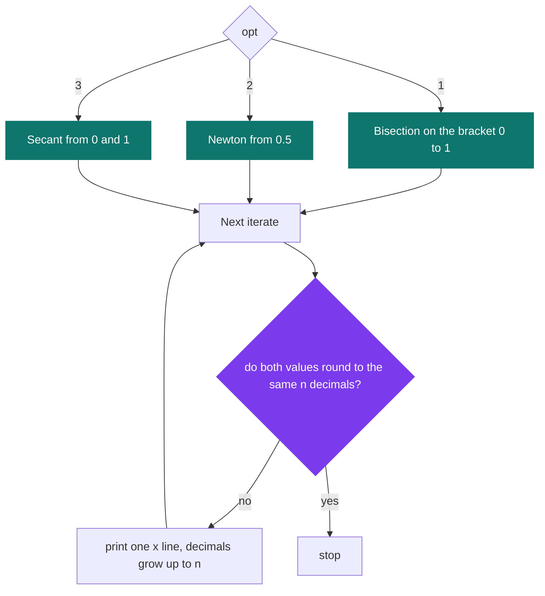

# 105torus — mathematics of the torus

[](https://antoinepoisson.github.io/Old-School-Projects/projects/mat-105torus-2018)

 

**Epitech project** · Mathematics (`B-MAT-100`) · Tek1 · 2018-2019 · 2 weeks · Grade A

> Behind the geometry of a doughnut, a quartic equation that has to be solved numerically.

## Overview

A ray hitting a sphere gives a quadratic: one discriminant, one square root, done. A ray hitting a torus gives a **quartic**. Ferrari's method solves degree four in closed form, but it generalises to nothing above that, so the exercise is to compare three iterative solvers instead.

The program takes the five coefficients of that quartic and a precision `n`, and finds the single root lying in `[0, 1]` by bisection, Newton's method or the secant method.

Landing on the root is the easy half. The trace is diffed line by line, so every iterate has to print with the right number of decimals and the loop has to stop on exactly the right round. Rebuilt today, all three methods reproduce the subject's reference traces line for line.

```text
torus: major radius R (the centre circle), minor radius r (the tube)

    (x² + y² + z² + R² − r²)²  =  4·R²·(x² + y²)

ray: P(t) = O + t·D      substitute P(t) into the surface, expand in t

    a4·t⁴ + a3·t³ + a2·t² + a1·t + a0 = 0
```

The geometry never reaches the code. The subject stops at the polynomial and hands over its coefficients, so the whole program is the last box of this pipeline — which is also the only box with no formula to copy.


## How it works

Seven arguments, the first of them the method. `-h` prints the contract:

```console
$ ./105torus -h
USAGE
	./105torus opt a0 a1 a2 a3 a4 n

DESCRIPTION
	opt	method option:
			1 for the bisection method
			2 for Newton’s method
			3 for the secant method
	a[0-4]	coefficients of the equation
	n	precision (the application of the polynomial to the solution should
		be smaller than 10ˆ-n)
```

Each method lives in its own file, seeded with the values the subject imposes, and each has its own way to break down:

| Option | Method | Imposed seed | Breaks on |
| --- | --- | --- | --- |
| `1` | Bisection | bracket `[0, 1]` | nothing — no division, the bracket only shrinks |
| `2` | Newton | `x₀ = 0.5` | `f'(x) == 0` → `Division by zero.`, exit 84 |
| `3` | Secant | `x₀ = 0`, `x₁ = 1` | `f(x₁) − f(x₀) == 0` → `Divised by 0`, exit 84 |

**The stopping test is a printing test.** Nothing here compares `|xₙ₊₁ − xₙ|` against an epsilon. Two values are scaled by `10ⁿ`, rounded to integers, and the loop stops when those integers are equal:

```c
if (round(a * pow(10, atoi(av[7]))) == round(b * pow(10, atoi(av[7]))))
    return;
```

Two numbers pass that test when they *print identically* at `n` decimals — and printed lines are what a grader diffs. A plain `|a − b| < 10⁻ⁿ` test would accept a pair that straddles a rounding boundary and still prints two different strings.

Bisection compares the two ends of its bracket; Newton and the secant compare the last two iterates. In bisection that collision is the loop's only exit: `limit` is set to 1 and never cleared, so `for (int i = 1; i < 21 || limit == 1; i++)` never ends on its own.



The secant is the exception on that last arrow: its print sits after the test and runs unconditionally, so the round that stops it emits one extra line, a copy of the one before. The reference trace ends on that same repeated line, so keeping the quirk is what makes the output match.

The display follows the same idea: bisection calls `printf("x = %.*f\n", i, c)` with the iteration index as the precision field until it reaches `n`, so decimals appear one per round, as the method earns them.

## What this project demonstrates

- Three numerical methods implemented side by side to compare their convergence speeds
- A stopping criterion driven by the requested precision, with progressive decimal display
- Division by zero handled explicitly for Newton as well as for the secant

Measured on `x⁴ + x − 1` (root ≈ `0.724492`), counting the `x = ` lines each run prints:

| Precision | Bisection | Newton | Secant |
| --- | --- | --- | --- |
| `10⁻³` | 16 | 5 | 6 |
| `10⁻⁴` | 13 | 4 | 7 |
| `10⁻⁶` | 20 | 5 | 7 |
| `10⁻⁹` | 29 | 6 | 8 |

Three more digits cost Newton one extra line at most; the same three digits cost bisection four, then nine. The counts are not monotone in `n` — 13 lines at `10⁻⁴` against 16 at `10⁻³` — precisely because the criterion is a rounding collision rather than a width test, so where the root sits relative to a rounding boundary decides when it fires.

## Key features

- Root finding for a function through three distinct numerical methods: bisection, Newton and secant
- Comparison of the number of iterations each method requires
- Stopping criterion based on the requested precision

The two extremes on the same input, at `10⁻⁴`:

```console
$ ./105torus 1 -1 1 0 0 1 4        # bisection
x = 0.5
x = 0.75
x = 0.625
x = 0.6875
x = 0.7188
x = 0.7344
x = 0.7266
x = 0.7227
x = 0.7246
x = 0.7236
x = 0.7241
x = 0.7244
x = 0.7245

$ ./105torus 2 -1 1 0 0 1 4        # Newton
x = 0.5
x = 0.7917
x = 0.7299
x = 0.7245
```

## Technical stack

- **Languages** — C, 234 lines across 6 source files, plus 2 headers
- **Tools** — Makefile, gcc, Git, `libm` for `pow()` and `round()`
- **Concepts** — iterative root-finding methods (bisection, Newton, secant), stopping criterion and imposed precision, polynomial derivative and division-by-zero cases, libm mathematical library

## Engineering constraints

- imposed binary: 105torus
- imposed initial values: 0.5 for Newton, 0 and 1 for bisection and secant
- strict output format: one « x = ... » line per iteration, at the requested precision
- free choice of language among those available at the school

`check_error()` accepts only integer literals: a leading `-` passes on the coefficients `a0`–`a4`, is refused on `n`, and no other character may be anything but a digit. Each rejection is one `write(2, ...)` and exit code 84, the school's standard error status; the two divide-by-zero messages take `printf` instead and land on stdout.

That validator also settles a parsing question the code never asks: Newton reads the coefficients with `atoi` while `calcul_funct_x()` reads them with `atof`, and the two agree only because no argument can ever contain a decimal point.

## Beyond the baseline

The subject offers two optional extensions — a graphical comparison of the convergence rates, and solving equations of degree above four. The delivery stays on the required scope, and the one thing it adds by itself is defensive: the subject guarantees one and only one root in `[0, 1]`, and both divisions are still guarded rather than left to produce an infinity.

**Audit.** The body of `calcul_deri_funct_x()` in `tool.c` is a character-for-character copy of `calcul_funct_x()` — it returns `f`, not `f'`. The arithmetic is still right, because Newton computes the real derivative inline as `4·a4·x³ + 3·a3·x² + 2·a2·x + a1` and uses the misnamed helper only for the numerator: the defect is in the name, not in the result.

The 30-file `libmy` static library is linked and never called once. That is the correct outcome, not an oversight — `printf("%.*f")` with a runtime precision field is exactly the thing a hand-rolled `my_putstr` cannot do, and the imposed output format is built on it.

## Verification

The Makefile carries a `tests_run` rule that would compile `tests/` with Criterion and `--coverage`, but no test directory ships with the project, so the rule cannot run.

The reference traces stand in for it. The subject publishes one worked example per method on `x⁴ − 5x³ + 6x² − 1`, and a fresh build reproduces all three of them exactly, including the secant's repeated last line:

```console
$ ./105torus 3 -1 0 6 -5 1 8
x = 0.5
x = 0.52941176
x = 0.52274853
x = 0.52274000
x = 0.52274000
```

## Build & run

```bash
make
./105torus 2 -1 1 0 0 1 6      # Newton on x⁴ + x − 1, six decimals
```

Produces `105torus`. The Makefile passes `--extra` where `-Wextra` was meant; clang rejects it as an unknown argument, so a current toolchain needs that one-character fix before the build goes through.

---

[← Maths — applied mathematics in C](../README.md) · [↑ Tek1](../../README.md) · [⌂ All projects](../../../README.md)
