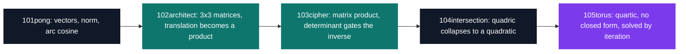

# Maths — applied mathematics in C

[← Tek1](../README.md) · [⌂ All projects](../../README.md)

Five C programs whose entire contract is their printed output: imposed wording, an imposed number of decimals, and no matrix library to do the algebra — `numpy` and friends are forbidden, so every product is written out by hand. The mathematics climbs one degree at a time: a velocity vector recovered from two positions, 3×3 homogeneous matrices, a cipher whose determinant decides whether the message is recoverable, a ray/quadric intersection that collapses into `a·t² + b·t + c = 0`.

The last one does not collapse. A ray meeting a torus gives a **quartic**, so 105torus drops closed form and hunts the root with bisection, Newton and the secant method — stopping when two successive iterates round to the same `n` decimals, because identical printed lines are exactly what a grader diffs.

| Project | What it is | Size | Grade |
| --- | --- | --- | --- |
| [101pong](101pong_2018) | Velocity, future position and incidence angle from two ball positions | 2 weeks | A |
| [102architect](102architect_2018) | Four 2D transforms as 3×3 homogeneous matrices, coefficients written by hand | 2 weeks | A |
| [103cipher](103cipher_2018) | Matrix-product cipher where zero padding kills the inverse | 2 weeks | A |
| [104intersection](104intersection_2018) | Closed-form ray intersection with sphere, cylinder and cone | 2 weeks | A |
| [105torus](105torus_2018) | Quartic root finding by bisection, Newton and secant | 2 weeks | A |

Each step reuses the previous one's tools and adds one difficulty: the vector primitives of 101pong feed the parametric line of 104intersection, and the hand-written 3×3 algebra of 102architect is what 103cipher pushes as far as the determinant.

## Projects (5)

- **[101pong — vectors and bounces](101pong_2018)** — *2 weeks · Grade A*
  Seven numbers in, a velocity, an extrapolated position and an incidence angle out — with a `z0`/`z1` gate that settles whether the ball ever reaches the paddle before any trigonometry runs.

- **[102architect — transformations and homogeneous coordinates](102architect_2018)** — *2 weeks · Grade A*
  Translation is not a linear map in the plane; lifting the point to `(x, y, 1)` makes it a multiplication like the other three.

- **[103cipher — matrix cipher](103cipher_2018)** — *2 weeks · Grade A*
  Encrypting by multiplying the message by a key matrix — and six of the sixteen accepted key lengths leave an empty row, so the determinant is zero and the text is gone.

- **[104intersection — lines and quadrics](104intersection_2018)** — *2 weeks · Grade A*
  Substituting `P + t·v` into a sphere, cylinder or cone, then reading the sign of the discriminant as geometry: miss, graze, or pass through.

- **[105torus — mathematics of the torus](105torus_2018)** — *2 weeks · Grade A*
  Three numerical methods on the same quartic, side by side: at `10⁻⁹`, bisection takes 29 iterations and Newton takes 6.
