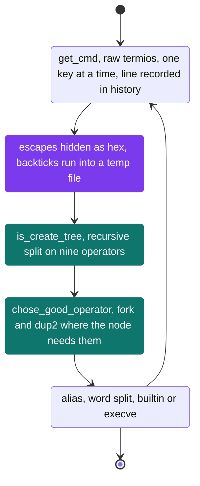
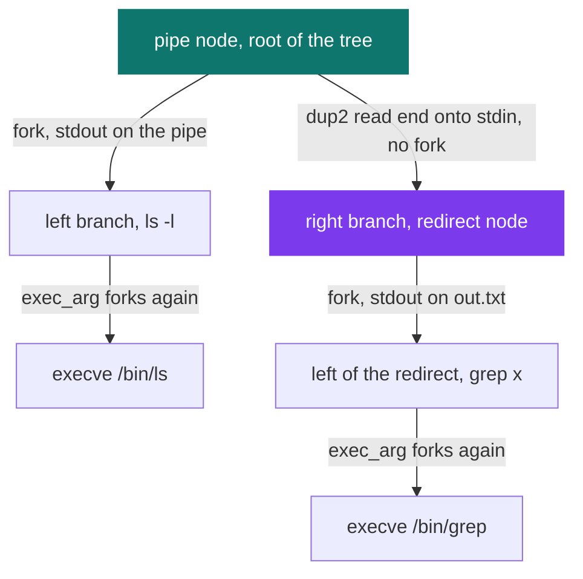

# 42sh — full shell

[](https://antoinepoisson.github.io/Old-School-Projects/projects/psu-42sh-2018)

   

**Epitech project** · Shell Programming (`B-PSU-210`) · Tek1 · 2018-2019 · 2 weeks · Team of 4 · Grade A

> The shell that closes first year: raw-mode line editing, navigable history, aliases, backticks
> and conditional chaining — four people, one process tree.

## Overview

The reference is not a spec sheet, it is `tcsh`. The subject makes it the authority on syntax and on
commands: error messages go to the error output, and the exit code has to be the one `tcsh` would
have returned.

That turns wording into a hard requirement. A child killed by SIGSEGV must print
`Segmentation fault (core dumped)`, an unknown binary `foo: Command not found.`, an odd number of
backticks ``Unmatched '`'.`` — trailing dot included.

```console
[/home/Crow/42sh] $> cat << STOP
? tcsh is the reference
? STOP
tcsh is the reference
[/home/Crow/42sh] $> nosuchbin
nosuchbin: Command not found.
[/home/Crow/42sh] $> ./crash
Segmentation fault (core dumped)
[/home/Crow/42sh] $> history
1   14:32   cat << STOP
2   14:32   nosuchbin
3   14:33   ./crash
4   14:33   history
```

7,681 lines of C over 120 files, with no `readline` and no `getline`: the authorised function list is
the libc and ncurses, nothing else. `sources/` holds 61 `.c` files — the main loop plus 12 module
directories, cut so four people could commit in parallel for two weeks.

## How it works

**One line, one straight path.** `is_minishell()` in `is_shell.c` is five calls in a row, and each
stage sits in its own module behind a single entry point — which is what let four people work without
stepping on each other.



**Line editing without readline.** `new_term()` clears `ICANON` and `ECHO` through `termios`, so
every keystroke arrives raw; `tgetent()` then `tgetstr()` fetch the `cl` and `dl` capabilities, and
the editor repaints prompt and line on every key.

Arrow keys arrive as a three-byte burst that `read()` pulls into a single `int`, compared against
`4283163` and `4348699` — `0x415B1B` and `0x425B1B`, `ESC [ A` and `ESC [ B` in memory order. Blunt,
and it removes the escape-sequence state machine entirely.

**Precedence is a loop, not a grammar.** `is_create_tree()` scans the line for operator kind 0, then
kind 1, then kind 2; the first kind found anywhere becomes the root, and the line is cut in two
around it. Recursion handles both halves.

`check_parentheses()` runs before the scan, counts the pair and blanks every `)`, so kind 0 only ever
matches the opening one.

| Split order | Token | Node does |
| --- | --- | --- |
| 0 | `(` | grouping |
| 1 | `;` | sequence |
| 2 | `\|` | pipe |
| 3 | `<<` | here-document |
| 4 | `<` | input redirect |
| 5 | `>>` | append |
| 6 | `>` | output redirect |
| 7 | `\|\|` | run right when left failed |
| 8 | `&&` | run right when left succeeded |

Encoding precedence as a scan order rather than a grammar is what got nine operators working in two
weeks. The audit reads straight off that first column: `&&` is scanned last, so it binds tighter
than `|`, and `a && b | c` groups as `(a && b) | c` where `tcsh` groups it the other way.

**Seven of the nine nodes fork; `;` and `(` run in place.** `control_pipe()` forks the left branch
with its stdout on the write end, keeps the read end on its own stdin, and runs the right branch in
place. It saves fd 0 with `dup(0)` beforehand, so the next prompt still reads from the terminal.

Running `ls -l | grep x > out.txt` puts the pipe at the root and the redirect on its right branch:



**Escapes hidden in plain sight.** A backslashed character never reaches the operator scanner as
itself. `find_backslash()` rewrites it as its two-digit hex code, so the tree is built on a line
that contains no pipe at all, and `change_backslash()` restores the byte at the leaf.

```text
typed      cat file \| grep x
scanned    cat file \7C grep x     the operator pass finds no pipe here
executed   cat file | grep x       restored in exec_arg, before word splitting
```

## What this project demonstrates

- A line editor written straight against `termios` and `termcap`: raw mode, manual repaint, no `readline`
- A recursive command tree over nine operators, each node running exactly the `fork`, `pipe` and `dup2` its own semantics need
- Error strings, exit codes and 39 signal names aligned on `tcsh`, down to the trailing dot
- Four contributors, 12 modules, 61 source files: the internal interfaces had to hold before the code could move

## Key features

Eight built-ins, matched by `search_my_command()` before any `PATH` lookup, so they never reach
`execve`:

| Built-in | Notable behaviour |
| --- | --- |
| `cd` | `cd -`, bare `cd` to `$HOME`, `PWD` and `OLDPWD` rewritten |
| `env` `setenv` `unsetenv` | the shell owns a private copy of `environ` |
| `alias` | substituted at the leaf before word splitting, 34 lines read from `.42shrc` at startup |
| `echo` | `$?`, single and double quotes, `\n` `\t` `\r`, `Unmatched '"'.` on an odd quote |
| `history` | `-c`, `-r`, `-h` and `[n]`, entries stamped `HH:MM` |
| `exit` | also how each forked branch hands its status back to the parent |

- Backtick substitution: the inner line re-enters the whole pipeline, its output is captured in a
  temporary file, then flattened to a single line before reinjection
- Here-documents with the `? ` continuation prompt, fed to the left branch through a pipe
- `&&` and `||` short-circuit on the child's `WEXITSTATUS`
- Parentheses grouping, checked for balance before the tree is built

## Technical stack

- **Languages** — C
- **Frameworks / libraries** — ncurses, termcap
- **Tools** — Makefile, gcc, Criterion, Git
- **Concepts** — raw terminal mode (termios), line editing and termcap capabilities, command tree and operator precedence, backtick substitution and character inhibitors

## Engineering constraints

- imposed group size: 4 to 5
- imposed binary: 42sh
- imposed reference shell: tcsh, including for return codes
- functions limited to the libc and ncurses

## Beyond the baseline

- Character inhibitors through the hex-transcoding pass (`globbing/inhibitors.c`)
- Backticks with their own mini string library, 16 files under `sources/backticks/`
- Line editing written by hand rather than delegated to `readline`
- 152 Criterion tests over 16 files

Two stubs sit on live wires. The main loop calls `find_globbing()`, which hands its argument straight
back, and Tab is bound to `auto_comp()`, whose body is empty.

Everything behind them is written and compiled: `globbing_star()`, `globbing_qmark()`,
`globbing_hook()` for `[a-z]` ranges and the `opendir()` lister that feeds them. Nothing calls them.
That is the recurring failure of a four-way split — the module lands, the call that wires it in does
not.

The largest project at the end of Tek1, and the one where the split into modules decided what shipped.

## Verification

`tests/` holds 152 Criterion tests across 16 files, compiled with `--coverage` and reported through
`gcovr`. The Makefile's `TEST_SRC` names 15 of those files, so 151 of the 152 are actually built.

`test_message_signal_error.c` is the largest with 44 assertions: one for each of the 39 handled
signal numbers, plus five out-of-range checks. A wrong signal name is the first place the output
drifts away from `tcsh`.

## Build & run

```bash
make            # produces ./42sh
make tests_run  # builds and runs the Criterion suite, then a gcovr report
make debug      # rebuild with -g3 and start under valgrind
```

---

[← PSU — Unix systems programming](../README.md) · [↑ Tek1](../../README.md) · [⌂ All projects](../../../README.md)
