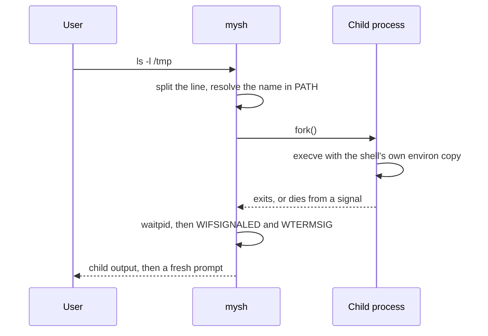
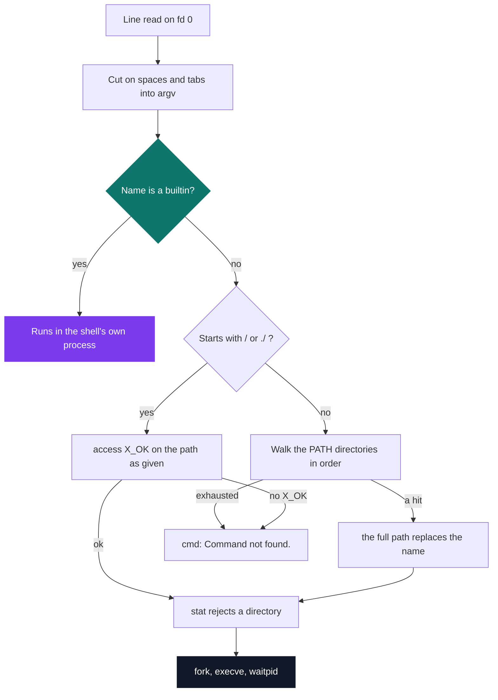

# Minishell 1

[](https://antoinepoisson.github.io/Old-School-Projects/projects/psu-minishell1-2018)

  

**Epitech project** · Shell Programming (`B-PSU-210`) · Tek1 · 2018-2019 · 2 weeks · Grade A

> Writing your own shell: the program that launches all the others — and has to survive every one of them.

`mysh` is the process that must not die. A child it starts can segfault, abort, or be killed from
another terminal, and the shell has to read the raw status word back, name the signal the way
`tcsh` names it, and come back with a prompt.

The second constraint is invisible until you get it wrong. `cd`, `setenv` and `unsetenv` change the
shell's *own* state — fork them and they work, then vanish with the child. They cannot be programs.

## Overview

Everything typed in a terminal goes through a shell: read a line, find the program on disk, run it
in a separate process, wait for it, start again. This project is that loop, written from scratch.

No `system()`, no `popen()`, no libc string function — those are rewritten alongside, 42 C files in
`lib/my`. The shell logic is **1,212 lines across 16 C files**; with the library, the tests and the
bonus tree the repository holds **149 C sources and headers, 7,525 lines**.



## How it works

A line comes in through a homemade `get_next_line`, is cut into an argument vector, and then takes
one of two paths that never meet. Builtins run here. Everything else runs somewhere else.



The `PATH` splitter does double duty: it cuts on `:` **and** appends a `/` to every entry it
produces, so the lookup is one concatenation with no separator logic. `my_strcat` returns a fresh
buffer, which is why the `PATH` table survives the search unmutated.

```c
/* sources/my_exec.c — the PATH walk, in full */
for (; var->path[i] != NULL; i += 1) {
    result = my_strcat(var->path[i], var->arg_two_d[0]);
    if (access(result, X_OK) == 0) {
        free(var->arg_two_d[0]);
        var->arg_two_d[0] = result;
        return (1);
    }
    free(result);
}
```

Five builtins. Four of them act on the shell process itself — its working directory, its
environment, its own life. `env` is there because the environment it prints is the copy the shell
owns, not the one libc holds.

| Builtin | What it does |
| --- | --- |
| `cd` | `chdir`, rewrites `PWD` and `OLDPWD`; `cd -` returns to `OLDPWD` |
| `setenv` | adds or replaces a variable, name must start with a letter |
| `unsetenv` | removes one or several variables in one call |
| `env` | prints the shell's own copy of the environment |
| `exit` | frees the whole state, prints `exit`, then `exit(n)` |

That copy is deep-copied from `envp` at startup into a `char **` the shell owns, and handed to
`execve` as its third argument — so a child sees `setenv PATH ...` at once. The lookup table is a
*derived* array, split from `PATH` once in `check_error.c` and never rebuilt, so the shell keeps
searching the directories it read at launch. Environment and cache are two different things.

`waitpid` hands back a status word, not a message. `WIFSIGNALED` then `WTERMSIG` turn it into a
number, and a 39-entry table turns that number into the string `tcsh` prints, with `(core dumped)`
appended when `WCOREDUMP` says a core was written.

The school's coding style caps how long a function may be, so those 39 cases cannot live in one
`switch`. They are spread over five `research_signal*` functions that `check_echec_exec` tries in
turn until one of them returns 1.

A directory is executable in the `access(X_OK)` sense, so `/bin` typed as a command passes the
lookup — a `stat` on the `S_IFMT` bits catches it *before* the `fork`:

```console
[/home/crow/PSU] $> cd /doesnotexist
/doesnotexist: Not a directory.
[/home/crow/PSU] $> /bin
/bin: Permission denied.
[/home/crow/PSU] $> ./crash
Segmentation fault (core dumped)
[/home/crow/PSU] $> notacommand
notacommand: Command not found.
[/home/crow/PSU] $> exit
exit
```

Job control is the layer directly above this one, and it is out of scope here: `mysh` installs no
handler, so shell and child share one foreground process group and `SIGINT` reaches both. Signal 2
has no entry in the message table, which is consistent: a Ctrl+C that kills the child kills the
shell with it.

## What this project demonstrates

- Concretely understanding what a terminal does for every command
- The built-in / external distinction: why `cd` cannot be a program
- Termination messages reproduced signal by signal, like the reference shell
- Bonus: aliases loaded at startup from a `.myshrc` file

## Key features

- Interactive shell: line reading, argument splitting, binary lookup in the PATH, fork and exec
- Built-in commands `cd`, `env`, `setenv`, `unsetenv`, `exit`
- Environment managed internally, propagated to child processes
- Signal interception and printing of the matching error message (segfault, bus error)

## Technical stack

- **Languages** — C
- **Tools** — Makefile, gcc, Criterion, Git
- **Concepts** — fork / execve / waitpid, PATH resolution, built-in commands, decoding the termination status (WIFSIGNALED / WTERMSIG)

## Engineering constraints

- **Imposed binary `mysh`** — the grading harness types into it and reads its bytes back
- **No high-level function** — `system` and `popen` are banned, so the `fork` / `execve` / `waitpid`
  triple has to be written out
- **Limited set of allowed functions** — hence `lib/my`, 42 C files from `my_strlen` to `my_printf`

## Beyond the baseline

A second, complete tree under `bonus/` — 18 sources against the base 16 — adds command aliases.
`.myshrc` is read once at startup from the current directory, and `control_alias` then rewrites the
first word of every line before it is cut into argv.

```sh
alias ..='cd ../../'
alias l='ls -alp'
alias clr='clear'
alias re='make re'
```

`fill_alias` keeps only the lines whose first five characters are `alias`, which is what lets the
same file carry comments. The rest of the tree is the base shell with two hooks: `check_error.c`
loads the table at startup, `my_exit.c` frees it.

## Verification

**112 Criterion tests** across 12 files and 1,582 lines — more test code than shell code. The signal
table gets one test per entry: 39 assert a hit, and five more hand a signal number to the wrong
`research_signal*` bucket and assert the miss, which pins the dispatch boundaries.

Three suites install `cr_redirect_stdout` / `cr_redirect_stderr` through Criterion's `.init` hook,
because the functions under test write straight to descriptors 1 and 2 instead of returning a
string.

`make tests_run` compiles with `--coverage` and `-lcriterion` and finishes with `gcovr`; it links
`$(OBJ)`, and the `TEST_SRC` list sitting next to it in the Makefile is never referenced.

## Build & run

```bash
make
```

Produces `mysh`. `make debug` rebuilds with `-g3` and runs the shell under Valgrind. The link line
also needs `lib/libgnl.a`, the `get_next_line` archive; only its header `includes/gnl.h` is
committed here.

---

[← PSU — Unix systems programming](../README.md) · [↑ Tek1](../../README.md) · [⌂ All projects](../../../README.md)
