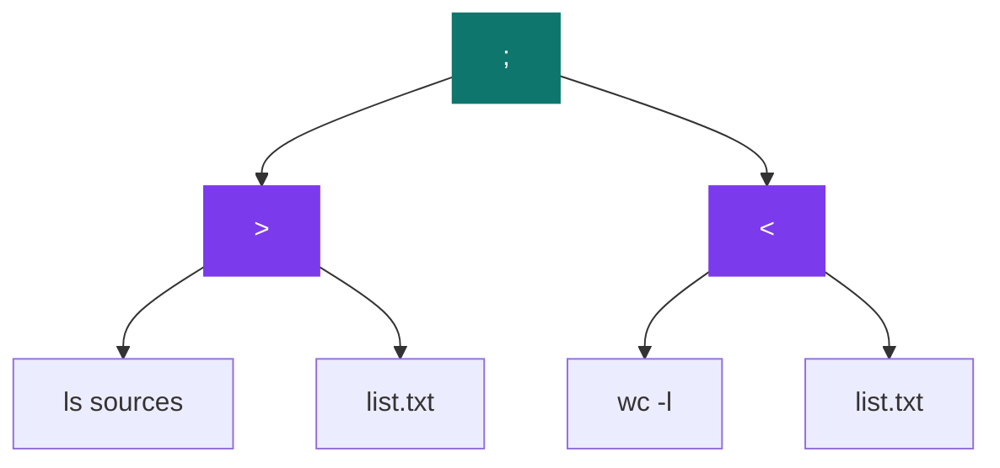

# Minishell 2

[](https://antoinepoisson.github.io/Old-School-Projects/projects/psu-minishell2-2018)

  

**Epitech project** · Shell Programming (`B-PSU-210`) · Tek1 · 2018-2019 · 2 weeks · Solo · Grade A

> The shell that gains pipes, redirections and command chaining.

## Overview

`mysh` turns a whole command line into a binary tree, walks it, and wires `pipe`,
`dup2` and `open` so that six operators combine freely on a single line.

A pipe is two file descriptors, and after a `fork` both of them exist in both
processes. Every process has to close the end it does not use. Miss one close
and the reader at the end of the chain never sees EOF — the pipeline hangs, with
no error message and nothing in the output to explain it.

Real sessions — the prompt is `[<cwd>] $> `, the here-document prompt is `? `:

```console
[/home/anthony/PSU_minishell2_2018] $> cat main.c | grep include | wc -l
3
[/home/anthony/PSU_minishell2_2018] $> ls sources > list.txt ; wc -l < list.txt
9
[/home/anthony/PSU_minishell2_2018] $> cat << EOF
? one
? two
? EOF
one
two
[/home/anthony/PSU_minishell2_2018] $> ls | | wc
Invalid null command.
```

That prompt is printed only when `isatty(0)` is true. The shell is graded by
piping a command line into it rather than typing it, and a prompt written into
that stream would break every expected-output comparison.

## How it works

The line is cut into command segments and operators, then split recursively into
a binary tree: each node carries one operator and two subtrees, a leaf carries a
plain command string.

Precedence is not a table of rules, it is the order in which the splitter looks
for operators. The root splits on the lowest-numbered operator present, so `;`
always ends up above `|`, and `|` above any redirection.

| Operator | Split order | What the executor does |
| --- | --- | --- |
| `;` | 0 | Runs the left subtree, then the right one |
| `\|` | 1 | `pipe` + `fork`: the child runs the left side, the parent the right |
| `<<` | 2 | A child feeds a pipe with lines read behind a `? ` prompt |
| `<` | 3 | A child copies the file into a pipe, the parent reads it |
| `>>` | 4 | `open` with `O_CREAT`, reopened `O_RDWR` + `O_APPEND`, `dup2` onto stdout |
| `>` | 5 | The same two-step open, with `O_TRUNC` instead of `O_APPEND` |

So `ls sources > list.txt ; wc -l < list.txt` becomes one tree, and the
executor never needs a special case for "redirection inside a chain":



**The pipeline is where the descriptors get dangerous.** For a chain, `mysh`
forks one child per writing stage and keeps the *reading* stage in its own
process — the shell process becomes the tail of the pipeline.


That last arrow is why the shell survives. Its own stdin has just been replaced
by a pipe, so `control_pipe` saves descriptor 0 with `dup` before the fork and
puts it back afterwards — without it, the shell would read its next command from
an exhausted pipe and quit at the first pipeline typed.

The child side is three lines of discipline, then a recursive descent back into
the tree, because a pipe stage can itself be a pipe or a redirection:

```c
static void management_pipe_son(variable_t *var, tree_t *tree, int pipe_fd[])
{
    close(pipe_fd[0]);
    dup2(pipe_fd[1], 1);
    close(pipe_fd[1]);
    if (check_element_is_operator(tree->left))
        chose_good_operator(var, tree->left);
    else
        exec_arg(var, tree->left->data);
    close(1);
}
```

`|`, `<` and `<<` share that exact shape: a producer process on one side of a
pipe, the consumer on the other. The uniformity has a visible cost in `<`,
which copies the file into the pipe one byte at a time — a `read`/`write` pair
per byte, where `dup2(fd, 0)` would have been a single call.

A validation pass runs before any `fork`, so a malformed line never spawns a
process: `Invalid null command.` for an empty side of a pipe or a line that
opens on an operator, `Missing name for redirect.` for a dangling `>`, and
`Ambiguous input redirect.` for pairs that cannot compose (`cat < a < b`).

## What this project demonstrates

- Rigorous descriptor handling: one omission freezes the whole chain
- Tree-based parsing rather than case-by-case handling
- The mechanism behind all the power of the Unix command line

## Key features

- Shell with operators: pipes, >, >>, < and << redirections, ; separator
- Building an execution tree through a recursive-descent parser (parser_ll/create_tree.c) then walking it to execute
- Every built-in of minishell 1 retained: `cd`, `env`, `setenv`, `unsetenv`, `exit`
- Chaining several pipes and redirections on the same line
- 39 signal names reported the way tcsh does, `(core dumped)` included

## Technical stack

- **Languages** — C
- **Tools** — Makefile, gcc, Criterion, Git
- **Concepts** — pipe and dup2, descriptor redirection, command tree, return codes

## Engineering constraints

- imposed group size: 1 (individual work)
- imposed binary: mysh
- limited set of allowed functions — 35 of them, none named `printf`, `strdup`
  or `strlen`, hence the bundled `libmy`: 1,251 lines of hand-written output,
  number parsing and string splitters

## Beyond the baseline

- Sixteen Criterion test files, including one on the execution of the tree itself

Moving to an execution tree is the real leap over minishell 1.

## Verification

152 Criterion tests live in 16 files. `make tests_run` compiles the 15 files
listed in the Makefile, runs them, then calls `gcovr` for coverage.

| Part | Files | Lines |
| --- | --- | --- |
| Shell sources + headers | 32 | 2,125 |
| Criterion tests | 16 | 2,131 |
| Bundled `libmy` | 34 | 1,251 |

`test_exec_tree.c` is the interesting one. It hands `is_create_tree` the line
`"ls > toto ; cat < main.c"` and checks the walk returns the root it was given,
so the whole splitter is exercised without a single `fork`.

## Build & run

```bash
make            # links ./mysh
make tests_run  # builds unit_tests, runs it, then gcovr
```

Produces `mysh`. The line reader lives in `lib/libgnl.a`, a build product that
this archive does not track; `lib/my/` ships as source and is rebuilt by `make`.

---

[← PSU — Unix systems programming](../README.md) · [↑ Tek1](../../README.md) · [⌂ All projects](../../../README.md)
