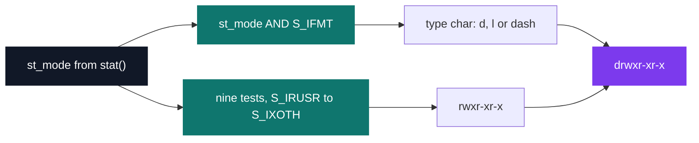

# my_ls

[](https://antoinepoisson.github.io/Old-School-Projects/projects/psu-my-ls-2018)

  

**Epitech project** · Unix System Programming (Part I) (`B-PSU-100`) · Tek1 · 2018-2019 · 2 weeks · Grade B

> Re-coding the ls command, options included — far deeper than it looks.

`ls -l` is a promise of alignment. The size column lines up whatever the directory holds, the date
reads `Jul 30 16:58` and never `Jul 30 4:58 PM`, and the mode string is always exactly ten
characters. Reproducing that byte for byte is the whole exercise.

The allowed function list removes the easy way out: no `printf`, no `strcmp`, no `qsort`. Every
byte leaves through `write()` — `my_putchar` spends one syscall per character — and the six string
helpers the program calls come from a `libmy` written by hand.

Alignment then forces the architecture. The first line cannot be printed until the widest size in
the directory is known, so the long listing runs **two passes** over the entries — one that
measures, one that writes.

What `./my_ls -l include` actually prints, column by column:

```text
total 16
-rw-r--r-- 1 poisson staff 2584 Jul 30 16:58 is_ls_big_r.h
-rw-r--r-- 1 poisson staff 1644 Jul 30 16:58 is_my_ls.h
-rw-r--r-- 1 poisson staff 1291 Jul 30 16:58 my_lib.h
-rw-r--r-- 1 poisson staff  579 Jul 30 16:58 my_struct.h
│          │ │       │     │    │            │
│          │ │       │     │    │            └─ d_name, straight from readdir
│          │ │       │     │    └─ ctime() re-sliced to month, day and HH:MM
│          │ │       │     └─ st_size, padded to the width measured in pass 1
│          │ │       └─ st_gid resolved by getgrgid
│          │ └─ st_uid resolved by getpwuid
│          └─ st_nlink
└─ st_mode: one type char plus nine permission bits
```

## Overview

Everyone types `ls` several times a day. Re-coding it forces you to learn how the system actually
describes a file — its size, its permissions, its owner, its date — and all of it arrives as raw
integers inside a single `struct stat`.

Options are parsed character by character, so `-lRrt`, `-l -R -rt` and `-t -l` are the same
command. The accepted letters are `l`, `R`, `d`, `t` and `r`; anything else prints
`Invalid Argument.` on `stderr` and exits 84.

| Option | Behaviour |
| --- | --- |
| `-l` | Long listing: mode, links, owner, group, size, date, name |
| `-R` | Recurse into every sub-directory found |
| `-d` | List the directory itself instead of its contents |
| `-t` | Sort by modification time, newest first |
| `-r` | Reverse whichever sort is active |

Hidden entries are not behind a flag: any name starting with `.` is skipped inside the print loop,
after the sort has already run over the whole directory.

1 657 lines of C across 24 source files, plus 4 headers, linked against a 30-file `libmy` of which
six functions are actually called: `my_putstr`, `my_strlen`, `my_strcmp`, `my_strcat`, `my_revstr`
and `my_putchar`.

## How it works

**Reading each directory twice.** `readdir` is a cursor, not an array: nothing tells you how many
entries a `DIR` holds. So `first_analyze` opens the directory, drains `readdir` to count, and
closes it; only then can `result` be allocated at the right size and the directory reopened to be
filled.


**Decoding the mode field.** `st_mode` packs the file type and the nine permission bits into one
integer. The type comes from a mask, the rwx string from nine independent tests, and the two are
concatenated into the ten-character prefix.



**Aligning the size column.** Both passes share one `static int` inside `check_lenght_size`, driven
by an integer mode: `3` records a new maximum, `4` returns it, `6` returns this entry's own width,
`5` resets before the next directory. It stands in for the state a `printf("%*ld")` would carry.

```c
void size(struct stat sb)
{
    int size = check_lenght_size(sb, 4);

    my_putstr(" ");
    for (int i = check_lenght_size(sb, 6); i < size; i++)
        my_putstr(" ");
    my_put_long(sb.st_size);
}
```

**Sorting by date without comparing timestamps.** `-t` never reads `st_mtime` as a number: it
rebuilds the string `ctime` returns into a 19-character key and compares keys with `my_strcmp`.
Months and single-digit days are space-padded, and ASCII `' '` sorts below `'0'`, so lexicographic
order over the keys is chronological order. Equal keys fall back to the name, so ties are stable.

```text
ctime(&sb.st_mtime)          19-char key            rank
"Sun Dec  9 14:32:01 2018"   "2018 12  9 14 32 01"    2
"Mon Jan  7 09:05:44 2019"   "2019  1  7 09 05 44"    3
"Fri Nov 30 22:10:03 2018"   "2018 11 30 22 10 03"    1
```

**Case-insensitive collation.** `my_strcmp` folds `A`–`Z` to lowercase before comparing, so the
default listing puts `main.c` ahead of `Makefile` — the ordering a GNU `ls` gives in a UTF-8
locale, not the byte order `LC_ALL=C ls` gives.

**Recursion.** `-R` keeps a linked list of directories still to visit: each listed level scans its
entries backwards and inserts every sub-directory into the list, and the outer loop pops until the
list is empty. The traversal stays iterative — a `readdir` calling itself would hold one open `DIR`
per level of depth.

**Audit note.** The symlink path is written and correct — `readlink` into a `st_size`-sized buffer,
printed as ` -> target` — but it is unreachable, because every lookup goes through `stat()`, which
follows the link and reports the target's type. `lstat()` is the one call that keeps the link
itself visible, and it appears nowhere in the sources.

## What this project demonstrates

- Turning raw `struct stat` integers into the exact text layout a user expects
- A two-pass column algorithm: nothing can be printed before the whole directory has been measured
- `-R` traversal driven by an explicit worklist rather than by call-stack recursion

## Key features

- Reimplementation of `ls` with the `-l`, `-R`, `-r`, `-t` and `-d` options
- Complete long listing: permissions, link count, owner, group, size, date, name
- Recursive tree traversal with `-R`
- Sorting by modification date (`-t`) and order reversal (`-r`)
- UID and GID resolved to names through `getpwuid` and `getgrgid`

## Technical stack

- **Languages** — C
- **Tools** — Makefile, gcc, Criterion, Git
- **Concepts** — file system calls, metadata and inodes, column formatting, recursion over a directory tree

## Engineering constraints

| Constraint | What it forced |
| --- | --- |
| Imposed binary `my_ls` | Fixed Makefile target and entry point |
| Imposed options `-a -l -R -d -t`, any order | Per-character flag parsing, not `getopt` |
| Restricted function list | No `printf`, no libc string functions — `write()` and a hand-written `libmy` |
| Errors on `stderr`, exit code 84 | `ls: cannot access 'x': No such file or directory` reproduced verbatim |
| Sorting, colours and columns as bonus | Alphabetical order and alignment were opt-in work, not requirements |

## Beyond the baseline

- Alphabetical order and size-column alignment, both classified as bonus in the subject
- Case-insensitive collation, so `main.c` lists before `Makefile`
- Criterion tests built with `--coverage`, `stdout` and `stderr` redirected

## Verification

Three Criterion tests in `tests/test.c`: `my_put_long` on `123456789`, `check_error_flag` on a
rejected string, and `check_error_flag` on a bare `-`. `cr_redirect_stdout` and `cr_redirect_stderr`
let the assertions read the real bytes written.

```bash
make tests_run
```

The test target builds with `--coverage`, so `gcov` output is available after a run.

## Build & run

```bash
make
./my_ls -l           # long listing of the current directory
./my_ls -lt include  # long listing, newest first
./my_ls -R lib       # recursive walk of lib and its sub-directories
./my_ls -d include   # the directory entry itself
```

Produces `my_ls`.

---

[← PSU — Unix systems programming](../README.md) · [↑ Tek1](../../README.md) · [⌂ All projects](../../../README.md)
