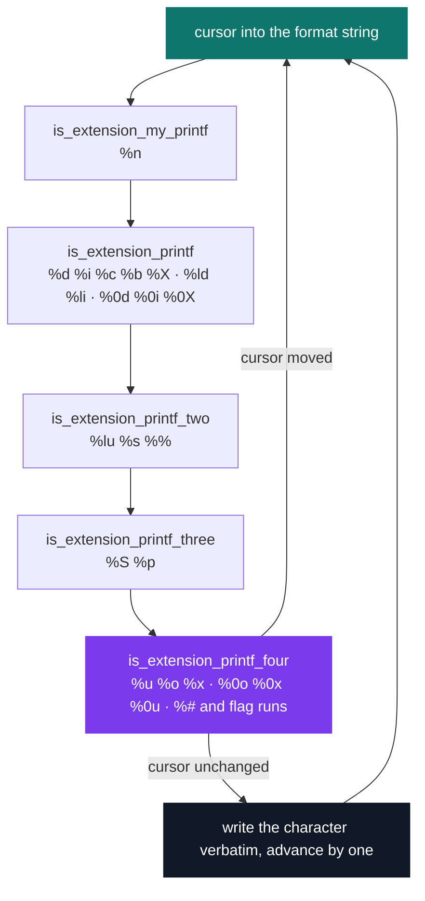
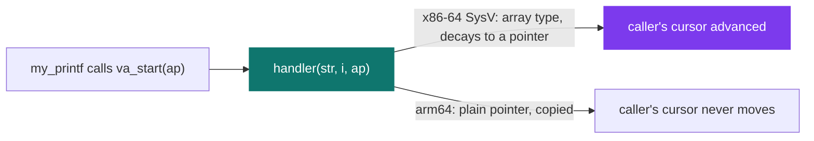

# my_printf

[](https://antoinepoisson.github.io/Old-School-Projects/projects/psu-my-printf-2018)

  

**Epitech project** · Unix System Programming (Part II) (`B-PSU-101`) · Tek1 · 2018-2019 · 2 weeks · Grade B

> Rewriting printf: a function you call without thinking, resting on a C mechanism almost nobody uses directly.

`my_printf` covers 13 conversions across four numeric bases, the `%l` long forms and the written-character counter, and reaches the terminal through exactly one syscall wrapper.

`va_arg` has no type safety of any kind. It does not know how many arguments were pushed, or what they were. The format string is the only thing telling the function what is sitting on the stack.

If the format lies, nothing warns you. You get whatever bytes happen to be at that offset. This is the one place in C where the compiler stops helping.

## Overview

Every byte leaves through `write(1, &c, 1)`, one character at a time. No `putchar`, no `puts`, no libc formatting anywhere — this *is* the formatting layer, so it cannot call one.

12 sources and 5 headers, 597 lines, archived into `libmy.a`. 57 Criterion assertions across 8 test files hold it in place.

| Directive | Output | Backed by |
| --- | --- | --- |
| `%d` `%i` | signed decimal | `my_put_nbr` |
| `%u` | decimal, sign dropped | `my_unsigned_putnbr` |
| `%b` | binary | `my_put_nbr_base(n, "01")` |
| `%o` `%x` `%X` | octal, hex lower and upper | `my_put_nbr_base` |
| `%c` `%s` | char, string with a `(null)` guard | `my_putchar` / `my_putstr` |
| `%p` | `0x` prefix then hex address | `my_put_adress` |
| `%ld` `%li` | 64-bit signed decimal | `my_put_long` |
| `%lu` | reads a `long`, prints it unsigned | `my_unsigned_putnbr` |
| `%S` | decimal code, `\NNN` octal escape if unprintable | `is_extension_printf_three` |
| `%#o` `%#x` `%#X` | prefixed `0` and `0x` forms | `is_flag_h_tag` |
| `%n` `%%` | running write count, literal `%` | — |

## How it works

The scanner holds one cursor into the format string and pushes it through a cascade of five handlers. Each handler tests the two or three characters under the cursor. On a match it consumes the argument and jumps the cursor past the directive; otherwise it hands the cursor back untouched.



The last handler closes the loop. If the cursor survived the whole cascade unmoved, the character under it is not a directive, so it is written as a literal.

That fallback buys a real property: an unrecognised directive degrades to plain text instead of consuming an argument it has no right to. `my_printf("%5d", 42)` prints `%5d` and leaves the `42` untouched on the stack. Width and precision are outside this grammar, and stepping outside it is free rather than fatal.

One case does not fall through: a run of `+`, `-` and space with no conversion behind it is rewritten in a canonical order. `%- ++2` comes back as `%+-2`, `%-   3` as `% -3`. Seven of the 57 assertions exist only to pin that normalisation down.

Because each handler re-tests the cursor after the previous ones moved it, one pass through the cascade can retire several directives: `"%d%c"` is fully consumed in a single trip.

**The assumption holding it all up.** Passing a `va_list` down a call chain is normally done through `va_copy` or a `va_list *`. Here it is passed by value to all five handlers, and the argument cursor still advances for the caller.

That works because on the x86-64 System V ABI `va_list` is an array type, so the parameter decays to a pointer and the callee mutates the caller's state. The whole dispatch design rests on that, and nothing in the source says so.



Rebuild the same twelve files for arm64, where `va_list` is a plain pointer copied by value, and the caller's cursor never leaves argument 0:

```text
my_printf("[%s] %d %x %o %b", "abc", 42, 42, 42, 42);

x86-64   [abc] 42 2a 52 101010
arm64    [abc] 81486666 4db634a 466661512 100110110110110001101001010
```

Every conversion after `%s` re-reads the same slot, so the four bases all render the low 32 bits of the `"abc"` pointer — a value that moves with every run. The ABI is not a footnote here; it is the load-bearing assumption.

**One function for every base.** All four numeric bases go through a single recursive routine that takes the base as its own alphabet. `base_size` is just `my_strlen(base)`, so binary, octal, decimal and hexadecimal are the same code with a different string. Verbatim:

```c
    if (nb >= 0) {
        quotient = nb % base_size;
        reste = nb / base_size;
        if (reste != 0)
            my_put_nbr_base(reste, base);
        if (quotient <= 9)
            my_putchar(quotient + '0');
        if (base[10] == 'A' && quotient > 9)
            my_putchar(quotient + 55);
        if (base[10] == 'a' && quotient > 9)
            my_putchar(quotient + 87);
    }
```

Letter case is not a parameter either — it is read back out of the alphabet at `base[10]`, which is `'A'` for `%X` and `'a'` for `%x`.

The write counter lives inside `my_putchar`, the single choke point every path goes through, so nothing has to be tallied at the conversion sites. `return_printf` is *defined*, not merely declared, in `my_printf.h` — which links only because exactly one translation unit includes that header.

Nothing clears it, so consecutive calls return a running total: a 27-character call followed by a 4-character one returns 27 then 31.

## What this project demonstrates

- Variadic dispatch built directly on `va_start` / `va_arg` / `va_end`, with the ABI assumption that makes the handler chain work
- Base conversion factored into one recursive function instead of duplicated per format
- A bonus variant of the library that colourises output by argument type through ANSI sequences

## Key features

- 13 conversions plus the `%l` long forms and the `%#` / `%0` flag variants
- Memory addresses and conversion into an arbitrary base given as a symbol string
- Return value counted at one choke point: exact for a call, cumulative across a process
- Compiles to a `libmy.a` static library with no libc output dependency

## Technical stack

- **Languages** — C
- **Tools** — Makefile, gcc, Criterion, Git
- **Concepts** — variadic functions, format string parsing, generic base conversion, ANSI sequences

## Engineering constraints

- no libc output function
- output through `write` only
- Epitech coding standard

## Beyond the baseline

`bonus/` is a parallel tree — 17 sources, 5 headers, its own Makefile — that keeps the parser and swaps every output primitive for a colourised one. It also adds `%r`, which prints a string reversed.

Numbers and `%c` go through the cyan primitive; strings, `(null)`, a literal `%` and the `0` / `0x` prefixes go through the red one.

```c
void my_putchar_color_int(char c)
{
    write(1, "\033[1;36m", 7);
    write(1, &c, 1);
    write(1, "\033[0m", 4);
    return_printf++;
    return;
}
```

Colour is applied per character, not per conversion, so every byte carries its own 11-byte escape pair. The counter still increments once per visible character, which keeps the return value honest even when the stream is full of escapes.

The standard deliverable stays colour-free.

## Verification

`make tests_run` rebuilds the library from scratch, links every source, the 8 test files and `libmy.a` with `--coverage -lcriterion`, then runs the binary: 57 assertions, one per test case, plus an `itoa` helper used to build expected strings.

Every case redirects stdout with `cr_redirect_stdout()` and matches the captured bytes. `%p` is checked against the system `printf` on the same pointer rather than against a hard-coded address.

Same x86-64 build, same inputs, next to the system `printf`:

| Call | `my_printf` | `printf(3)` |
| --- | --- | --- |
| `my_printf("%b", 123)` | `1111011` | not a C conversion |
| `my_printf("%S", '\r')` | `\015` | not a C conversion |
| `my_printf("%s", NULL)` | `(null)` | `(null)` |
| `my_printf("%ld", 4294967296)` | `4294967296` | `4294967296` |
| `my_printf("%lu", 4294967296)` | `0` | `4294967296` |
| `my_printf("%#X", 109)` | `0x6D` | `0X6D` |
| `my_printf("%u", -123)` | `123` | `4294967173` |
| `my_printf("%5d", 42)` | `%5d` | `   42` |

`%ld` keeps 64 bits all the way to `my_put_long(long)`, while `%lu` pulls a full `long` off the stack and then hands it to `my_unsigned_putnbr(int)`, so anything above 32 bits is cut on the way out. `%#X` prints a lowercase prefix because both hex branches share one `my_putstr("0x")`.

`%u` prints the magnitude rather than reinterpreting the bit pattern, and width is not part of the grammar. Both follow from a parser built on directive matching rather than on a flags/width/precision state machine.

## Build & run

```bash
make              # -> libmy.a
make tests_run    # -> builds and runs the Criterion suites
```

Link against it and declare the prototype:

```c
int my_printf(char *str, ...);
```

---

[← PSU — Unix systems programming](../README.md) · [↑ Tek1](../../README.md) · [⌂ All projects](../../../README.md)
