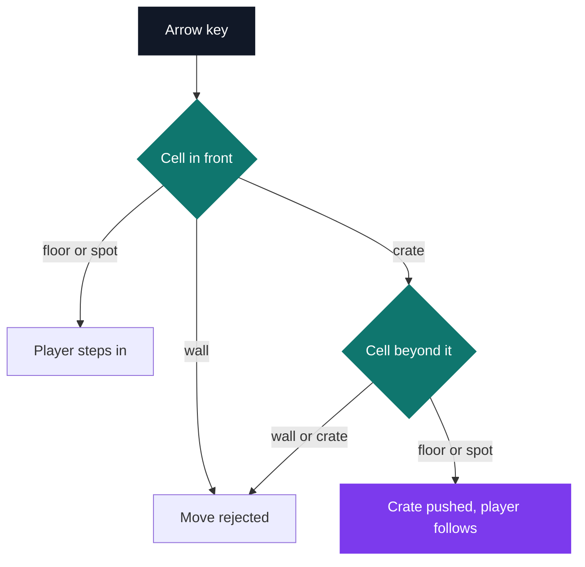
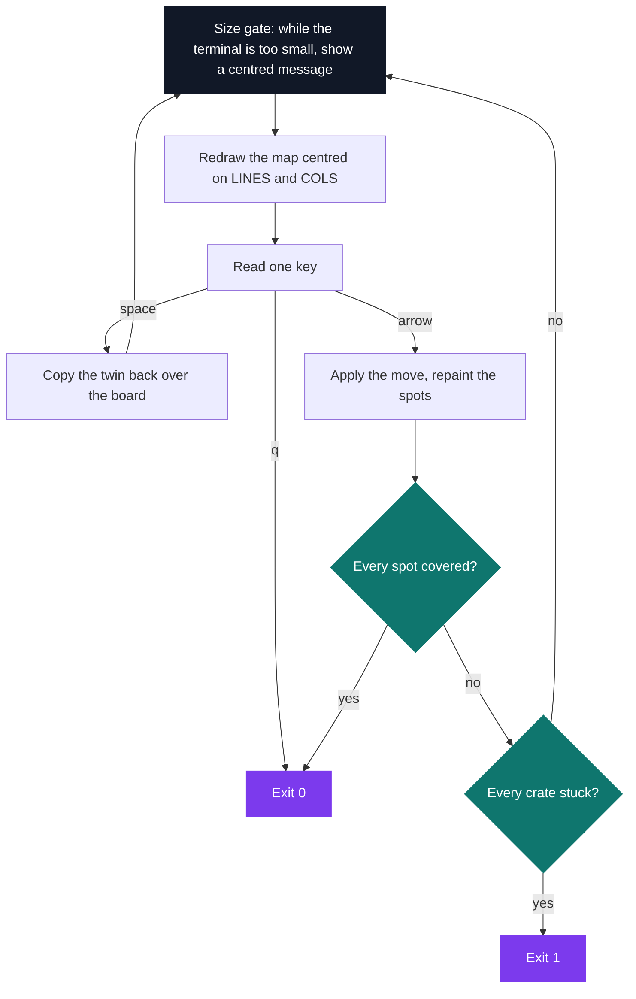

# my_sokoban

[](https://antoinepoisson.github.io/Old-School-Projects/projects/psu-my-sokoban-2018)

  

**Epitech project** · Unix System Programming (Part I) (`B-PSU-100`) · Tek1 · 2018-2019 · 2 weeks · Grade B

> The crate-pushing puzzle in a resizable terminal, with a loss condition the program works out from the board itself.

## Overview

A crate can be pushed but never pulled, so one wrong push kills the level for good — and the program is required to notice: return `0` once every crate sits on a spot, return `1` once none of them can be moved any more.

That second exit code is where the work is. It is not a move counter and not a turn limit: the program has to read the board and decide that the position is lost.

A level is a plain text file. The loader accepts five map symbols plus the newline and nothing else — one unknown character and the file is refused before curses ever starts.

A level file the loader accepts, two crates for two spots:

```text
#############
#           #
#   O   O   #
#           #
#   X   X   #
#     P     #
#           #
#############
```

| Symbol | Meaning |
| --- | --- |
| `#` | wall |
| `X` | crate |
| `O` | storage spot |
| `P` | player, exactly one |
| space | floor |

The file is sized with `stat()`, read in a single `read()`, then split into rows on the newlines. The character check runs on the raw text; the counting rules run on the grid — no spot, a player count other than one, or a crate count that differs from the spot count all end in exit code `84`.

## How it works

`load_map` runs twice on the same path, so the level is parsed into two grids: the board the player mutates, and a twin that nothing ever writes to. That twin does two jobs — the space bar copies it back over the board to reset the level, and it stays the authority on where the storage spots are.

The twin is needed because a move overwrites cells. Stepping off a square writes a space over it, so a spot the player walked across would disappear — after every move, cells marked `O` in the twin that no longer hold the player or a crate are repainted.

Each arrow key resolves to three cases, decided on the cell in front and the cell beyond it.



Pushing right, in the code itself — the crate only moves when the cell two steps away is neither a crate nor a wall:

```c
if (y < (nb_cols - 2) && map[x][y + 1] == 'X' && map[x][y + 2] != 'X'
    && map[x][y + 2] != '#') {
    map[x][y + 1] = 'P';
    map[x][y + 2] = 'X';
    map[x][y] = ' ';
}
```

**Detecting a dead level.** For each crate, the test reads its four corner neighbour pairs — up/left, up/right, right/down, left/down. A pair blocks when neither of its two cells is floor, spot or player, which leaves wall or crate. One blocking pair is enough to call that crate stuck.

Counting a neighbouring crate as a blocker is what makes both classic dead patterns fall out of the same test:

```text
 #####          #######
 #X  #          #  XX #
 #   #          #  XX #
 #####          #######
 corner         2x2 block
```

The crate on the left has a wall above and a wall to its side, so no push can ever reach it. None of the four crates on the right can be approached from the side it would have to be pushed from, whatever the rest of the map looks like.

The game only declares a loss when **every** crate on the board is stuck. That is the conservative side of the trade-off: it never cuts a winnable game short, and the cost is that one crate dead in a corner does not end the game while the others still slide.

**The turn.** One key, one repaint.



Resizing is handled without a signal handler. `sigaction`, `signal` and `ioctl` were all on the authorised list; none of the three appears in the sources.

Instead every turn re-reads `LINES` and `COLS`. The size gate compares them to the map and holds the game on the single centred line `The window is too small` until the window is big enough.

The draw call then recomputes the origin as `(LINES / 2)` and `(COLS / 2) - (nb_cols / 2)` before printing each row. Stretch an 80x24 terminal to 120x40 mid-game and the next redraw lands the map 20 columns right and 8 rows down.

## What this project demonstrates

- Automatic detection of dead-end situations: the game is lost as soon as every crate is stuck
- Strict map file validation before starting the game, and instant reset through the space bar
- Map re-centred each turn, with an enlargement message while the terminal is too small

## Key features

- Sokoban in ncurses: the player pushes crates onto target spots
- Map loading from a text file, dimensions derived automatically
- Victory detection, level reset, clean exit
- Window resizing taken into account

## Technical stack

- **Languages** — C
- **Frameworks / libraries** — ncurses
- **Tools** — Makefile, gcc, Criterion, Git
- **Concepts** — terminal interface, map parsing, deadlock detection, resize handling

## Engineering constraints

- imposed binary: my_sokoban
- imposed library: ncurses
- limited set of allowed functions

The authorised list is all of ncurses plus `malloc`, `free`, `exit`, the `(f)open` / `(f)read` / `(f)write` / `(f)close` family, `getline`, `ioctl`, `usleep`, `sigaction`, `signal`, `stat`, `lstat` and `fstat`. `printf` is not on it.

So the 9 game sources (516 lines) sit on the project's own `libmy` — 31 files, 751 lines of string, number and output helpers, where `my_putstr` walks the string into `my_putchar` and `my_putchar` is a `write(1, &c, 1)`. Everything the linked binary asks of libc, from `nm -u`:

```text
malloc  open  read  close  stat  write  exit
```

## Beyond the baseline

- An embedded information window (my_popup.c) for in-game messages
- Criterion tests on map validation and row and column counting

## Verification

14 Criterion tests in `tests/`, run with `make tests_run`, built with `--coverage`.

They cover the parts that do not need a terminal: row and column counting on raw file text, the `-h` usage string, the argument check, and the grid rules — a map with no player and a map with no spot are both expected to be rejected.

Audit note: three of those tests call `count_cols` and `check_error_last_first_line`. `count_cols` survives only as a commented-out body in `count_rows_cols.c` that forwarded to `count_cols_check`, `check_error_last_first_line` has no definition left anywhere, and both prototypes are still sitting in `include/load_map.h`.

The two symbols are undefined at link time, so the test target needs them back before the suite runs — the game itself links clean without either.

## Build & run

```bash
make
./my_sokoban map
```

The compile line passes `-Wall --extra`; `--extra` reads as a typo for `-Wextra`, and a current clang rejects it outright.

| Key | Action |
| --- | --- |
| arrows | move and push |
| space | reset the level |
| `q` | quit |

| Exit code | Meaning |
| --- | --- |
| `0` | every spot covered, or quit |
| `1` | every crate stuck, level unsolvable |
| `84` | bad arguments or invalid map file |

`./my_sokoban -h` prints the usage and the symbol legend.

---

[← PSU — Unix systems programming](../README.md) · [↑ Tek1](../../README.md) · [⌂ All projects](../../../README.md)
