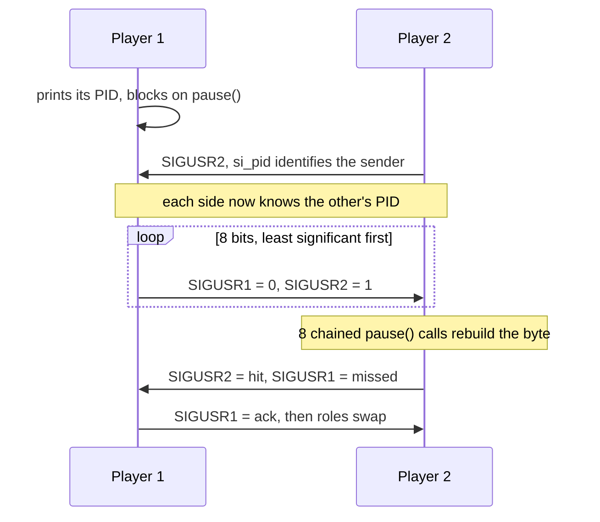

# my_navy — battleship over signals

[](https://antoinepoisson.github.io/Old-School-Projects/projects/psu-navy-2018)

  

**Epitech project** · Unix System Programming (Part I) (`B-PSU-100`) · Tek1 · 2018-2019 · 2 weeks · Team of 2 · Grade B

> Two processes play battleship, and the only channel between them is `SIGUSR1` and `SIGUSR2` — two interrupts that carry no payload at all.

A signal is not a message: no body, no queue, and no guaranteed delivery order between two
different signal numbers. It is a doorbell carrying exactly one bit of information — *this one rang*.

Two doorbells are the entire transport layer. No socket, no pipe, no shared memory: a board
coordinate has to be serialised into a timed sequence of interrupts, and two signals landing too
close together leave the receiver blocked forever on a `pause()` that never returns.

## Overview

Player 1 starts the binary with only a position file; it prints its PID and blocks. Player 2 starts
it again with that PID and its own file, and its first `SIGUSR2` doubles as the handshake — the
handler is installed with `SA_SIGINFO`, so the caller's PID is read straight out of `si_pid`.

From there the two processes alternate. One round costs exactly **10 signals**: 8 for the attacked
cell, 1 for the hit-or-miss answer, 1 for the acknowledgement that releases the defender.



## How it works

The coordinate is never sent as a letter and a digit. Both grids are the same buffer — ten rows of
eighteen bytes — so a cell is addressed by its **byte offset inside that buffer**, `row * 18 +
column`. The receiver walks its own board counting bytes and lands on the same cell, with no
coordinate arithmetic on either side.


```text
attack: C1
  row index 2, column index 6   ->   offset 2 * 18 + 6 = 42
  itobin(42) = 101010           ->   six bits, two short of a byte

  SIGUSR1  SIGUSR2  SIGUSR1  SIGUSR2  SIGUSR1  SIGUSR2  SIGUSR1  SIGUSR1
     0        1        0        1        0        1        0        0
  |------------------ itobin loop -------------------| |-- zero pad ---|

receiver: 8 x pause() -> "01010100" -> reversed "00101010" -> bintoi -> 42 -> C1
```

The frame has to be **exactly 8 signals** every time, or the receiver's `pause()` chain
desynchronises for the rest of the game. `itobin` emits only as many digits as the offset has
binary digits, so two guards zero-pad it back up to a fixed-width byte:

```c
    if (bintoi(cpy) < 64) {
        kill(navy->enemy_pid, SIGUSR1);
        usleep(10);
    }
    if (bintoi(cpy) < 128) {
        kill(navy->enemy_pid, SIGUSR1);
        usleep(10);
    }
```

Two guards are exactly the right number, and the geometry is why: the smallest reachable offset is
A1 at 38 and the largest is H8 at 178, so every frame is 6, 7 or 8 bits wide before padding.

Synchronisation is bought with delay rather than with a per-bit acknowledgement — `usleep(100)`
ahead of every bit the loop sends, and a receiver already parked in `pause()`. Standard signals are
not queued, so two bits landing inside the same handler window collapse into one and the game hangs.

One audit note on the same theme: `struct sigaction` is filled in with `sa_sigaction` and `sa_flags`
only, leaving `sa_mask` uninitialised. `sigemptyset()` is on the subject's authorised function list,
and on a protocol built on not losing a signal that is the field worth clearing.

## What this project demonstrates

- Designing a complete wire format with a two-symbol alphabet and no per-bit acknowledgement
- Handling race conditions and signal coalescing as a concrete, reproducible failure
- Respecting async-signal safety: a handler either appends one `'0'` or `'1'` to a static buffer or
  records the sender's PID, and every character printed leaves through raw `write()`

## Key features

- Two-player battleship across two independent processes, signals as the only IPC
- Coordinates transmitted bit by bit through `SIGUSR1` and `SIGUSR2`
- Fleet loaded from a file, with placement validated before the first shot
- Both grids — own and opponent — redrawn after every exchange

Four ships of length 2 to 5, 14 cells in total, one per line. `analyse_pos` requires the two
endpoints declared on line *n* to sit *n+1* apart on one axis, and `place_ships` then indexes the
raw file at the fixed offsets 2, 10, 18 and 26 — so a line is seven characters plus a newline,
never anything else:

```text
2:C1:C2
3:D4:F4
4:B5:B8
5:D7:H7
```

Which `fill_map` renders as, byte for byte:

```text
 |A B C D E F G H
-+---------------
1|. . 2 . . . . .
2|. . 2 . . . . .
3|. . . . . . . .
4|. . . 3 3 3 . .
5|. 4 . . . . . .
6|. 4 . . . . . .
7|. 4 . 5 5 5 5 5
8|. 4 . . . . . .
```

## Technical stack

- **Languages** — C
- **Tools** — Makefile, gcc, Criterion, Git
- **Concepts** — Unix signals, homemade communication protocol, inter-process synchronisation, race conditions

## Engineering constraints

| Constraint | Consequence in the code |
| --- | --- |
| Communication only through `SIGUSR1` / `SIGUSR2` | Every coordinate becomes an 8-bit signal frame |
| Fixed list of authorised functions, no `printf` | All output goes through `write()`, behind `mput` / `mputstr` |
| One global variable allowed, if justified | None used; state lives in function-scope `static` |
| 8x8 grid, display identical to the subject's | Grid built byte by byte, printed with `write()` |
| Exit 0 on victory, 1 on defeat, 84 on error | Value threaded from `end_of_game` up to `main` |

## Beyond the baseline

The "one global variable" rule was met by using none at all. Both pieces of cross-handler state are
function-scope statics behind an accessor: `recover_signal()` is both the handler's write path and
the game loop's read path, and `stack_pid()` stores the opponent's PID by multiplying a static by
it, then hands it back on a call with `1`.

Unit tests were not required. Three Criterion files add them, including the `-h` usage
text asserted byte for byte with `cr_stdout_match_str`.

## Verification

| File | Tests | Covers |
| --- | --- | --- |
| `tests/test_attack.c` | 4 | `battleship`, `end_of_game`, `fill_map`, `connection` |
| `tests/test_manage_error.c` | 5 | argument count, unreadable position file, `game_help` output |
| `tests/test_redirection.c` | 3 | `recover_signal` buffer, `redirect_signal` install |

12 tests over 166 lines, against 1,019 lines of C across 19 source and header files. `make
tests_run` compiles with `--coverage` and runs `gcovr`.

## Build & run

```bash
make
./navy positions.txt          # player 1: prints its PID, then waits
./navy <pid> positions.txt    # player 2: connects and shoots second
```

---

[← PSU — Unix systems programming](../README.md) · [↑ Tek1](../../README.md) · [⌂ All projects](../../../README.md)
