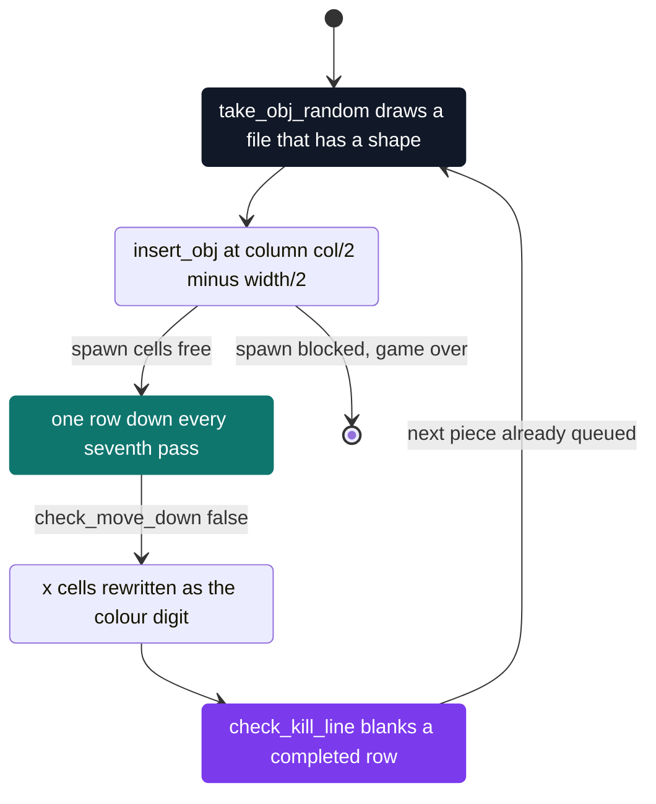

# Tetris

[](https://antoinepoisson.github.io/Old-School-Projects/projects/psu-tetris-2018)

  

**Epitech project** · Unix System Programming (`B-PSU-200`) · Tek1 · 2018-2019 · 2 weeks · Grade B

> Eighties Tetris in a terminal, with the pieces defined by text file instead of by code.

## Overview

Half of the grade is decided before a single piece falls. The subject puts fifty percent of the marks on the
`--debug` dump read by automated tests: the six key bindings, the next-piece flag, the level, the map size,
then every file of `./tetriminos/` with its dimensions, its colour and its shape.

So the surface that matters is not the game loop, it is the parser behind it. No shape is written in the
code. Each piece is a text file — `width height colour` on the first line, asterisks and spaces below. Drop a
new file in the folder and the game plays it, with no recompilation.

1,463 lines of C over 25 source and header files, 367 more of Criterion tests, and an in-house libc that
brings the tree to 3,302 lines. 39 tests, 11 command-line options parsed by hand, ten piece files shipped —
six of which load.

## How it works

**A piece is a file.** The first line declares the bounding box and a colour index; the rest is the sprite.
Nothing else describes the shape anywhere in the program.

```console
$ cat -e tetriminos/bar.tetrimino
1 4 2$
*$
*$
*$
*$
$ cat -e tetriminos/z_letter.tetrimino
3 3 7$
  **$
*$
 **$
```

The bar agrees with its header: one column, four rows, colour 2. The second file does not — its widest row
is four characters against a declared three — so the loader keeps the entry and throws the shape away.

Four of the ten committed files are inconsistent, which makes the folder a fixture for the validator as much
as a piece set. Colours run through the program's own `e_colors` enum, so `4` draws
cyan here where ncurses itself numbers cyan 6.

| File | Header `w h colour` | Verdict |
| --- | --- | --- |
| `bar`, `square` | `1 4 2`, `2 2 6` | green I-piece, yellow O-piece |
| `plus`, `2` | `3 3 4` | cyan cross — not a tetromino, and the engine does not care |
| `l_letter`, `kaka_eco_plus` | `2 3 3`, `1 3 0` | blue L, and a bar whose colour 0 draws black on black |
| `1` | `3 3 4` | four shape rows for a declared height of 3 → `Error` |
| `z_letter` | `3 3 7` | widest row is 4 → `Error` |
| `u_letter` | `2 3 2` | shape is 3 wide by 2 tall, header says the opposite → `Error` |
| `t_letter` | `2 3 8` | same transposition, and colour 8 is out of the 0–7 range → `Error` |

**The header is never trusted.** `calcul_row()` walks the sprite, counts the rows that still hold a block and
takes the widest one once trailing spaces are dropped; `control_right_data()` compares that pair with the
declared one. The dump prints one entry per file, valid or not, so a grader sees which ones fell over:

```text
Tetriminos :  10
Tetriminos :  Name 1 :  Error
Tetriminos :  Name 2 :  Size 3*3 :  Color 4 :
 *
***
 *
```

**The board doubles as the colour buffer.** The falling piece is written as `x`; when it locks, every `x` is
overwritten with its colour digit. One `char **` therefore holds the stack, the active piece and the palette,
and `color_of_charac()` maps a cell straight to an ncurses pair.



**A piece must not collide with itself.** Storing the active piece inside the board makes the move test
tricky: the cell under a block is usually another block of the same piece. The check walks from the bottom
row up and erases each `x` right after testing it, so the cell below has already been cleared when it is
read. The copy taken up front is the undo buffer.

```c
bool check_move_down(options_t *opt, char **plan)
{
    char **save = cp_two_d(plan);

    for (int i = opt->size.row - 1; i >= 0; i--)
        for (int i_two = 0; plan[i][i_two]; i_two++) {
            if (plan[i][i_two] == 'x' &&
                check_move(opt, plan, i + 1, i_two) != true) {
                plan = save;
                opt->plan = save;
                return (false);
            } else if (plan[i][i_two] == 'x')
                plan[i][i_two] = ' ';
        }
    plan = save;
    opt->plan = save;
    return (true);
}
```

**The terminal driver is the clock.** No timer, no `select()`. An `ioctl` on `termios` sets `VMIN = 0` and
`VTIME = 1`, so a `read()` returns what is buffered or gives up after 100 ms, and two of those reads per pass
— one for movement, one for quit and pause — pace the whole game. Arrow keys arrive as the three bytes
`ESC [ D` split across two-byte reads, so the movement test matches the trailing letter — `D`, `C`, `B` —
instead of decoding the escape sequence.

Two findings worth naming. The turn key is parsed, validated, remappable and reported by the debug dump, but
no transform reaches the sprite: rotating a `char **` means re-deriving its box and re-running the collision
test against both the walls and the stack, and only the plumbing was built. And `kill_line()` blanks a
completed row, then tries to pull the stack down with `for (line -= 1; line <= 0; line--)` — a comparison
that can only hold for the top two rows, so a cleared line leaves a gap instead of closing it.

## What this project demonstrates

- A file format defined, parsed and validated end to end, with four broken fixtures left in to prove it rejects
- A debug dump reprinting every retained option and one line per piece file, valid or not — half the grade
- Eleven options parsed by hand — `getopt` was allowed and unused — taking `--level=3`, `-L 3` and braces alike

## Key features

- Tetrominoes loaded from `./tetriminos/`, sorted by name, invalid files reported instead of silently dropped
- Left, right and a one-row soft drop, each validated against the walls and the stack before it is applied
- Completed lines detected row by row after every lock, then cleared from the board
- Remappable keys resolved from the current terminfo, configurable board size, pause and quit
- Coloured ncurses board plus a side panel showing high score, score, lines, level and timer

## Technical stack

- **Languages** — C
- **Frameworks / libraries** — ncurses, terminfo (`setupterm`, `tigetstr`)
- **Tools** — Makefile, gcc, Criterion, gcovr, Valgrind, Git
- **Concepts** — piece-file parsing, timed game loop, hand-written option parsing, non-canonical terminal mode

## Engineering constraints

- Imposed binary `tetris`, imposed repository name, imposed library ncurses
- A `./tetriminos/` folder must sit next to the binary; return 84 if it holds no valid piece
- Errors on standard error, exit code 84 on failure and 0 otherwise
- Allowed functions limited to `rand`, `srand`, `getopt`, `getopt_long`, `clock` and those of earlier projects

## Beyond the baseline

The piece files, the six rebindable keys and the debug dump are all subject requirements. What sits on top:

- Option spellings doubled up: `-L 3`, `--level=3` and `--level={3}` all parse, braces from the usage text included
- A five-colour ASCII title banner above the board (`loop_display.c`), drawn on pairs no piece uses
- Input read straight from `termios` (`modify_term.c`) rather than through the ncurses input layer
- 39 Criterion tests and a `make tests_run` coverage rule, past the `re`, `clean` and `fclean` the subject asks for
- `make debug`, which rebuilds with `-g3` and replays the dump under Valgrind

## Verification

39 Criterion tests in `tests/test_tetris.c`, run with `make tests_run`, which builds with `--coverage` and
reports through `gcovr`. They are return-code checks on hand-built inputs: the three collision predicates and
the three moves over a 5×5 grid of spaces, the file-name filter, `calcul_row()` on a 2×2 sprite, both modes
of `control_right_file()`, the list helpers and the debug printers. `make debug` rebuilds with `-g3` and runs
`./tetris --debug` under Valgrind.

## Build & run

```bash
make
./tetris --level=3 --map-size={25,12}   # start level, and a 25 by 12 board
./tetris -l a -r d -w                   # rebind left and right, next-piece flag off
./tetris -D                             # debug dump, then any key to start
```

Produces `tetris`. It reads `./tetriminos/` and `./config/hightscore` relative to the working directory, so
run it from the project root.

---

[← PSU — Unix systems programming](../README.md) · [↑ Tek1](../../README.md) · [⌂ All projects](../../../README.md)
