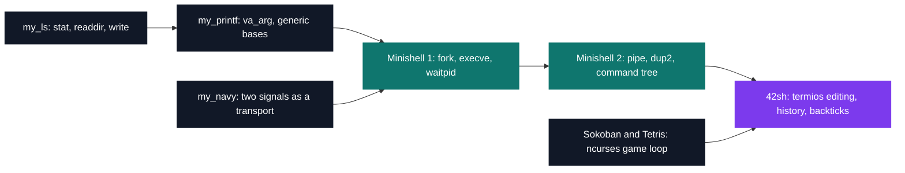

# PSU — Unix systems programming

[← Tek1](../README.md) · [⌂ All projects](../../README.md)

Eight projects in C where the interface is the system call, not the convenience function: `stat`, `readdir`, `fork`, `execve`, `pipe`, `dup2`, `kill`, `termios`.

The spine is the shell, built three times over: minishell 1 launches and buries processes, minishell 2 turns a command line into a binary tree of pipes and redirections, 42sh adds raw-mode line editing with no `readline`. The grader for 42sh is a diff against `tcsh` — same stdout, same stderr, same exit code, down to the trailing dot in `Command not found.`

The outlier is my_navy: two processes playing battleship across `SIGUSR1` and `SIGUSR2` alone, so a board coordinate crosses as eight timed interrupts, 100 microseconds apart.

| Project | What it is | Size | Grade |
| --- | --- | --- | --- |
| [my_ls](PSU_my_ls_2018) | `ls -l` rebuilt on `struct stat`, two passes to align the size column | 2 weeks | B |
| [my_navy](PSU_navy_2018) | Battleship over two signals, 10 of them per round | 2 weeks · team of 2 | B |
| [my_sokoban](PSU_my_sokoban_2018) | ncurses Sokoban that detects a level gone unsolvable | 2 weeks | B |
| [my_printf](PSU_my_printf_2018) | `printf` on `va_arg`, four bases through one recursive routine | 2 weeks | B |
| [Minishell 1](PSU_minishell1_2018) | PATH lookup, fork, execve, waitpid, and builtins that cannot be forked | 2 weeks | A |
| [Tetris](PSU_tetris_2018) | Terminal Tetris whose pieces are text files, not code | 2 weeks | B |
| [Minishell 2](PSU_minishell2_2018) | A command line parsed into a binary tree of six operators | 2 weeks · solo | A |
| [42sh](PSU_42sh_2018) | Line editor, history, aliases, backticks, nine operators | 2 weeks · team of 4 | A |

## Projects (8)

### Unix System Programming (Part I) (`B-PSU-100`)

- **[my_ls](PSU_my_ls_2018)** — *2 weeks · Grade B*
  `ls -l` rebuilt from `struct stat`, with two passes per directory so the size column lines up.

- **[my_navy — battleship over signals](PSU_navy_2018)** — *2 weeks · Team of 2 · Grade B*
  A game of battleship between two processes whose entire transport layer is `SIGUSR1` and `SIGUSR2`.

- **[my_sokoban](PSU_my_sokoban_2018)** — *2 weeks · Grade B*
  The crate-pushing puzzle in a resizable terminal, exiting 1 once no crate can be moved any more.

### Unix System Programming (Part II) (`B-PSU-101`)

- **[my_printf](PSU_my_printf_2018)** — *2 weeks · Grade B*
  Rewriting printf on `va_arg`, with binary, octal, decimal and hex sharing one recursive routine.

### Shell Programming (`B-PSU-210`)

- **[Minishell 1](PSU_minishell1_2018)** — *2 weeks · Grade A*
  The program that launches all the others: PATH resolution, fork and exec, and the signal named when a child dies.

- **[Minishell 2](PSU_minishell2_2018)** — *2 weeks · Solo · Grade A*
  One line becomes a binary tree: six operators, `pipe` and `dup2` wired node by node.

- **[42sh — full shell](PSU_42sh_2018)** — *2 weeks · Team of 4 · Grade A*
  Raw-mode line editing, navigable history, aliases, backticks and conditional chaining — 7,681 lines, four people.

### Unix System Programming (`B-PSU-200`)

- **[Tetris](PSU_tetris_2018)** — *2 weeks · Grade B*
  Eighties Tetris in a terminal, every piece loaded from a text file the validator is free to reject.
